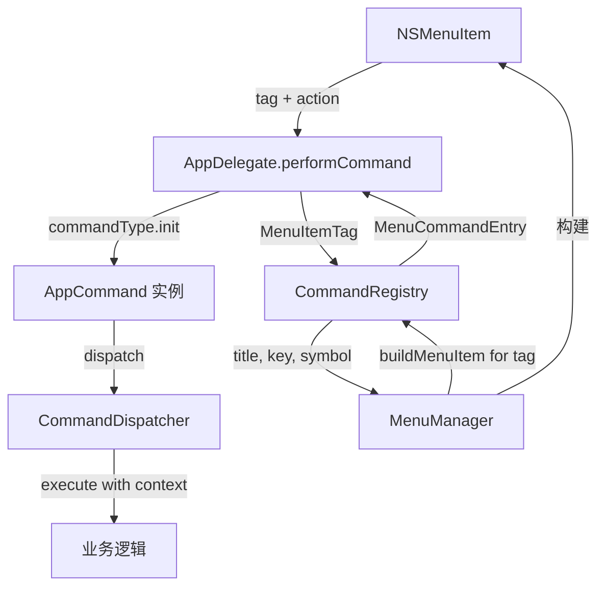
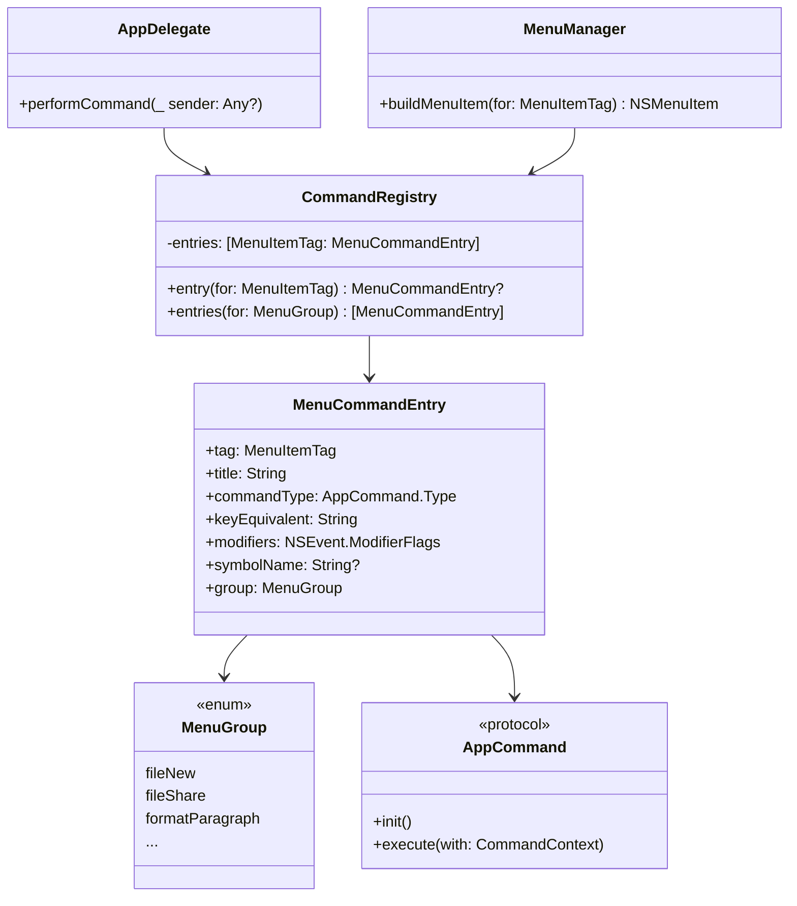

# 设计文档：AppDelegate 命令注册表

## 概述

本设计将 AppDelegate 中 84 个 `@objc` selector 转发方法收敛为 1 个统一的 `performCommand(_:)` 方法，引入 CommandRegistry 注册表驱动菜单项构建与命令分发。核心思路是：将菜单命令的元数据（标题、快捷键、Command 类型、图标等）集中到注册表，MenuManager 从注册表读取元数据构建 NSMenuItem，AppDelegate 通过注册表查找并实例化 Command。

重构后新增菜单项只需在 CommandRegistry 添加 1 条记录 + 创建 Command 实现，无需修改 AppDelegate 和 MenuManager。

## 架构

### 当前架构

```
NSMenuItem → @objc func xxx() → CommandDispatcher.dispatch(XxxCommand())
```

每个菜单项对应 AppDelegate 中一个 `@objc` 方法，手动构造 Command 并分发。MenuManager 手写每个 NSMenuItem 的属性（5-10 行/项）。

### 目标架构

```
NSMenuItem(action: performCommand) → performCommand(_:) → CommandRegistry.entry(for: tag) → Command.init() → CommandDispatcher.dispatch()
```



### 组件关系



## 组件与接口

### 1. MenuCommandEntry（菜单命令条目）

值类型，存储单个菜单命令的完整元数据。

```swift
struct MenuCommandEntry {
    let tag: MenuItemTag
    let title: String
    let commandType: AppCommand.Type
    let keyEquivalent: String
    let modifiers: NSEvent.ModifierFlags
    let symbolName: String?
    let group: MenuGroup
}
```

文件位置：`Sources/Shared/Kernel/Command/CommandRegistry.swift`

### 2. MenuGroup（菜单分组枚举）

定义菜单项的逻辑分组，MenuManager 按组批量构建菜单项。

```swift
enum MenuGroup: String {
    // 文件菜单
    case fileNew, fileShare, fileImport, fileExport, fileNoteActions
    // 格式菜单
    case formatParagraph, formatChecklist, formatChecklistMore
    case formatMoveItem, formatAppearance
    case formatFont, formatAlignment, formatIndent
    // 编辑菜单
    case editAttachment
    // 显示菜单
    case viewMode, viewFolderOptions, viewZoom, viewSections
    // 窗口菜单
    case windowLayout, windowTile, windowNote
}
```

文件位置：`Sources/Shared/Kernel/Command/CommandRegistry.swift`

### 3. CommandRegistry（命令注册表）

集中管理所有注册表驱动的菜单命令条目。

```swift
@MainActor
final class CommandRegistry {
    static let shared = CommandRegistry()
    private var entries: [MenuItemTag: MenuCommandEntry] = [:]

    private init() {
        registerAll()
    }

    func entry(for tag: MenuItemTag) -> MenuCommandEntry? {
        entries[tag]
    }

    func entries(for group: MenuGroup) -> [MenuCommandEntry] {
        entries.values
            .filter { $0.group == group }
            .sorted { $0.tag.rawValue < $1.tag.rawValue }
    }

    private func register(_ entry: MenuCommandEntry) {
        entries[entry.tag] = entry
    }

    private func registerAll() {
        // 约 78 条注册（84 个原始方法 - 6 个别名）
        // 按 MenuGroup 分组注册
    }
}
```

文件位置：`Sources/Shared/Kernel/Command/CommandRegistry.swift`

设计决策：CommandRegistry 使用 `static let shared` 单例，因为它是只读的元数据注册表，符合项目 `.shared` 约束中基础设施类的定位。注册表在 `init()` 时一次性注册所有条目，运行时不可变。

### 4. AppCommand 协议变更

新增 `init()` 要求，使所有 Command 支持零参数构造：

```swift
@MainActor
public protocol AppCommand {
    init()
    func execute(with context: CommandContext)
}
```

现有已有 `init()` 的 Command 无需修改。带参数的 Command（如 `CreateNoteCommand(folderId:)`）需要改造为在 `execute()` 中从 `context.coordinator` 获取参数。

### 5. AppDelegate.performCommand（统一入口）

```swift
@objc func performCommand(_ sender: Any?) {
    guard let menuItem = sender as? NSMenuItem,
          let tag = MenuItemTag(rawValue: menuItem.tag),
          let entry = CommandRegistry.shared.entry(for: tag)
    else {
        LogService.shared.warning(.app, "未找到菜单命令映射")
        return
    }
    let command = entry.commandType.init()
    commandDispatcher?.dispatch(command)
}
```

### 6. MenuManager.buildMenuItem（注册表驱动构建）

```swift
private func buildMenuItem(for tag: MenuItemTag) -> NSMenuItem {
    guard let entry = CommandRegistry.shared.entry(for: tag) else {
        fatalError("未注册的菜单项: \(tag)")
    }
    let item = NSMenuItem(
        title: entry.title,
        action: #selector(AppDelegate.performCommand(_:)),
        keyEquivalent: entry.keyEquivalent
    )
    item.keyEquivalentModifierMask = entry.modifiers
    item.tag = tag.rawValue
    if let symbolName = entry.symbolName {
        setMenuItemIcon(item, symbolName: symbolName)
    }
    return item
}
```

MenuManager 继续手动控制分隔线、子菜单结构和菜单层级，CommandRegistry 只负责单个菜单项属性。

### 7. 系统 selector 菜单项

约 15-20 个使用 AppKit 内置 selector 的菜单项保持原有构建方式不变，不纳入 CommandRegistry：

- NSApplication：`terminate:`、`hide:`、`unhideAllApplications:`、`orderFrontStandardAboutPanel:`、`orderFrontCharacterPalette:`
- NSWindow：`performClose:`、`performMiniaturize:`、`performZoom:`、`toggleToolbarShown:`、`runToolbarCustomizationPalette:`、`toggleFullScreen:`
- NSText/NSTextView：`cut:`、`copy:`、`paste:`、`pasteAsPlainText:`、`delete:`、`selectAll:`、`undo:`、`redo:`
- NSTextView：`performFindPanelAction:`、拼写/替换/转换/语音相关

### 8. 带参数 Command 改造策略

当前约 3 个 Command 在构造时接收参数：

| Command | 当前参数 | 改造后参数来源 |
|---------|---------|--------------|
| `CreateNoteCommand` | `folderId: String?` | `context.coordinator.folderState.selectedFolderId` |
| `ShareNoteCommand` | `window: NSWindow?` | `context.coordinator.mainWindowController?.window` |
| `SyncCommand` / `IncrementalSyncCommand` | 无 init 参数但缺少 `public init()` | 添加 `public init()` |

改造原则：将构造参数移到 `execute(with:)` 中从 `CommandContext` 获取，保持业务行为完全一致。

## 数据模型

### MenuCommandEntry

| 属性 | 类型 | 说明 |
|------|------|------|
| `tag` | `MenuItemTag` | 菜单项标识，与 NSMenuItem.tag 对应 |
| `title` | `String` | 菜单项显示标题 |
| `commandType` | `AppCommand.Type` | Command 类型，用于零参数构造 |
| `keyEquivalent` | `String` | 快捷键字符（空字符串表示无快捷键） |
| `modifiers` | `NSEvent.ModifierFlags` | 快捷键修饰键 |
| `symbolName` | `String?` | SF Symbol 图标名称（可选） |
| `group` | `MenuGroup` | 所属菜单分组 |

### MenuGroup 枚举值

| 分组 | 所属菜单 | 包含的命令类型 |
|------|---------|-------------|
| `fileNew` | 文件 | 新建笔记、新建文件夹、新建智能文件夹 |
| `fileShare` | 文件 | 共享 |
| `fileImport` | 文件 | 导入笔记、导入 Markdown |
| `fileExport` | 文件 | 导出 PDF/Markdown/纯文本 |
| `fileNoteActions` | 文件 | 置顶、私密笔记、复制、打印 |
| `formatParagraph` | 格式 | 标题/小标题/副标题/正文 |
| `formatChecklist` | 格式 | 核对清单、标记已勾选 |
| `formatChecklistMore` | 格式 | 全部勾选/取消、移到底部、删除已勾选 |
| `formatMoveItem` | 格式 | 上移/下移项目 |
| `formatAppearance` | 格式 | 浅色背景、高亮 |
| `formatFont` | 格式 | 粗体/斜体/下划线/删除线/增大字号/减小字号 |
| `formatAlignment` | 格式 | 左对齐/居中/右对齐 |
| `formatIndent` | 格式 | 增大缩进/减小缩进 |
| `editAttachment` | 编辑 | 附加文件、添加链接 |
| `viewMode` | 显示 | 列表视图/画廊视图 |
| `viewFolderOptions` | 显示 | 隐藏文件夹、显示笔记数量 |
| `viewZoom` | 显示 | 放大/缩小/实际大小 |
| `viewSections` | 显示 | 展开/折叠区域 |
| `windowLayout` | 窗口 | 填充/居中/左半/右半/上半/下半/最大化/恢复 |
| `windowTile` | 窗口 | 平铺左/右 |
| `windowNote` | 窗口 | 新窗口、在新窗口中打开笔记 |

### 注册表条目数量

- 注册表驱动的菜单命令：约 78 条（84 个原始 @objc 方法 - 6 个别名方法）
- 系统 selector 菜单项：约 15-20 个（保持原样）
- 别名方法删除：setHeading1→SetHeadingCommand、setHeading2→SetSubheadingCommand、setHeading3→SetSubtitleCommand、toggleBulletList→ToggleUnorderedListCommand、toggleNumberedList→ToggleOrderedListCommand、toggleChecklist→ToggleCheckboxListCommand


## 正确性属性

*属性（Property）是在系统所有有效执行中都应成立的特征或行为——本质上是对系统应做什么的形式化陈述。属性是人类可读规格说明与机器可验证正确性保证之间的桥梁。*

### Property 1：注册表查找与命令分发一致性

*For any* 已注册的 MenuCommandEntry，通过 `entry(for: tag)` 查找应返回非 nil 结果，且返回的 `commandType.init()` 应能成功构造 Command 实例。即：对于注册表中的任意条目，tag 查找 → Command 构造的完整链路应始终成功。

**Validates: Requirements 1.3, 4.3, 5.2**

### Property 2：分组过滤正确性

*For any* MenuGroup 值 g，`entries(for: g)` 返回的所有 MenuCommandEntry 的 `group` 属性都应等于 g，且注册表中所有 `group == g` 的条目都应出现在返回列表中（无遗漏、无多余）。

**Validates: Requirements 1.4**

### Property 3：菜单项构建属性匹配

*For any* 已注册的 MenuItemTag，`buildMenuItem(for: tag)` 构建的 NSMenuItem 应满足：`item.title == entry.title`、`item.keyEquivalent == entry.keyEquivalent`、`item.keyEquivalentModifierMask == entry.modifiers`、`item.tag == entry.tag.rawValue`。

**Validates: Requirements 6.1, 6.2**

## 错误处理

### performCommand 错误场景

| 场景 | 处理方式 |
|------|---------|
| sender 不是 NSMenuItem | 记录 warning 日志，忽略调用 |
| NSMenuItem.tag 无法转换为 MenuItemTag | 记录 warning 日志，忽略调用 |
| MenuItemTag 未在 CommandRegistry 中注册 | 记录 warning 日志，忽略调用 |
| CommandDispatcher 为 nil（coordinator 未就绪） | 现有逻辑已处理，CommandDispatcher 内部记录 warning |

### buildMenuItem 错误场景

| 场景 | 处理方式 |
|------|---------|
| 传入的 MenuItemTag 未在 CommandRegistry 中注册 | `fatalError`（开发阶段错误，不应出现在运行时） |

### 设计决策

- `performCommand` 采用静默失败策略（记录日志 + 忽略），因为菜单点击失败不应导致应用崩溃
- `buildMenuItem` 采用 `fatalError`，因为未注册的 tag 是开发阶段的编程错误，应在开发时立即发现

## 测试策略

### 单元测试

单元测试聚焦于具体实例和边界情况：

1. **CommandRegistry 初始化验证**：验证注册表包含约 78 条记录（需求 1.5）
2. **带参数 Command 改造验证**：验证 `CreateNoteCommand()` 零参数构造后，`execute()` 从 context 获取 folderId（需求 4.1）
3. **ShareNoteCommand 改造验证**：验证零参数构造后从 context 获取 window（需求 4.2）
4. **performCommand 无效输入**：传入非 NSMenuItem 的 sender、无效 tag 值，验证不崩溃且记录日志（需求 5.3）
5. **symbolName 图标设置**：验证有 symbolName 的条目构建的 NSMenuItem 设置了图标（需求 6.3）

### 属性测试

属性测试验证跨所有输入的通用属性，使用 Swift 内置的 XCTest 框架实现（项目不依赖外部库）。由于项目约束不使用外部 PBT 库，属性测试通过遍历注册表全量数据实现等效验证：

1. **Property 1 测试**：遍历 CommandRegistry 所有条目，验证 `entry(for: tag)` 返回非 nil 且 `commandType.init()` 构造成功
   - 标签：`Feature: 137-command-registry, Property 1: 注册表查找与命令分发一致性`

2. **Property 2 测试**：遍历所有 MenuGroup 枚举值，验证 `entries(for: group)` 返回的条目 group 属性一致，且总数等于注册表中该 group 的条目数
   - 标签：`Feature: 137-command-registry, Property 2: 分组过滤正确性`

3. **Property 3 测试**：遍历 CommandRegistry 所有条目，调用 `buildMenuItem(for: tag)` 并验证返回的 NSMenuItem 属性与注册表条目匹配
   - 标签：`Feature: 137-command-registry, Property 3: 菜单项构建属性匹配`

### 集成验证

- 每个任务完成后执行 `xcodebuild build` 确保编译通过
- 手动点击所有菜单项确认命令正确触发
- 重点验证带参数的 Command 改造后行为一致
- validateMenuItem 机制无需额外测试（保持不变）
