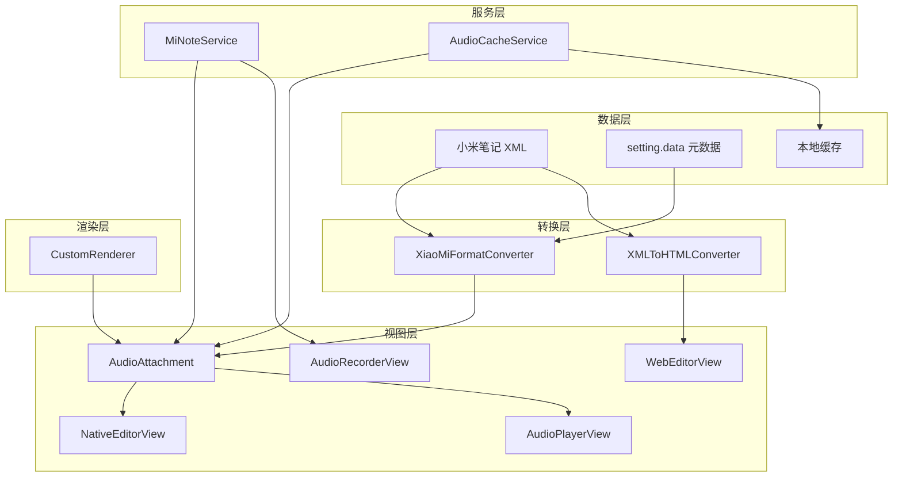
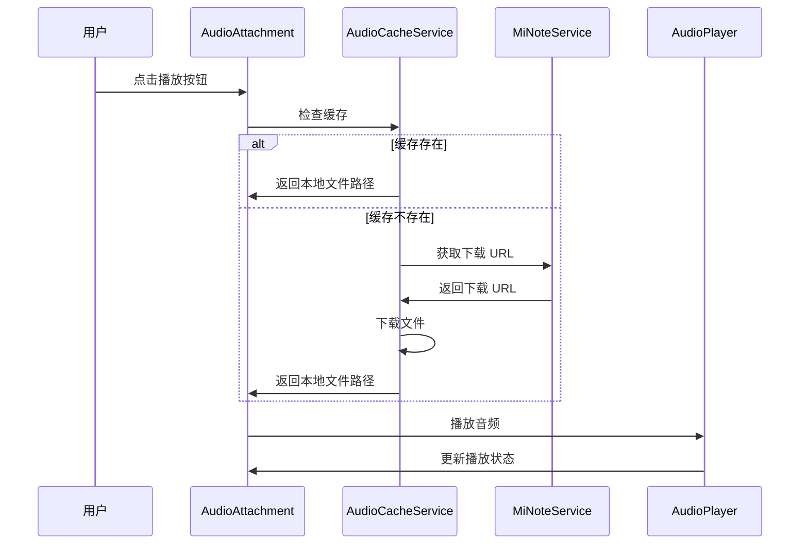
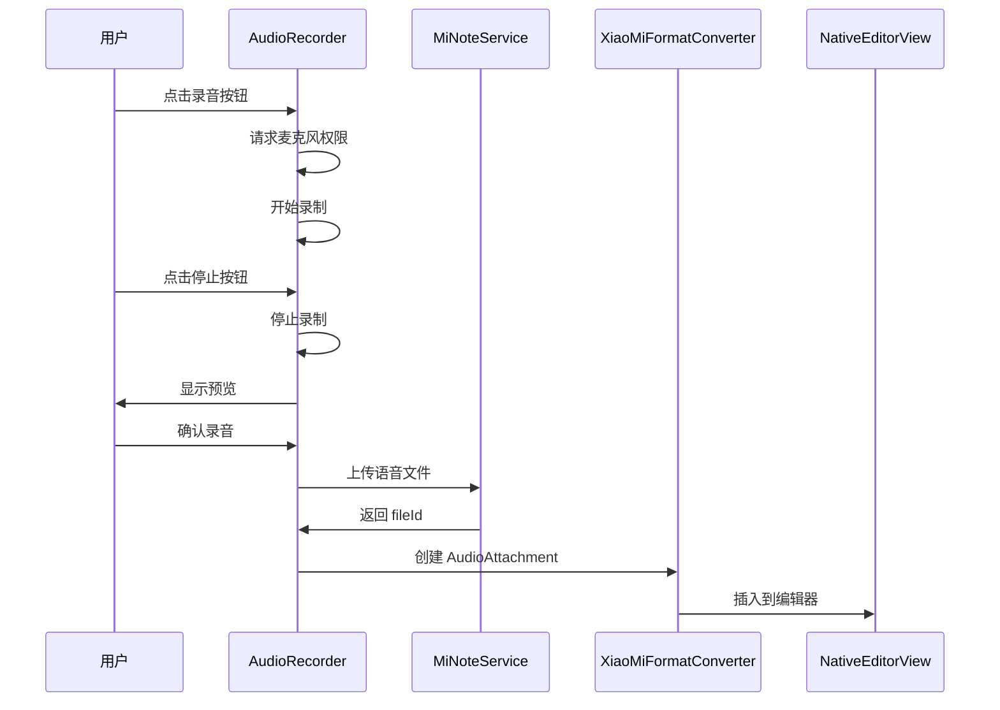

# 设计文档

## 概述

本设计文档描述了小米笔记 macOS 客户端中完整的语音文件（录音）支持功能的技术实现方案。该功能包括：
- 解析和显示语音文件占位符
- 下载和播放语音文件
- 录制和上传新的语音文件
- 删除语音文件
- 语音文件缓存管理

### 背景

小米笔记的语音文件在 XML 中以 `<sound fileid="xxx" />` 格式存储。笔记的 `setting.data` 字段包含所有附件的元数据，包括：
- `digest`: 文件摘要/哈希值（如 `abb060f90b04a56a51af80963c2e64104f1065cd.mp3`）
- `mimeType`: MIME 类型（如 `audio/mp3`）
- `fileId`: 文件唯一标识符（如 `1315204657.L-BDaSuaT0rAqtMLCX3cfw`）

### API 发现

通过测试验证，语音文件上传 API 的关键发现：
- **type 参数**: 必须使用 `note_img`（与图片相同），`note_sound`/`note_audio`/`note_recording` 均无效
- **MIME 类型**: 推荐使用标准的 `audio/mpeg`
- **上传流程**: 三步流程（request_upload_file → upload_block_chunk → commit）

## 架构

### 组件关系图



### 数据流 - 播放语音



### 数据流 - 录制语音



## 组件和接口

### 1. AudioAttachment 类（扩展）

扩展现有的 AudioAttachment 类，添加播放控制功能。

```swift
/// 语音文件附件 - 用于在 NSTextView 中显示语音文件占位符和播放控件
final class AudioAttachment: NSTextAttachment, ThemeAwareAttachment {
    
    // MARK: - Properties
    
    /// 语音文件 ID
    var fileId: String?
    
    /// 文件摘要（digest）
    var digest: String?
    
    /// MIME 类型
    var mimeType: String?
    
    /// 是否为深色模式
    var isDarkMode: Bool
    
    /// 占位符尺寸
    var placeholderSize: NSSize
    
    /// 播放状态
    enum PlaybackState {
        case idle           // 空闲
        case loading        // 加载中
        case playing        // 播放中
        case paused         // 暂停
        case error(String)  // 错误
    }
    
    /// 当前播放状态
    var playbackState: PlaybackState = .idle
    
    /// 播放进度（0.0 - 1.0）
    var playbackProgress: Double = 0.0
    
    /// 当前播放时间（秒）
    var currentTime: TimeInterval = 0
    
    /// 总时长（秒）
    var duration: TimeInterval = 0
    
    // MARK: - Playback Control
    
    /// 开始播放
    func play() async throws
    
    /// 暂停播放
    func pause()
    
    /// 停止播放
    func stop()
    
    /// 跳转到指定位置
    func seek(to progress: Double)
}
```

### 2. AudioPlayerService 类

负责音频播放的服务类。

```swift
/// 音频播放服务
final class AudioPlayerService: NSObject, ObservableObject {
    
    static let shared = AudioPlayerService()
    
    // MARK: - Properties
    
    /// 当前播放的音频 URL
    @Published var currentURL: URL?
    
    /// 播放状态
    @Published var isPlaying: Bool = false
    
    /// 当前播放时间
    @Published var currentTime: TimeInterval = 0
    
    /// 总时长
    @Published var duration: TimeInterval = 0
    
    /// 播放进度（0.0 - 1.0）
    var progress: Double {
        guard duration > 0 else { return 0 }
        return currentTime / duration
    }
    
    // MARK: - Private
    
    private var audioPlayer: AVAudioPlayer?
    private var timer: Timer?
    
    // MARK: - Public Methods
    
    /// 播放音频文件
    func play(url: URL) throws
    
    /// 暂停播放
    func pause()
    
    /// 停止播放
    func stop()
    
    /// 跳转到指定位置
    func seek(to progress: Double)
    
    /// 获取音频时长
    func getDuration(for url: URL) -> TimeInterval?
}
```

### 3. AudioRecorderService 类

负责音频录制的服务类。

```swift
/// 音频录制服务
final class AudioRecorderService: NSObject, ObservableObject {
    
    static let shared = AudioRecorderService()
    
    // MARK: - Properties
    
    /// 录制状态
    enum RecordingState {
        case idle           // 空闲
        case recording      // 录制中
        case paused         // 暂停
        case finished       // 完成
    }
    
    @Published var state: RecordingState = .idle
    
    /// 录制时长
    @Published var recordingDuration: TimeInterval = 0
    
    /// 音量级别（0.0 - 1.0）
    @Published var audioLevel: Float = 0
    
    /// 最大录制时长（秒）
    let maxDuration: TimeInterval = 300 // 5 分钟
    
    /// 录制的音频文件 URL
    var recordedFileURL: URL?
    
    // MARK: - Private
    
    private var audioRecorder: AVAudioRecorder?
    private var timer: Timer?
    
    // MARK: - Public Methods
    
    /// 请求麦克风权限
    func requestPermission() async -> Bool
    
    /// 检查麦克风权限状态
    func checkPermissionStatus() -> AVAudioSession.RecordPermission
    
    /// 开始录制
    func startRecording() throws
    
    /// 暂停录制
    func pauseRecording()
    
    /// 继续录制
    func resumeRecording()
    
    /// 停止录制
    func stopRecording() -> URL?
    
    /// 取消录制
    func cancelRecording()
}
```

### 4. AudioCacheService 类

负责语音文件缓存管理的服务类。

```swift
/// 语音文件缓存服务
final class AudioCacheService {
    
    static let shared = AudioCacheService()
    
    // MARK: - Properties
    
    /// 缓存目录
    private let cacheDirectory: URL
    
    /// 最大缓存大小（字节）
    let maxCacheSize: Int64 = 100 * 1024 * 1024 // 100 MB
    
    // MARK: - Public Methods
    
    /// 获取缓存的音频文件路径
    func getCachedFile(for fileId: String) -> URL?
    
    /// 缓存音频文件
    func cacheFile(data: Data, fileId: String, mimeType: String) throws -> URL
    
    /// 下载并缓存音频文件
    func downloadAndCache(fileId: String) async throws -> URL
    
    /// 检查文件是否已缓存
    func isCached(fileId: String) -> Bool
    
    /// 获取缓存大小
    func getCacheSize() -> Int64
    
    /// 清理缓存
    func clearCache()
    
    /// 清理指定文件的缓存
    func removeCache(for fileId: String)
    
    /// 清理最久未使用的缓存
    func evictLeastRecentlyUsed(targetSize: Int64)
}
```

### 5. MiNoteService 扩展

在现有的 MiNoteService 中添加语音文件相关的 API 方法。

```swift
extension MiNoteService {
    
    // MARK: - Audio File Upload
    
    /// 上传语音文件到小米服务器
    /// - Parameters:
    ///   - audioData: 语音文件数据
    ///   - fileName: 文件名
    ///   - mimeType: MIME 类型，默认 "audio/mpeg"
    /// - Returns: 包含 fileId、digest、mimeType 的字典
    func uploadAudio(audioData: Data, fileName: String, mimeType: String = "audio/mpeg") async throws -> [String: Any]
    
    // MARK: - Audio File Download
    
    /// 获取语音文件下载 URL
    /// - Parameter fileId: 文件 ID
    /// - Returns: 下载 URL
    func getAudioDownloadURL(fileId: String) async throws -> URL
    
    /// 下载语音文件
    /// - Parameter fileId: 文件 ID
    /// - Returns: 音频数据
    func downloadAudio(fileId: String) async throws -> Data
}
```

### 6. AudioPlayerView（SwiftUI）

用于显示音频播放控件的 SwiftUI 视图。

```swift
/// 音频播放器视图
struct AudioPlayerView: View {
    
    @ObservedObject var playerService: AudioPlayerService
    
    let fileId: String
    let onClose: () -> Void
    
    var body: some View {
        VStack(spacing: 12) {
            // 播放进度条
            ProgressView(value: playerService.progress)
            
            // 时间显示
            HStack {
                Text(formatTime(playerService.currentTime))
                Spacer()
                Text(formatTime(playerService.duration))
            }
            .font(.caption)
            
            // 播放控制按钮
            HStack(spacing: 20) {
                // 后退 15 秒
                Button(action: { playerService.seek(to: max(0, playerService.progress - 0.1)) }) {
                    Image(systemName: "gobackward.15")
                }
                
                // 播放/暂停
                Button(action: togglePlayback) {
                    Image(systemName: playerService.isPlaying ? "pause.fill" : "play.fill")
                        .font(.title)
                }
                
                // 前进 15 秒
                Button(action: { playerService.seek(to: min(1, playerService.progress + 0.1)) }) {
                    Image(systemName: "goforward.15")
                }
            }
        }
        .padding()
    }
}
```

### 7. AudioRecorderView（SwiftUI）

用于录制音频的 SwiftUI 视图。

```swift
/// 音频录制器视图
struct AudioRecorderView: View {
    
    @ObservedObject var recorderService: AudioRecorderService
    
    let onComplete: (URL) -> Void
    let onCancel: () -> Void
    
    var body: some View {
        VStack(spacing: 16) {
            // 录制时长显示
            Text(formatTime(recorderService.recordingDuration))
                .font(.system(size: 48, weight: .light, design: .monospaced))
            
            // 音量指示器
            AudioLevelMeter(level: recorderService.audioLevel)
            
            // 控制按钮
            HStack(spacing: 30) {
                // 取消按钮
                Button("取消", action: onCancel)
                
                // 录制/停止按钮
                Button(action: toggleRecording) {
                    Circle()
                        .fill(recorderService.state == .recording ? .red : .gray)
                        .frame(width: 60, height: 60)
                        .overlay(
                            recorderService.state == .recording ?
                            RoundedRectangle(cornerRadius: 4)
                                .fill(.white)
                                .frame(width: 20, height: 20) :
                            Circle()
                                .fill(.red)
                                .frame(width: 24, height: 24)
                        )
                }
            }
            
            // 剩余时间提示
            if recorderService.state == .recording {
                Text("剩余 \(formatTime(recorderService.maxDuration - recorderService.recordingDuration))")
                    .font(.caption)
                    .foregroundColor(.secondary)
            }
        }
        .padding()
    }
}
```

### 8. WebEditorContext 扩展（Web 编辑器语音支持）

扩展 WebEditorContext 以支持在 Web 编辑器中插入和播放语音。

```swift
extension WebEditorContext {
    
    // MARK: - Audio Insertion
    
    /// 在 Web 编辑器中插入语音录音
    /// - Parameters:
    ///   - fileId: 语音文件 ID
    ///   - digest: 文件摘要（可选）
    ///   - mimeType: MIME 类型（可选）
    func insertAudio(fileId: String, digest: String? = nil, mimeType: String? = nil) {
        let script = """
        (function() {
            window.editor.insertAudioElement('\(fileId)', '\(digest ?? "")', '\(mimeType ?? "audio/mpeg")');
        })();
        """
        webView?.evaluateJavaScript(script)
    }
    
    // MARK: - Audio Playback Control
    
    /// 播放 Web 编辑器中的语音
    /// - Parameter fileId: 语音文件 ID
    func playAudio(fileId: String) async throws {
        // 复用 AudioPlayerService 进行播放
        // 先检查缓存，如果没有则下载
        let audioURL: URL
        if let cachedURL = AudioCacheService.shared.getCachedFile(for: fileId) {
            audioURL = cachedURL
        } else {
            let audioData = try await MiNoteService.shared.downloadAudio(fileId: fileId)
            audioURL = try AudioCacheService.shared.cacheFile(data: audioData, fileId: fileId, mimeType: "audio/mpeg")
        }
        
        try AudioPlayerService.shared.play(url: audioURL, fileId: fileId)
        
        // 更新 Web 编辑器中的播放状态
        updateAudioPlaybackState(fileId: fileId, isPlaying: true)
    }
    
    /// 暂停播放
    func pauseAudio(fileId: String) {
        AudioPlayerService.shared.pause()
        updateAudioPlaybackState(fileId: fileId, isPlaying: false)
    }
    
    /// 更新 Web 编辑器中的播放状态
    private func updateAudioPlaybackState(fileId: String, isPlaying: Bool) {
        let script = """
        (function() {
            window.editor.updateAudioPlaybackState('\(fileId)', \(isPlaying));
        })();
        """
        webView?.evaluateJavaScript(script)
    }
}
```

### 9. JavaScript 编辑器扩展（editor.js）

在 Web 编辑器的 JavaScript 中添加语音支持。

```javascript
// 插入语音元素
window.editor.insertAudioElement = function(fileId, digest, mimeType) {
    const audioHtml = `
        <div class="mi-note-sound" data-fileid="${fileId}" data-digest="${digest}" data-mimetype="${mimeType}" contenteditable="false">
            <div class="sound-icon">🎤</div>
            <div class="sound-label">语音录音</div>
            <div class="sound-controls">
                <button class="play-btn" onclick="window.editor.playAudio('${fileId}')">▶</button>
            </div>
        </div>
    `;
    
    // 在当前光标位置插入
    document.execCommand('insertHTML', false, audioHtml);
    
    // 通知 Swift 内容已变化
    window.webkit.messageHandlers.contentChanged.postMessage({});
};

// 播放语音
window.editor.playAudio = function(fileId) {
    window.webkit.messageHandlers.playAudio.postMessage({ fileId: fileId });
};

// 更新播放状态
window.editor.updateAudioPlaybackState = function(fileId, isPlaying) {
    const element = document.querySelector(`.mi-note-sound[data-fileid="${fileId}"]`);
    if (element) {
        const playBtn = element.querySelector('.play-btn');
        if (playBtn) {
            playBtn.textContent = isPlaying ? '⏸' : '▶';
        }
        element.classList.toggle('playing', isPlaying);
    }
};
```

### 10. HTMLToXMLConverter 扩展

扩展 HTML 到 XML 转换器以支持语音标签。

```javascript
// 在 html-to-xml.js 中添加

// 解析语音占位符
function parseSoundElement(element) {
    const fileId = element.getAttribute('data-fileid');
    if (!fileId) {
        return '';
    }
    return `<sound fileid="${fileId}" />`;
}

// 在主转换函数中添加处理
function convertElementToXML(element) {
    // ... 其他元素处理 ...
    
    // 处理语音占位符
    if (element.classList && element.classList.contains('mi-note-sound')) {
        return parseSoundElement(element);
    }
    
    // ... 其他处理 ...
}
```
```

## 数据模型

### 语音文件元数据结构

```swift
/// 语音文件元数据
struct AudioFileMetadata: Codable {
    /// 文件 ID（唯一标识符）
    let fileId: String
    
    /// 文件摘要（哈希值，包含扩展名）
    let digest: String?
    
    /// MIME 类型
    let mimeType: String?
    
    /// 文件大小（字节）
    var fileSize: Int64?
    
    /// 时长（秒）
    var duration: TimeInterval?
}
```

### 缓存文件元数据

```swift
/// 缓存文件元数据
struct CachedAudioFile: Codable {
    /// 文件 ID
    let fileId: String
    
    /// 本地文件路径
    let localPath: String
    
    /// 文件大小
    let fileSize: Int64
    
    /// 缓存时间
    let cachedAt: Date
    
    /// 最后访问时间
    var lastAccessedAt: Date
}
```

### XML 格式示例

```xml
<!-- 语音文件标签 -->
<sound fileid="1315204657.L-BDaSuaT0rAqtMLCX3cfw" />

<!-- setting.data 中的元数据 -->
{
    "data": [
        {
            "digest": "abb060f90b04a56a51af80963c2e64104f1065cd.mp3",
            "mimeType": "audio/mp3",
            "fileId": "1315204657.L-BDaSuaT0rAqtMLCX3cfw"
        }
    ]
}
```

## 正确性属性

*正确性属性是系统在所有有效执行中应该保持为真的特征或行为。*

### Property 1: Sound 标签解析正确性

*For any* 包含 `<sound fileid="xxx" />` 标签的有效 XML 内容，解析后应该：
1. 正确提取 fileId 属性值
2. 创建一个 AudioAttachment 对象
3. AudioAttachment 的 fileId 属性应该与 XML 中的值相等

**Validates: Requirements 1.1, 1.2**

### Property 2: 上传后下载一致性（Round-trip）

*For any* 有效的音频数据，上传后再下载应该得到相同的数据（字节级一致）

**Validates: Requirements 9.1, 6.1**

### Property 3: 缓存一致性

*For any* 已缓存的音频文件，通过 fileId 获取的本地文件应该与原始下载数据一致

**Validates: Requirements 10.1, 10.2**

### Property 4: 播放状态一致性

*For any* AudioPlayerService 实例，播放状态转换应该遵循：
- idle → playing（调用 play）
- playing → paused（调用 pause）
- paused → playing（调用 play）
- playing/paused → idle（调用 stop）

**Validates: Requirements 7.1, 7.5**

### Property 5: 录制时长限制

*For any* 录制会话，录制时长不应超过 maxDuration

**Validates: Requirements 8.5**

### Property 6: AudioAttachment 导出正确性

*For any* 包含 AudioAttachment 的 NSAttributedString，导出为 XML 时应该：
1. 生成 `<sound fileid="xxx" />` 格式的标签
2. fileId 属性值与 AudioAttachment 的 fileId 相等

**Validates: Requirements 5.1, 5.2**

### Property 7: 往返一致性（XML Round-trip）

*For any* 包含 `<sound>` 标签的有效 XML 内容，解析为 NSAttributedString 后再导出为 XML，应该产生语义等效的内容

**Validates: Requirements 5.3**

### Property 8: Web 编辑器语音插入正确性

*For any* 通过 Web 编辑器插入的语音录音，生成的 HTML 应该：
1. 包含正确的 data-fileid 属性
2. 包含 mi-note-sound 类名
3. 保存时能正确转换为 `<sound fileid="xxx" />` XML 标签

**Validates: Requirements 12.2, 12.3, 12.4**

### Property 9: Web 编辑器 HTML 到 XML 转换正确性

*For any* 包含语音占位符的 HTML 内容，转换为 XML 时应该：
1. 正确识别 .mi-note-sound 元素
2. 提取 data-fileid 属性
3. 生成格式正确的 `<sound fileid="xxx" />` 标签

**Validates: Requirements 12.4**

## 错误处理

### 网络错误

| 错误场景 | 处理方式 |
|---------|---------|
| 下载失败 | 显示错误提示，提供重试按钮 |
| 上传失败 | 显示错误提示，保留本地录音，允许重试 |
| 网络超时 | 显示超时提示，自动重试一次 |

### 播放错误

| 错误场景 | 处理方式 |
|---------|---------|
| 文件格式不支持 | 显示"不支持的音频格式"提示 |
| 文件损坏 | 显示"音频文件损坏"提示，清除缓存 |
| 播放中断 | 自动暂停，显示错误提示 |

### 录制错误

| 错误场景 | 处理方式 |
|---------|---------|
| 麦克风权限被拒绝 | 显示权限说明，引导到系统设置 |
| 存储空间不足 | 显示"存储空间不足"提示 |
| 录制中断 | 保存已录制内容，显示提示 |

### 缓存错误

| 错误场景 | 处理方式 |
|---------|---------|
| 缓存写入失败 | 记录日志，继续使用内存数据 |
| 缓存读取失败 | 重新下载文件 |
| 缓存空间不足 | 自动清理最久未使用的文件 |

## 测试策略

### 双重测试方法

- **单元测试**: 验证特定示例、边界情况和错误条件
- **属性测试**: 验证跨所有输入的通用属性

### 测试用例分类

1. **解析测试**
   - 正常 sound 标签解析
   - 缺少 fileid 属性的处理
   - 多个 sound 标签的解析

2. **上传测试**
   - 正常上传流程
   - 文件已存在（服务器缓存）
   - 上传失败重试

3. **下载测试**
   - 正常下载流程
   - 缓存命中
   - 下载失败处理

4. **播放测试**
   - 播放/暂停/停止
   - 进度跳转
   - 播放完成

5. **录制测试**
   - 权限请求
   - 录制/停止
   - 时长限制

6. **缓存测试**
   - 缓存写入/读取
   - 缓存清理
   - LRU 淘汰

