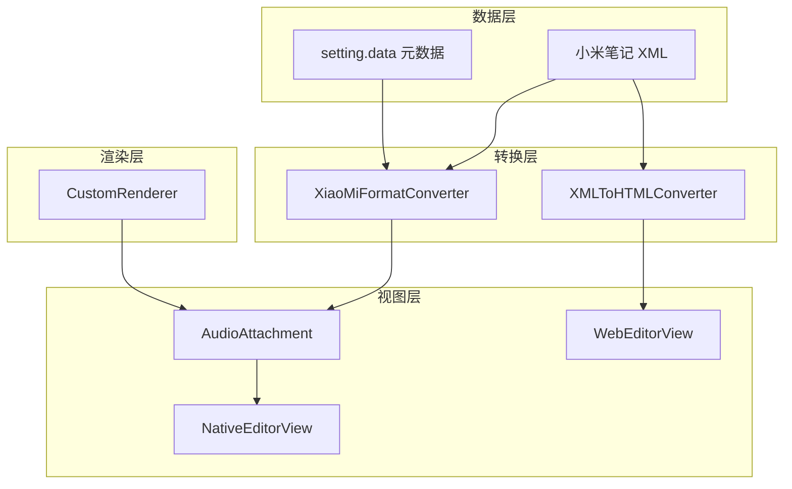

# 设计文档

## 概述

本设计文档描述了小米笔记 macOS 客户端中语音文件（录音）支持功能的技术实现方案。该功能允许用户查看笔记中的语音文件占位符，并支持删除操作。

### 背景

小米笔记的语音文件在 XML 中以 `<sound fileid="xxx" />` 格式存储。笔记的 `setting.data` 字段包含所有附件的元数据，包括：
- `digest`: 文件摘要/哈希值（如 `abb060f90b04a56a51af80963c2e64104f1065cd.mp3`）
- `mimeType`: MIME 类型（如 `audio/mp3`）
- `fileId`: 文件唯一标识符（如 `1315204657.L-BDaSuaT0rAqtMLCX3cfw`）

## 架构

### 组件关系图



### 数据流

```mermaid
sequenceDiagram
    participant Note as 笔记数据
    participant XFC as XiaoMiFormatConverter
    participant CR as CustomRenderer
    participant AA as AudioAttachment
    participant NE as NativeEditorView
    
    Note->>XFC: XML 内容 + setting.data
    XFC->>XFC: 解析 <sound> 标签
    XFC->>CR: 创建音频附件
    CR->>AA: 初始化 AudioAttachment
    AA->>NE: 渲染占位符
```

## 组件和接口

### 1. AudioAttachment 类

新增的自定义附件类，用于在 NSTextView 中显示语音文件占位符。

```swift
/// 语音文件附件 - 用于在 NSTextView 中显示语音文件占位符
final class AudioAttachment: NSTextAttachment, ThemeAwareAttachment {
    
    // MARK: - Properties
    
    /// 语音文件 ID
    var fileId: String?
    
    /// 文件摘要（digest）
    var digest: String?
    
    /// MIME 类型
    var mimeType: String?
    
    /// 是否为深色模式
    var isDarkMode: Bool
    
    /// 占位符尺寸
    var placeholderSize: NSSize
    
    // MARK: - Initialization
    
    /// 便捷初始化方法
    convenience init(fileId: String, digest: String? = nil, mimeType: String? = nil)
    
    // MARK: - NSTextAttachment Override
    
    override func image(forBounds imageBounds: CGRect,
                       textContainer: NSTextContainer?,
                       characterIndex charIndex: Int) -> NSImage?
    
    override func attachmentBounds(for textContainer: NSTextContainer?,
                                  proposedLineFragment lineFrag: CGRect,
                                  glyphPosition position: CGPoint,
                                  characterIndex charIndex: Int) -> CGRect
    
    // MARK: - ThemeAwareAttachment
    
    func updateTheme()
    
    // MARK: - Private Methods
    
    /// 创建占位符图像
    private func createPlaceholderImage() -> NSImage
    
    /// 绘制音频图标
    private func drawAudioIcon(in rect: CGRect, color: NSColor)
}
```

### 2. XiaoMiFormatConverter 扩展

在现有的格式转换器中添加语音文件解析和导出支持。

```swift
extension XiaoMiFormatConverter {
    
    // MARK: - Sound Element Parsing
    
    /// 处理 <sound> 元素并返回 NSAttributedString
    private func processSoundElementToNSAttributedString(_ line: String) throws -> NSAttributedString
    
    /// 从 XML 行中提取 sound 元素的 fileId
    private func extractSoundFileId(from line: String) -> String?
    
    // MARK: - Sound Element Export
    
    /// 将 AudioAttachment 转换为 XML
    private func convertAudioAttachmentToXML(_ attachment: AudioAttachment) -> String
}
```

### 3. CustomRenderer 扩展

在现有的渲染器中添加创建音频附件的方法。

```swift
extension CustomRenderer {
    
    /// 创建音频附件
    func createAudioAttachment(fileId: String, digest: String? = nil, mimeType: String? = nil) -> AudioAttachment
}
```

### 4. XMLToHTMLConverter 扩展

在 JavaScript 转换器中添加语音文件的 HTML 转换支持。

```javascript
class XMLToHTMLConverter {
    /**
     * 解析 <sound> 元素（语音文件）
     * @param {string} line - XML 行
     * @returns {string} HTML
     */
    parseSoundElement(line) {
        // 提取 fileid 属性
        const fileIdMatch = line.match(/fileid="([^"]+)"/);
        const fileId = fileIdMatch ? fileIdMatch[1] : '';
        
        return `<div class="mi-note-sound" data-fileid="${fileId}">
            <span class="sound-icon">🎤</span>
            <span class="sound-label">语音录音</span>
        </div>`;
    }
}
```

## 数据模型

### 语音文件元数据结构

```swift
/// 语音文件元数据
struct AudioFileMetadata {
    /// 文件 ID（唯一标识符）
    let fileId: String
    
    /// 文件摘要（哈希值，包含扩展名）
    let digest: String?
    
    /// MIME 类型
    let mimeType: String?
}
```

### XML 格式示例

```xml
<!-- 语音文件标签 -->
<sound fileid="1315204657.L-BDaSuaT0rAqtMLCX3cfw" />

<!-- setting.data 中的元数据 -->
{
    "data": [
        {
            "digest": "abb060f90b04a56a51af80963c2e64104f1065cd.mp3",
            "mimeType": "audio/mp3",
            "fileId": "1315204657.L-BDaSuaT0rAqtMLCX3cfw"
        }
    ]
}
```


## 正确性属性

*正确性属性是系统在所有有效执行中应该保持为真的特征或行为——本质上是关于系统应该做什么的形式化陈述。属性作为人类可读规范和机器可验证正确性保证之间的桥梁。*

### Property 1: Sound 标签解析正确性

*For any* 包含 `<sound fileid="xxx" />` 标签的有效 XML 内容，解析后应该：
1. 正确提取 fileId 属性值
2. 创建一个 AudioAttachment 对象
3. AudioAttachment 的 fileId 属性应该与 XML 中的值相等

**Validates: Requirements 1.1, 1.2**

### Property 2: Setting.data 元数据解析正确性

*For any* 包含语音文件元数据的有效 setting.data JSON，解析后应该正确提取：
1. fileId 字段
2. digest 字段
3. mimeType 字段

**Validates: Requirements 1.3**

### Property 3: 主题适配属性

*For any* AudioAttachment 实例，在深色模式和浅色模式下生成的占位符图像应该不同（颜色适配）

**Validates: Requirements 2.4**

### Property 4: XML 到 HTML 转换正确性

*For any* 包含 `<sound fileid="xxx" />` 标签的 XML 内容，转换为 HTML 后应该：
1. 包含 `mi-note-sound` 类的 div 元素
2. 包含 `data-fileid` 属性，值与原始 fileId 相等
3. 包含音频图标和"语音录音"文字

**Validates: Requirements 3.1, 3.2**

### Property 5: 删除后导出正确性

*For any* 包含 AudioAttachment 的 NSAttributedString，删除该附件后导出的 XML 不应该包含对应的 `<sound>` 标签

**Validates: Requirements 4.3, 4.4**

### Property 6: AudioAttachment 导出正确性

*For any* 包含 AudioAttachment 的 NSAttributedString，导出为 XML 时应该：
1. 生成 `<sound fileid="xxx" />` 格式的标签
2. fileId 属性值与 AudioAttachment 的 fileId 相等

**Validates: Requirements 5.1, 5.2**

### Property 7: 往返一致性（Round-trip）

*For any* 包含 `<sound>` 标签的有效 XML 内容，解析为 NSAttributedString 后再导出为 XML，应该产生语义等效的内容（fileId 值相同）

**Validates: Requirements 5.3**

## 错误处理

### 解析错误

| 错误场景 | 处理方式 |
|---------|---------|
| `<sound>` 标签缺少 fileid 属性 | 记录警告日志，跳过该元素，继续解析 |
| fileid 属性值为空 | 记录警告日志，跳过该元素 |
| XML 格式错误 | 抛出 ConversionError.invalidXML |
| setting.data JSON 解析失败 | 记录错误日志，使用空元数据继续 |

### 渲染错误

| 错误场景 | 处理方式 |
|---------|---------|
| 占位符图像创建失败 | 返回默认的错误占位符图像 |
| 主题检测失败 | 使用浅色模式作为默认值 |

## 测试策略

### 双重测试方法

本功能采用单元测试和属性测试相结合的方式：

- **单元测试**: 验证特定示例、边界情况和错误条件
- **属性测试**: 验证跨所有输入的通用属性

### 属性测试配置

- 使用 Swift 的 XCTest 框架
- 每个属性测试至少运行 100 次迭代
- 使用随机生成的 fileId 和 XML 内容

### 测试用例分类

1. **解析测试**
   - 正常 sound 标签解析
   - 缺少 fileid 属性的处理
   - 空 fileid 值的处理
   - 多个 sound 标签的解析

2. **导出测试**
   - AudioAttachment 到 XML 的转换
   - fileId 保留验证
   - 往返一致性测试

3. **渲染测试**
   - 占位符图像生成
   - 深色/浅色模式适配

4. **HTML 转换测试**
   - XML 到 HTML 的转换
   - HTML 结构验证
