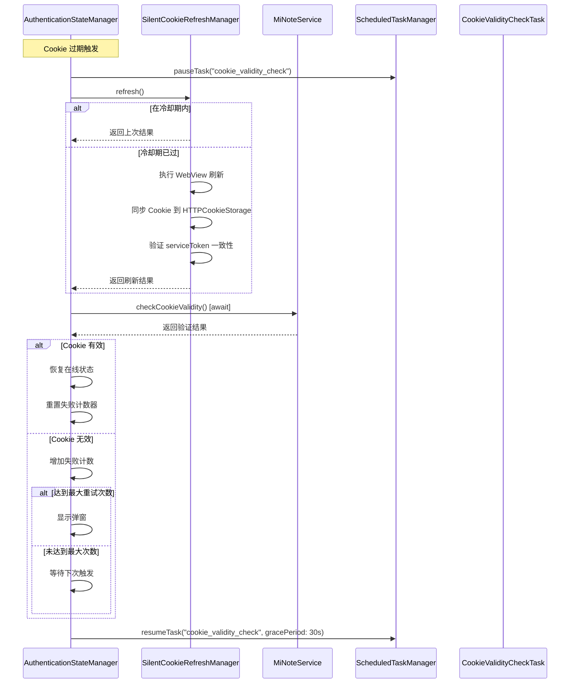

# Design Document: Cookie 静默刷新无限循环修复

## Overview

本设计文档描述了修复 Cookie 静默刷新无限循环问题的技术方案。问题的根本原因是：

1. **时序问题**：刷新成功后，`updateCookieValidityCache()` 是异步执行的，但 `restoreOnlineStatus()` 立即执行，此时 `isCookieValid` 还是旧值
2. **Cookie 同步问题**：WebView 中的 Cookie 可能没有正确同步到 URLSession 的 HTTPCookieStorage
3. **缺乏冷却机制**：没有防止短时间内重复刷新的机制
4. **状态恢复逻辑错误**：即使验证失败，也会打印"成功恢复在线状态"

## Architecture



## Components and Interfaces

### 1. SilentCookieRefreshManager 增强

```swift
@MainActor
final class SilentCookieRefreshManager: NSObject {
    // 新增：冷却期相关属性
    private var lastRefreshTime: Date?
    private var lastRefreshResult: Bool?
    private let cooldownPeriod: TimeInterval = 60.0  // 60秒冷却期
    
    // 新增：检查是否在冷却期内
    private func isInCooldownPeriod() -> Bool {
        guard let lastTime = lastRefreshTime else { return false }
        return Date().timeIntervalSince(lastTime) < cooldownPeriod
    }
    
    // 修改：refresh() 方法增加冷却期检查
    func refresh() async throws -> Bool {
        // 冷却期检查
        if isInCooldownPeriod() {
            print("[SilentCookieRefreshManager] 在冷却期内，返回上次结果")
            return lastRefreshResult ?? false
        }
        
        // ... 原有刷新逻辑 ...
        
        // 记录刷新时间和结果
        lastRefreshTime = Date()
        lastRefreshResult = success
        return success
    }
    
    // 新增：同步 Cookie 并验证一致性
    private func synchronizeCookiesAndVerify(cookies: [HTTPCookie]) async -> Bool {
        // 同步到 HTTPCookieStorage
        let cookieStore = HTTPCookieStorage.shared
        for cookie in cookies {
            cookieStore.setCookie(cookie)
        }
        
        // 验证 serviceToken 一致性
        let webViewServiceToken = extractServiceToken(from: cookies)
        let httpStorageServiceToken = extractServiceTokenFromHTTPStorage()
        
        return webViewServiceToken == httpStorageServiceToken && !webViewServiceToken.isEmpty
    }
    
    // 新增：重置冷却期（用于手动刷新）
    func resetCooldown() {
        lastRefreshTime = nil
        lastRefreshResult = nil
    }
}
```

### 2. AuthenticationStateManager 增强

```swift
@MainActor
class AuthenticationStateManager: ObservableObject {
    // 新增：连续失败计数
    private var consecutiveFailures: Int = 0
    private let maxConsecutiveFailures: Int = 3
    
    // 新增：刷新周期标志
    private var isInRefreshCycle: Bool = false
    
    // 修改：attemptSilentRefresh() 方法
    private func attemptSilentRefresh() async {
        // 防止重入
        guard !isInRefreshCycle else {
            print("[AuthenticationStateManager] 已在刷新周期中，跳过")
            return
        }
        
        isInRefreshCycle = true
        defer { isInRefreshCycle = false }
        
        // 暂停定时检查任务
        ScheduledTaskManager.shared.pauseTask("cookie_validity_check")
        
        do {
            let refreshSuccess = try await MiNoteService.shared.refreshCookie()
            
            if refreshSuccess {
                // 关键修复：同步等待验证完成
                let isValid = try await MiNoteService.shared.checkCookieValidity()
                
                if isValid {
                    // Cookie 确实有效，恢复在线状态
                    consecutiveFailures = 0
                    restoreOnlineStatusAfterValidation(isValid: true)
                    print("[AuthenticationStateManager] ✅ Cookie 刷新并验证成功")
                } else {
                    // 刷新成功但验证失败
                    handleRefreshSuccessButValidationFailed()
                }
            } else {
                handleRefreshFailure()
            }
        } catch {
            handleRefreshFailure()
        }
        
        // 恢复定时检查任务（带宽限期）
        ScheduledTaskManager.shared.resumeTask("cookie_validity_check", gracePeriod: 30.0)
    }
    
    // 新增：处理刷新成功但验证失败的情况
    private func handleRefreshSuccessButValidationFailed() {
        consecutiveFailures += 1
        print("[AuthenticationStateManager] ⚠️ 刷新成功但验证失败，失败次数: \(consecutiveFailures)")
        
        if consecutiveFailures >= maxConsecutiveFailures {
            print("[AuthenticationStateManager] ❌ 达到最大失败次数，显示弹窗")
            showCookieExpiredAlert = true
            // 不清除 cookieExpiredShown，保持离线状态
        }
        // 不打印"成功恢复在线状态"
    }
    
    // 新增：处理刷新失败
    private func handleRefreshFailure() {
        consecutiveFailures += 1
        print("[AuthenticationStateManager] ❌ 刷新失败，失败次数: \(consecutiveFailures)")
        
        if consecutiveFailures >= maxConsecutiveFailures {
            showCookieExpiredAlert = true
        }
    }
    
    // 新增：验证后恢复状态
    private func restoreOnlineStatusAfterValidation(isValid: Bool) {
        guard isValid else {
            print("[AuthenticationStateManager] Cookie 无效，不恢复在线状态")
            return
        }
        
        isCookieExpired = false
        cookieExpiredShown = false
        shouldStayOffline = false
        showCookieExpiredAlert = false
        isOnline = true
    }
    
    // 新增：手动刷新时重置计数器
    func handleManualRefresh() {
        consecutiveFailures = 0
        SilentCookieRefreshManager.shared.resetCooldown()
    }
}
```

### 3. ScheduledTaskManager 增强

```swift
@MainActor
class ScheduledTaskManager: ObservableObject {
    // 新增：暂停的任务集合
    private var pausedTasks: Set<String> = []
    
    // 新增：任务恢复时间
    private var taskResumeTime: [String: Date] = [:]
    
    // 新增：暂停任务
    func pauseTask(_ taskId: String) {
        guard let task = tasks[taskId] else { return }
        
        pausedTasks.insert(taskId)
        stopTask(taskId)
        print("[ScheduledTaskManager] 暂停任务: \(task.name)")
    }
    
    // 新增：恢复任务（带宽限期）
    func resumeTask(_ taskId: String, gracePeriod: TimeInterval = 0) {
        guard pausedTasks.contains(taskId) else { return }
        
        pausedTasks.remove(taskId)
        
        if gracePeriod > 0 {
            taskResumeTime[taskId] = Date().addingTimeInterval(gracePeriod)
            print("[ScheduledTaskManager] 任务 \(taskId) 将在 \(gracePeriod) 秒后恢复")
            
            Task {
                try? await Task.sleep(nanoseconds: UInt64(gracePeriod * 1_000_000_000))
                await MainActor.run {
                    if let task = self.tasks[taskId], task.enabled {
                        self.startTask(task)
                    }
                }
            }
        } else {
            if let task = tasks[taskId], task.enabled {
                startTask(task)
            }
        }
    }
    
    // 新增：检查任务是否暂停
    func isTaskPaused(_ taskId: String) -> Bool {
        return pausedTasks.contains(taskId)
    }
}
```

### 4. CookieValidityCheckTask 增强

```swift
final class CookieValidityCheckTask: ScheduledTask, ObservableObject {
    // 新增：检查是否应该跳过
    private func shouldSkipCheck() -> Bool {
        // 如果正在刷新中，跳过检查
        return SilentCookieRefreshManager.shared.isRefreshing
    }
    
    func execute() async -> TaskResult {
        // 检查是否应该跳过
        if shouldSkipCheck() {
            print("[CookieValidityCheckTask] 刷新进行中，跳过检查")
            return TaskResult(taskId: id, success: true, data: ["skipped": true], error: nil)
        }
        
        // ... 原有检查逻辑 ...
    }
}
```

## Data Models

### RefreshState 枚举

```swift
enum RefreshState {
    case idle                    // 空闲状态
    case refreshing              // 正在刷新
    case cooldown(until: Date)   // 冷却期中
    case failed(count: Int)      // 失败状态（带失败次数）
    case success                 // 成功状态
}
```

### RefreshResult 结构体

```swift
struct RefreshResult {
    let success: Bool
    let timestamp: Date
    let validationPassed: Bool
    let error: Error?
}
```

## Correctness Properties

*A property is a characteristic or behavior that should hold true across all valid executions of a system-essentially, a formal statement about what the system should do. Properties serve as the bridge between human-readable specifications and machine-verifiable correctness guarantees.*

### Property 1: 冷却期机制

*For any* refresh request, if the previous refresh completed within the cooldown period (60 seconds), the request SHALL be rejected and return the previous result; if the cooldown period has expired, the request SHALL be allowed and the completion timestamp SHALL be updated.

**Validates: Requirements 1.1, 1.2, 1.4**

### Property 2: 刷新后验证同步

*For any* successful refresh operation, the online status SHALL only be updated after the cookie validity check completes; if the validity check fails, no new refresh SHALL be triggered within the same refresh cycle.

**Validates: Requirements 2.1, 2.3, 2.4, 5.1**

### Property 3: Cookie 同步一致性

*For any* cookie extraction from WKWebView, the serviceToken in HTTPCookieStorage SHALL match the one extracted from WKWebView after synchronization; if synchronization fails, the refresh SHALL be reported as failed.

**Validates: Requirements 3.1, 3.2, 3.3, 3.4**

### Property 4: 失败计数与限制

*For any* sequence of refresh attempts, the consecutive failure counter SHALL increment on each failure and reset on success; when the counter reaches 3, automatic refresh attempts SHALL stop and the alert SHALL be displayed.

**Validates: Requirements 4.1, 4.2, 4.3, 4.4**

### Property 5: 状态恢复正确性

*For any* refresh completion, if the cookie is valid, isOnline SHALL be true and isCookieExpired SHALL be false; the cookieExpiredShown flag SHALL only be cleared when the cookie is actually valid.

**Validates: Requirements 5.2, 5.4**

### Property 6: 刷新与检查协调

*For any* refresh operation, the cookie validity check task SHALL be paused when refresh starts and resumed with a grace period when refresh completes; during refresh, scheduled checks SHALL be skipped.

**Validates: Requirements 6.1, 6.2, 6.3, 6.4**

## Error Handling

### 错误类型

```swift
enum CookieRefreshError: Error {
    case inCooldownPeriod(remainingSeconds: TimeInterval)
    case maxRetriesExceeded(attempts: Int)
    case cookieSyncFailed(reason: String)
    case validationFailed(serverResponse: String)
    case webViewError(underlying: Error)
    case networkError(underlying: Error)
}
```

### 错误处理策略

1. **冷却期内请求**：返回上次结果，不抛出错误
2. **达到最大重试次数**：停止自动刷新，显示弹窗，记录日志
3. **Cookie 同步失败**：标记刷新失败，增加失败计数
4. **验证失败**：不恢复在线状态，增加失败计数
5. **WebView 错误**：记录错误，增加失败计数
6. **网络错误**：记录错误，增加失败计数

## Testing Strategy

### 单元测试

1. **冷却期测试**
   - 测试冷却期内请求被拒绝
   - 测试冷却期过期后请求被允许
   - 测试时间戳正确记录

2. **失败计数测试**
   - 测试失败计数递增
   - 测试成功后计数重置
   - 测试达到最大次数后停止

3. **状态恢复测试**
   - 测试有效 Cookie 后状态正确
   - 测试无效 Cookie 后状态保持

### 属性测试

使用 Swift 的属性测试框架（如 SwiftCheck）验证上述 6 个正确性属性。

**测试配置**：
- 每个属性测试运行至少 100 次迭代
- 使用随机生成的时间间隔、Cookie 值和状态组合

**测试标签格式**：
- Feature: cookie-refresh-loop-fix, Property 1: 冷却期机制
- Feature: cookie-refresh-loop-fix, Property 2: 刷新后验证同步
- 等等
