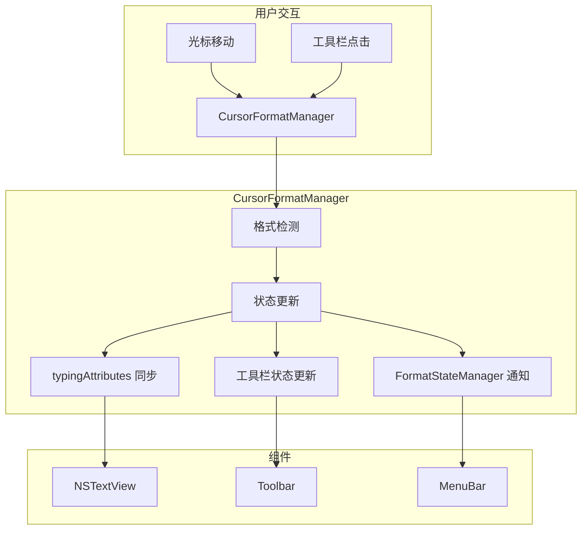

# 设计文档

## 概述

本设计文档描述了原生编辑器中光标位置格式状态同步功能的技术实现方案。核心目标是创建一个统一的 `CursorFormatManager` 来协调格式检测、工具栏同步和输入格式继承（typingAttributes）。

### 问题分析

当前实现存在以下问题：
1. `updateCurrentFormats()` 方法正确检测了光标前一个字符的格式状态
2. 但 NSTextView 的 `typingAttributes` 没有被同步更新
3. 导致新输入的文字使用默认格式而非继承前一个字符的格式

### 解决方案

创建 `CursorFormatManager` 作为统一的格式状态管理器，在光标位置变化时：
1. 检测光标前一个字符的格式属性
2. 更新工具栏按钮状态
3. 同步更新 NSTextView 的 `typingAttributes`

## 架构



## 组件和接口

### CursorFormatManager

统一的光标格式管理器，负责协调所有格式状态相关的操作。

```swift
/// 光标格式管理器
/// 统一管理光标位置的格式检测、工具栏同步和输入格式继承
/// _Requirements: 6.1, 6.2, 6.3, 6.4, 6.5, 6.6_
@MainActor
public final class CursorFormatManager {
    
    // MARK: - Singleton
    
    /// 共享实例
    public static let shared = CursorFormatManager()
    
    // MARK: - Properties
    
    /// 当前关联的 NSTextView（弱引用）
    private weak var textView: NSTextView?
    
    /// 当前关联的 NativeEditorContext（弱引用）
    private weak var editorContext: NativeEditorContext?
    
    /// 防抖定时器
    private var debounceTimer: Timer?
    
    /// 防抖间隔（毫秒）
    private let debounceInterval: TimeInterval = 0.05  // 50ms
    
    /// 当前检测到的格式状态
    private(set) var currentFormatState: FormatState = FormatState()
    
    // MARK: - Public Methods
    
    /// 注册编辑器组件
    /// - Parameters:
    ///   - textView: NSTextView 实例
    ///   - context: NativeEditorContext 实例
    func register(textView: NSTextView, context: NativeEditorContext)
    
    /// 取消注册
    func unregister()
    
    /// 处理光标位置变化
    /// - Parameter range: 新的选择范围
    /// _Requirements: 3.1, 6.2_
    func handleSelectionChange(_ range: NSRange)
    
    /// 处理工具栏格式切换
    /// - Parameter format: 要切换的格式
    /// _Requirements: 4.1-4.6, 6.3_
    func handleToolbarFormatToggle(_ format: TextFormat)
    
    /// 强制刷新格式状态
    func forceRefresh()
    
    // MARK: - Private Methods
    
    /// 检测光标位置的格式状态
    /// - Parameter position: 光标位置
    /// - Returns: 格式状态
    private func detectFormatState(at position: Int) -> FormatState
    
    /// 同步 typingAttributes
    /// - Parameter state: 格式状态
    /// _Requirements: 3.1, 3.4_
    private func syncTypingAttributes(with state: FormatState)
    
    /// 更新工具栏状态
    /// - Parameter state: 格式状态
    /// _Requirements: 1.1-1.6, 4.6_
    private func updateToolbarState(with state: FormatState)
    
    /// 通知 FormatStateManager
    /// - Parameter state: 格式状态
    /// _Requirements: 6.6_
    private func notifyFormatStateManager(with state: FormatState)
    
    /// 构建 typingAttributes 字典
    /// - Parameter state: 格式状态
    /// - Returns: 属性字典
    private func buildTypingAttributes(from state: FormatState) -> [NSAttributedString.Key: Any]
}
```

### 格式属性构建器

负责将 FormatState 转换为 NSAttributedString 属性字典。

```swift
/// 格式属性构建器
/// 将 FormatState 转换为 NSAttributedString 属性字典
struct FormatAttributesBuilder {
    
    /// 默认字体
    static let defaultFont = NSFont.systemFont(ofSize: 15)
    
    /// 默认文本颜色
    static let defaultTextColor = NSColor.labelColor
    
    /// 构建属性字典
    /// - Parameter state: 格式状态
    /// - Returns: 属性字典
    static func build(from state: FormatState) -> [NSAttributedString.Key: Any]
    
    /// 构建字体
    /// - Parameter state: 格式状态
    /// - Returns: 字体
    static func buildFont(from state: FormatState) -> NSFont
    
    /// 添加下划线属性
    /// - Parameters:
    ///   - attributes: 属性字典
    ///   - state: 格式状态
    static func addUnderlineAttributes(to attributes: inout [NSAttributedString.Key: Any], state: FormatState)
    
    /// 添加删除线属性
    /// - Parameters:
    ///   - attributes: 属性字典
    ///   - state: 格式状态
    static func addStrikethroughAttributes(to attributes: inout [NSAttributedString.Key: Any], state: FormatState)
    
    /// 添加高亮属性
    /// - Parameters:
    ///   - attributes: 属性字典
    ///   - state: 格式状态
    static func addHighlightAttributes(to attributes: inout [NSAttributedString.Key: Any], state: FormatState)
}
```

## 数据模型

### FormatState 扩展

现有的 FormatState 结构体已经包含了所需的格式状态信息，无需修改。

### 格式检测结果

```swift
/// 格式检测结果
struct FormatDetectionResult {
    /// 检测到的格式状态
    let state: FormatState
    
    /// 检测位置
    let position: Int
    
    /// 是否为光标模式（无选择）
    let isCursorMode: Bool
    
    /// 检测时间戳
    let timestamp: Date
}
```

## 正确性属性

*正确性属性是系统在所有有效执行中应保持为真的特征或行为。属性作为人类可读规范和机器可验证正确性保证之间的桥梁。*

### Property 1: 单一格式工具栏状态同步

*对于任意* 单一格式类型（加粗、斜体、下划线、删除线、高亮），当光标放置在该格式文字末尾且没有选中文字时，工具栏应显示对应格式按钮为激活状态。

**Validates: Requirements 1.1, 1.2, 1.3, 1.4, 1.5**

### Property 2: 多格式工具栏状态同步

*对于任意* 格式组合，当光标放置在具有多种格式的文字末尾时，工具栏应同时显示所有对应格式按钮为激活状态。

**Validates: Requirements 1.6**

### Property 3: 单一格式输入继承

*对于任意* 单一格式类型，当光标放置在该格式文字末尾且用户输入新字符时，新字符应继承该格式。

**Validates: Requirements 2.1, 2.2, 2.3, 2.4, 2.5**

### Property 4: 多格式输入继承

*对于任意* 格式组合，当光标放置在具有多种格式的文字末尾且用户输入新字符时，新字符应继承所有格式。

**Validates: Requirements 2.6**

### Property 5: typingAttributes 同步

*对于任意* 光标位置变化（无选择），typingAttributes 应更新为光标前一个字符的属性。

**Validates: Requirements 3.1**

### Property 6: 工具栏格式切换同步

*对于任意* 格式类型，当用户通过工具栏切换格式时，typingAttributes 应更新以反映新的格式状态，后续输入应应用该格式。

**Validates: Requirements 3.4, 4.1, 4.2, 4.3, 4.4, 4.5**

### Property 7: 格式交界处行为

*对于任意* 两种不同格式文字的交界处，当光标位于交界处时，应使用光标前一个字符的格式。

**Validates: Requirements 5.2, 5.3**

### Property 8: 统一管理器协调

*对于任意* 光标位置变化，CursorFormatManager 应自动执行格式检测、工具栏更新和 typingAttributes 同步三个操作。

**Validates: Requirements 6.2**

### Property 9: 防抖机制

*对于任意* 快速连续的光标位置变化，CursorFormatManager 应通过防抖机制合并更新，避免频繁的状态更新。

**Validates: Requirements 6.5**

### Property 10: FormatStateManager 集成

*对于任意* 格式状态变化，CursorFormatManager 应通知 FormatStateManager，确保菜单栏格式状态与工具栏一致。

**Validates: Requirements 6.6**

## 错误处理

### 边界条件

1. **文档开头（位置为 0）**：使用默认格式状态
2. **空文档**：使用默认格式状态
3. **格式检测失败**：使用默认格式状态并记录错误日志

### 错误恢复

```swift
/// 格式检测错误
enum FormatDetectionError: Error {
    case textViewUnavailable
    case textStorageEmpty
    case invalidPosition
    case attributeExtractionFailed
}

/// 错误处理
func handleDetectionError(_ error: FormatDetectionError) {
    // 记录错误日志
    print("[CursorFormatManager] 格式检测错误: \(error)")
    
    // 使用默认格式状态
    let defaultState = FormatState.default
    syncTypingAttributes(with: defaultState)
    updateToolbarState(with: defaultState)
    notifyFormatStateManager(with: defaultState)
}
```

## 测试策略

### 单元测试

1. **格式检测测试**：验证各种格式的正确检测
2. **属性构建测试**：验证 FormatState 到属性字典的转换
3. **边界条件测试**：验证空文档、文档开头等边界情况

### 属性测试

使用 Swift 的属性测试框架（如 SwiftCheck）验证正确性属性：

1. 生成随机格式文字
2. 模拟光标移动
3. 验证工具栏状态和 typingAttributes

### 集成测试

1. **端到端测试**：验证从光标移动到新字符输入的完整流程
2. **菜单栏同步测试**：验证菜单栏格式状态与工具栏一致

### 测试配置

- 每个属性测试最少运行 100 次迭代
- 使用 XCTest 框架
- 测试文件位置：`Tests/NativeEditorTests/CursorFormatSyncTests.swift`
