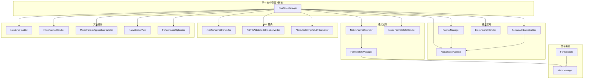
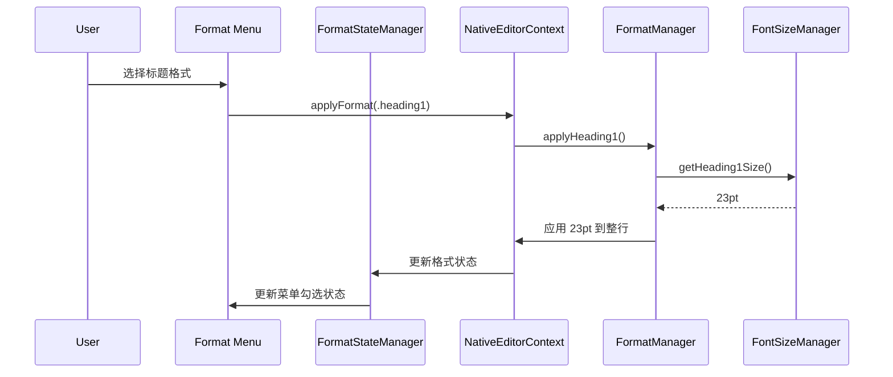

# Design Document: Font Size Refactor

## Overview

本设计文档描述了原生编辑器字体大小管理系统的重构方案。核心目标是创建一个统一的字体大小管理器（FontSizeManager），集中管理所有字体大小常量和相关逻辑，确保整个系统的一致性。

### 设计目标

1. **统一常量定义**：所有字体大小常量在一个地方定义
2. **标题不默认加粗**：标题格式使用常规字重
3. **行级属性**：字体大小作为行级属性，一行内保持统一
4. **格式菜单集成**：正确显示和应用字体大小
5. **XML 兼容性**：与小米笔记 XML 格式正确转换

### 当前问题分析

通过代码分析，发现以下文件中存在字体大小硬编码：

| 文件 | 当前值 | 问题 |
|------|--------|------|
| `FormatManager.swift` | H1=24, H2=20, H3=16, body=13 | 与目标值不一致 |
| `FormatAttributesBuilder.swift` | H1=22, H2=18, H3=16, body=13 | 与目标值不一致 |
| `BlockFormatHandler.swift` | H1=24, H2=20, H3=16, body=13 | 与目标值不一致 |
| `NativeEditorContext.swift` | 检测阈值: H1>=20, H2>=17, H3>=15 | 阈值与定义不匹配 |
| `NativeFormatProvider.swift` | 检测阈值: H1>=20, H2>=16, H3>=14 | 阈值与定义不匹配 |
| `MixedFormatStateHandler.swift` | 检测阈值: H1>=24, H2>=20, H3>=16 | 阈值与定义不匹配 |
| `CrossParagraphFormatHandler.swift` | H1=24, H2=20, H3=17 | 与其他文件不一致 |
| `XiaoMiFormatConverter.swift` | H1=24, H2=20, H3=16 | 使用加粗字重 |
| `ASTToAttributedStringConverter.swift` | H1=24, H2=20, H3=16 | 使用加粗字重 |
| `AttributedStringToASTConverter.swift` | 检测阈值: H1>=23.5, H2>=19.5, H3>=15.5 | 阈值与定义不匹配 |
| `NewLineHandler.swift` | body=13 | 需要更新为14 |
| `InlineFormatHandler.swift` | body=13 | 需要更新为14 |
| `NativeEditorView.swift` | body=13, list=15 | 需要更新 |
| `PerformanceOptimizer.swift` | 预加载字体使用旧值 | 需要更新 |
| `MixedFormatApplicationHandler.swift` | body=13 | 需要更新为14 |
| `SafeRenderer.swift` | body=14 | 已正确 |

### 需要修改的文件清单

**核心格式管理（必须修改）：**
1. `Sources/View/NativeEditor/Format/FormatManager.swift`
2. `Sources/View/Bridge/FormatAttributesBuilder.swift`
3. `Sources/View/NativeEditor/Format/BlockFormatHandler.swift`

**格式检测（必须修改）：**
4. `Sources/View/Bridge/NativeEditorContext.swift`
5. `Sources/View/NativeEditor/Format/NativeFormatProvider.swift`
6. `Sources/View/NativeEditor/Format/MixedFormatStateHandler.swift`
7. `Sources/View/NativeEditor/Format/CrossParagraphFormatHandler.swift`

**XML 转换（必须修改）：**
8. `Sources/Service/Editor/XiaoMiFormatConverter.swift`
9. `Sources/Service/Editor/Converter/ASTToAttributedStringConverter.swift`
10. `Sources/Service/Editor/Converter/AttributedStringToASTConverter.swift`

**其他格式处理（必须修改）：**
11. `Sources/View/NativeEditor/Format/NewLineHandler.swift`
12. `Sources/View/NativeEditor/Format/InlineFormatHandler.swift`
13. `Sources/View/NativeEditor/Format/MixedFormatApplicationHandler.swift`
14. `Sources/View/NativeEditor/Core/NativeEditorView.swift`
15. `Sources/View/NativeEditor/Performance/PerformanceOptimizer.swift`

## Architecture

### 组件关系图



### 数据流图



## Components and Interfaces

### FontSizeManager（新增）

新增的核心组件，负责统一管理字体大小常量和检测逻辑。

**文件位置**: `Sources/View/NativeEditor/Format/FontSizeManager.swift`

```swift
/// 字体大小管理器
/// 统一管理所有字体大小常量和检测逻辑
/// 
/// 字体大小规范：
/// - 大标题 (H1): 23pt
/// - 二级标题 (H2): 20pt
/// - 三级标题 (H3): 17pt
/// - 正文 (Body): 14pt
/// 
/// 检测阈值：
/// - H1: fontSize >= 23
/// - H2: 20 <= fontSize < 23
/// - H3: 17 <= fontSize < 20
/// - Body: fontSize < 17
@MainActor
public final class FontSizeManager {
    
    // MARK: - Singleton
    
    public static let shared = FontSizeManager()
    
    private init() {}
    
    // MARK: - 字体大小常量
    
    /// 大标题字体大小 (23pt)
    public let heading1Size: CGFloat = 23
    
    /// 二级标题字体大小 (20pt)
    public let heading2Size: CGFloat = 20
    
    /// 三级标题字体大小 (17pt)
    public let heading3Size: CGFloat = 17
    
    /// 正文字体大小 (14pt)
    public let bodySize: CGFloat = 14
    
    // MARK: - 检测阈值（与字体大小相同）
    
    /// 大标题检测阈值 (>= 23pt)
    public var heading1Threshold: CGFloat { heading1Size }
    
    /// 二级标题检测阈值 (>= 20pt, < 23pt)
    public var heading2Threshold: CGFloat { heading2Size }
    
    /// 三级标题检测阈值 (>= 17pt, < 20pt)
    public var heading3Threshold: CGFloat { heading3Size }
    
    // MARK: - 公共方法
    
    /// 根据段落格式获取字体大小
    /// - Parameter format: 段落格式
    /// - Returns: 对应的字体大小
    public func fontSize(for format: ParagraphFormat) -> CGFloat {
        switch format {
        case .heading1:
            return heading1Size
        case .heading2:
            return heading2Size
        case .heading3:
            return heading3Size
        default:
            return bodySize
        }
    }
    
    /// 根据标题级别获取字体大小
    /// - Parameter level: 标题级别 (1, 2, 3)
    /// - Returns: 对应的字体大小
    public func fontSize(for level: Int) -> CGFloat {
        switch level {
        case 1:
            return heading1Size
        case 2:
            return heading2Size
        case 3:
            return heading3Size
        default:
            return bodySize
        }
    }
    
    /// 根据字体大小检测段落格式
    /// - Parameter fontSize: 字体大小
    /// - Returns: 检测到的段落格式
    public func detectParagraphFormat(fontSize: CGFloat) -> ParagraphFormat {
        // 处理无效值
        guard fontSize > 0 else {
            return .body
        }
        
        // 使用统一的阈值检测
        if fontSize >= heading1Threshold {
            return .heading1
        } else if fontSize >= heading2Threshold {
            return .heading2
        } else if fontSize >= heading3Threshold {
            return .heading3
        } else {
            return .body
        }
    }
    
    /// 根据字体大小检测标题级别
    /// - Parameter fontSize: 字体大小
    /// - Returns: 标题级别 (0=正文, 1=H1, 2=H2, 3=H3)
    public func detectHeadingLevel(fontSize: CGFloat) -> Int {
        let format = detectParagraphFormat(fontSize: fontSize)
        switch format {
        case .heading1:
            return 1
        case .heading2:
            return 2
        case .heading3:
            return 3
        default:
            return 0
        }
    }
    
    /// 创建指定格式的字体（默认不加粗）
    /// - Parameters:
    ///   - format: 段落格式
    ///   - traits: 额外的字体特性（如加粗、斜体）
    /// - Returns: 创建的字体
    public func createFont(
        for format: ParagraphFormat,
        traits: NSFontDescriptor.SymbolicTraits = []
    ) -> NSFont {
        let size = fontSize(for: format)
        return createFont(ofSize: size, traits: traits)
    }
    
    /// 创建指定大小的字体
    /// - Parameters:
    ///   - size: 字体大小
    ///   - traits: 额外的字体特性
    /// - Returns: 创建的字体
    public func createFont(
        ofSize size: CGFloat,
        traits: NSFontDescriptor.SymbolicTraits = []
    ) -> NSFont {
        if traits.isEmpty {
            return NSFont.systemFont(ofSize: size, weight: .regular)
        }
        
        let baseFont = NSFont.systemFont(ofSize: size, weight: .regular)
        let descriptor = baseFont.fontDescriptor.withSymbolicTraits(traits)
        
        // 如果无法创建带特性的字体，返回基础字体
        return NSFont(descriptor: descriptor, size: size) ?? baseFont
    }
    
    /// 默认字体（正文大小，常规字重）
    public var defaultFont: NSFont {
        return createFont(for: .body)
    }
}
```

### FormatManager 修改

修改现有的 FormatManager，使用 FontSizeManager 获取字体大小。

**文件位置**: `Sources/View/NativeEditor/Format/FormatManager.swift`

**修改内容**:

```swift
// 修改前
var heading1Size: CGFloat = 24
var heading2Size: CGFloat = 20
var heading3Size: CGFloat = 16
var defaultFont: NSFont = NSFont.systemFont(ofSize: 13)

// 修改后 - 使用计算属性从 FontSizeManager 获取
var heading1Size: CGFloat { FontSizeManager.shared.heading1Size }  // 23
var heading2Size: CGFloat { FontSizeManager.shared.heading2Size }  // 20
var heading3Size: CGFloat { FontSizeManager.shared.heading3Size }  // 17
var defaultFont: NSFont { FontSizeManager.shared.defaultFont }     // 14pt

// 修改 applyHeadingStyle 方法，使用常规字重
private func applyHeadingStyle(
    to textStorage: NSTextStorage,
    range: NSRange,
    size: CGFloat,
    level: HeadingLevel = .none
) {
    let lineRange = (textStorage.string as NSString).lineRange(for: range)
    // 使用常规字重，不再使用 .bold/.semibold/.medium
    let font = NSFont.systemFont(ofSize: size, weight: .regular)
    
    textStorage.beginEditing()
    textStorage.addAttribute(.font, value: font, range: lineRange)
    
    if level != .none {
        textStorage.addAttribute(.headingLevel, value: level.rawValue, range: lineRange)
    }
    
    textStorage.endEditing()
}

// 修改 applyHeading1/2/3 方法，移除 weight 参数
func applyHeading1(to textStorage: NSTextStorage, range: NSRange) {
    applyHeadingStyle(to: textStorage, range: range, size: heading1Size, level: .h1)
}

func applyHeading2(to textStorage: NSTextStorage, range: NSRange) {
    applyHeadingStyle(to: textStorage, range: range, size: heading2Size, level: .h2)
}

func applyHeading3(to textStorage: NSTextStorage, range: NSRange) {
    applyHeadingStyle(to: textStorage, range: range, size: heading3Size, level: .h3)
}

// 修改 getHeadingLevel 方法，使用 FontSizeManager 的检测逻辑
func getHeadingLevel(in textStorage: NSTextStorage, at position: Int) -> Int {
    guard position < textStorage.length else { return 0 }
    
    if let font = textStorage.attribute(.font, at: position, effectiveRange: nil) as? NSFont {
        return FontSizeManager.shared.detectHeadingLevel(fontSize: font.pointSize)
    }
    
    return 0
}
```

### FormatAttributesBuilder 修改

**文件位置**: `Sources/View/Bridge/FormatAttributesBuilder.swift`

**修改内容**:

```swift
// 修改前
private static let heading1FontSize: CGFloat = 22
private static let heading2FontSize: CGFloat = 18
private static let heading3FontSize: CGFloat = 16
private static let bodyFontSize: CGFloat = 13
public static let defaultFont = NSFont.systemFont(ofSize: 13)

// 修改后 - 使用计算属性从 FontSizeManager 获取
private static var heading1FontSize: CGFloat { FontSizeManager.shared.heading1Size }  // 23
private static var heading2FontSize: CGFloat { FontSizeManager.shared.heading2Size }  // 20
private static var heading3FontSize: CGFloat { FontSizeManager.shared.heading3Size }  // 17
private static var bodyFontSize: CGFloat { FontSizeManager.shared.bodySize }          // 14
public static var defaultFont: NSFont { FontSizeManager.shared.defaultFont }          // 14pt
```

### BlockFormatHandler 修改

**文件位置**: `Sources/View/NativeEditor/Format/BlockFormatHandler.swift`

**修改内容**:

```swift
// 修改前
public static let heading1Size: CGFloat = 24
public static let heading2Size: CGFloat = 20
public static let heading3Size: CGFloat = 16
public static let bodyFontSize: CGFloat = 13
nonisolated(unsafe) public static let defaultFont: NSFont = NSFont.systemFont(ofSize: bodyFontSize)

// 修改后 - 使用计算属性从 FontSizeManager 获取
public static var heading1Size: CGFloat { FontSizeManager.shared.heading1Size }  // 23
public static var heading2Size: CGFloat { FontSizeManager.shared.heading2Size }  // 20
public static var heading3Size: CGFloat { FontSizeManager.shared.heading3Size }  // 17
public static var bodyFontSize: CGFloat { FontSizeManager.shared.bodySize }      // 14

// 注意：defaultFont 需要特殊处理，因为 FontSizeManager 是 MainActor 隔离的
// 使用 nonisolated(unsafe) 保持兼容性
nonisolated(unsafe) public static var defaultFont: NSFont = NSFont.systemFont(ofSize: 14)

// 修改 applyHeadingFormat 方法，使用常规字重
private static func applyHeadingFormat(
    level: Int,
    to lineRange: NSRange,
    in textStorage: NSTextStorage
) {
    let fontSize = FontSizeManager.shared.fontSize(for: level)
    // 使用常规字重，不再使用 .bold/.semibold/.medium
    let font = NSFont.systemFont(ofSize: fontSize, weight: .regular)
    
    textStorage.addAttribute(.font, value: font, range: lineRange)
    textStorage.addAttribute(.headingLevel, value: level, range: lineRange)
}
```

### NativeEditorContext 修改

**文件位置**: `Sources/View/Bridge/NativeEditorContext.swift`

**修改内容**:

```swift
// 修改 resetFontSizeToBody 方法，使用 FontSizeManager
private func resetFontSizeToBody() {
    let bodySize = FontSizeManager.shared.bodySize  // 14pt
    
    // ... 遍历选中范围，重置字体大小
    mutableText.enumerateAttribute(.font, in: range, options: []) { value, subRange, _ in
        if let font = value as? NSFont {
            let traits = font.fontDescriptor.symbolicTraits
            let newFont = FontSizeManager.shared.createFont(ofSize: bodySize, traits: traits)
            mutableText.addAttribute(.font, value: newFont, range: subRange)
        }
    }
}

// 修改 detectFontFormats 方法，使用 FontSizeManager 的检测逻辑
// 修改前
if fontSize >= 20 {
    formats.insert(.heading1)
} else if fontSize >= 17 && fontSize < 20 {
    formats.insert(.heading2)
} else if fontSize >= 15 && fontSize < 17 {
    formats.insert(.heading3)
}

// 修改后
let detectedFormat = FontSizeManager.shared.detectParagraphFormat(fontSize: fontSize)
switch detectedFormat {
case .heading1:
    formats.insert(.heading1)
case .heading2:
    formats.insert(.heading2)
case .heading3:
    formats.insert(.heading3)
default:
    break
}
```

### NativeFormatProvider 修改

**文件位置**: `Sources/View/NativeEditor/Format/NativeFormatProvider.swift`

**修改内容**:

```swift
// 修改 detectParagraphFormat 方法
private func detectParagraphFormat(
    from attributes: [NSAttributedString.Key: Any],
    textStorage: NSAttributedString,
    position: Int
) -> ParagraphFormat {
    // ... 其他检测逻辑 ...
    
    // 修改字体大小检测
    if let font = attributes[.font] as? NSFont {
        return FontSizeManager.shared.detectParagraphFormat(fontSize: font.pointSize)
    }
    
    return .body
}
```

### MixedFormatStateHandler 修改

**文件位置**: `Sources/View/NativeEditor/Format/MixedFormatStateHandler.swift`

**修改内容**:

```swift
// 修改字体大小检测逻辑
if let font = attributes[.font] as? NSFont {
    let detectedFormat = FontSizeManager.shared.detectParagraphFormat(fontSize: font.pointSize)
    switch detectedFormat {
    case .heading1:
        currentFormats.insert(.heading1)
        toolbarButtonStates[.heading1] = true
    case .heading2:
        currentFormats.insert(.heading2)
        toolbarButtonStates[.heading2] = true
    case .heading3:
        currentFormats.insert(.heading3)
        toolbarButtonStates[.heading3] = true
    default:
        break
    }
}
```

### CrossParagraphFormatHandler 修改

**文件位置**: `Sources/View/NativeEditor/Format/CrossParagraphFormatHandler.swift`

**修改内容**:

```swift
// 修改前
let fontSize: CGFloat
switch level {
case 1: fontSize = 24
case 2: fontSize = 20
case 3: fontSize = 17
default: fontSize = 15
}

// 修改后
let fontSize = FontSizeManager.shared.fontSize(for: level)
```

### XiaoMiFormatConverter 修改

**文件位置**: `Sources/Service/Editor/XiaoMiFormatConverter.swift`

**修改内容**:

```swift
// 修改 processRichTextTags 中的标签映射
// 修改前
let tagMappings: [(tag: String, attribute: NSAttributedString.Key, value: Any)] = [
    ("size", .font, NSFont.systemFont(ofSize: 24, weight: .bold)),
    ("mid-size", .font, NSFont.systemFont(ofSize: 20, weight: .semibold)),
    ("h3-size", .font, NSFont.systemFont(ofSize: 16, weight: .medium)),
    // ...
]

// 修改后 - 使用 FontSizeManager 并移除加粗
let tagMappings: [(tag: String, attribute: NSAttributedString.Key, value: Any)] = [
    ("size", .font, FontSizeManager.shared.createFont(for: .heading1)),      // 23pt, regular
    ("mid-size", .font, FontSizeManager.shared.createFont(for: .heading2)),  // 20pt, regular
    ("h3-size", .font, FontSizeManager.shared.createFont(for: .heading3)),   // 17pt, regular
    // ...
]

// 修改 processNSAttributesToXMLTags 中的标题检测
// 修改前
if fontSize >= 24 {
    headingTag = "size"
} else if fontSize >= 20 {
    headingTag = "mid-size"
} else if fontSize >= 16 && fontSize < 20 {
    headingTag = "h3-size"
}

// 修改后
let detectedFormat = FontSizeManager.shared.detectParagraphFormat(fontSize: fontSize)
switch detectedFormat {
case .heading1:
    headingTag = "size"
case .heading2:
    headingTag = "mid-size"
case .heading3:
    headingTag = "h3-size"
default:
    break
}
```

### ASTToAttributedStringConverter 修改

**文件位置**: `Sources/Service/Editor/Converter/ASTToAttributedStringConverter.swift`

**修改内容**:

```swift
// 修改初始化中的默认字体
// 修改前
self.defaultFont = NSFont.systemFont(ofSize: 14)

// 修改后
self.defaultFont = FontSizeManager.shared.defaultFont  // 14pt

// 修改 attributesForFormat 方法
// 修改前
case .heading1:
    attributes[.fontSize] = 24.0
    attributes[.fontWeight] = NSFont.Weight.bold
    
case .heading2:
    attributes[.fontSize] = 20.0
    attributes[.fontWeight] = NSFont.Weight.semibold
    
case .heading3:
    attributes[.fontSize] = 16.0
    attributes[.fontWeight] = NSFont.Weight.medium

// 修改后 - 使用 FontSizeManager 并移除加粗
case .heading1:
    attributes[.fontSize] = FontSizeManager.shared.heading1Size  // 23
    // 不设置 fontWeight，使用默认的 regular
    
case .heading2:
    attributes[.fontSize] = FontSizeManager.shared.heading2Size  // 20
    
case .heading3:
    attributes[.fontSize] = FontSizeManager.shared.heading3Size  // 17
```

### AttributedStringToASTConverter 修改

**文件位置**: `Sources/Service/Editor/Converter/AttributedStringToASTConverter.swift`

**修改内容**:

```swift
// 修改标题检测逻辑
// 修改前
let isHeading = fontSize >= 15.5
if fontSize >= 23.5 && fontSize <= 24.5 {
    formats.insert(.heading1)
} else if fontSize >= 19.5 && fontSize <= 20.5 {
    formats.insert(.heading2)
} else if fontSize >= 15.5 && fontSize <= 16.5 {
    formats.insert(.heading3)
}

// 修改后 - 使用 FontSizeManager 的检测逻辑
let detectedFormat = FontSizeManager.shared.detectParagraphFormat(fontSize: fontSize)
let isHeading = detectedFormat.isHeading

switch detectedFormat {
case .heading1:
    formats.insert(.heading1)
case .heading2:
    formats.insert(.heading2)
case .heading3:
    formats.insert(.heading3)
default:
    break
}
```

### 其他组件修改

#### NewLineHandler 修改

**文件位置**: `Sources/View/NativeEditor/Format/NewLineHandler.swift`

```swift
// 修改前
nonisolated(unsafe) public static let defaultFont: NSFont = NSFont.systemFont(ofSize: 13)

// 修改后
nonisolated(unsafe) public static var defaultFont: NSFont = NSFont.systemFont(ofSize: 14)
```

#### InlineFormatHandler 修改

**文件位置**: `Sources/View/NativeEditor/Format/InlineFormatHandler.swift`

```swift
// 修改前
nonisolated(unsafe) public static let defaultFont: NSFont = NSFont.systemFont(ofSize: 13)

// 修改后
nonisolated(unsafe) public static var defaultFont: NSFont = NSFont.systemFont(ofSize: 14)
```

#### MixedFormatApplicationHandler 修改

**文件位置**: `Sources/View/NativeEditor/Format/MixedFormatApplicationHandler.swift`

```swift
// 修改前
let font = (value as? NSFont) ?? NSFont.systemFont(ofSize: 13)

// 修改后
let font = (value as? NSFont) ?? FontSizeManager.shared.defaultFont
```

#### NativeEditorView 修改

**文件位置**: `Sources/View/NativeEditor/Core/NativeEditorView.swift`

```swift
// 修改默认字体
// 修改前
textView.font = NSFont.systemFont(ofSize: 13)

// 修改后
textView.font = FontSizeManager.shared.defaultFont  // 14pt

// 修改列表项字体大小
// 修改前
.font: NSFont.systemFont(ofSize: 15)

// 修改后
.font: FontSizeManager.shared.defaultFont  // 14pt
```

#### PerformanceOptimizer 修改

**文件位置**: `Sources/View/NativeEditor/Performance/PerformanceOptimizer.swift`

```swift
// 修改预加载字体
// 修改前
_ = NSFont.systemFont(ofSize: 13)
_ = NSFont.systemFont(ofSize: 24, weight: .bold)
_ = NSFont.systemFont(ofSize: 20, weight: .semibold)
_ = NSFont.systemFont(ofSize: 16, weight: .medium)

// 修改后
_ = FontSizeManager.shared.createFont(for: .body)
_ = FontSizeManager.shared.createFont(for: .heading1)
_ = FontSizeManager.shared.createFont(for: .heading2)
_ = FontSizeManager.shared.createFont(for: .heading3)

// 修改默认字体设置
// 修改前
textView.font = NSFont.systemFont(ofSize: 13)

// 修改后
textView.font = FontSizeManager.shared.defaultFont
```

## Data Models

### ParagraphFormat 扩展

为 ParagraphFormat 添加字体大小相关的便捷方法。

```swift
extension ParagraphFormat {
    /// 获取该格式对应的字体大小
    public var fontSize: CGFloat {
        return FontSizeManager.shared.fontSize(for: self)
    }
    
    /// 是否是标题格式
    public var isHeading: Bool {
        switch self {
        case .heading1, .heading2, .heading3:
            return true
        default:
            return false
        }
    }
}
```

### HeadingLevel 扩展

为 HeadingLevel 添加字体大小相关的便捷方法。

```swift
extension HeadingLevel {
    /// 获取该标题级别对应的字体大小
    public var fontSize: CGFloat {
        switch self {
        case .h1:
            return FontSizeManager.shared.heading1Size
        case .h2:
            return FontSizeManager.shared.heading2Size
        case .h3:
            return FontSizeManager.shared.heading3Size
        case .none:
            return FontSizeManager.shared.bodySize
        }
    }
    
    /// 从字体大小创建标题级别
    public static func from(fontSize: CGFloat) -> HeadingLevel {
        let format = FontSizeManager.shared.detectParagraphFormat(fontSize: fontSize)
        switch format {
        case .heading1:
            return .h1
        case .heading2:
            return .h2
        case .heading3:
            return .h3
        default:
            return .none
        }
    }
}
```

## Correctness Properties

*A property is a characteristic or behavior that should hold true across all valid executions of a system-essentially, a formal statement about what the system should do. Properties serve as the bridge between human-readable specifications and machine-verifiable correctness guarantees.*

### Property 1: Heading format uses regular weight

*For any* heading level (H1, H2, H3) and any text content, applying the heading format SHALL result in a font with regular weight (not bold).

**Validates: Requirements 2.1, 2.2, 2.3**

### Property 2: Bold format preservation with heading

*For any* text with heading format, applying bold format SHALL preserve both the heading font size and add bold weight.

**Validates: Requirements 2.4**

### Property 3: Format detection consistency

*For any* text with a specific paragraph format (heading1, heading2, heading3, body), detecting the format at any cursor position within that text SHALL return the correct format.

**Validates: Requirements 3.1, 3.2, 3.3, 3.4**

### Property 4: Format application applies correct size to entire line

*For any* paragraph format and any cursor position or selection within a line, applying the format SHALL set the correct font size (23pt for H1, 20pt for H2, 17pt for H3, 14pt for body) for the entire line.

**Validates: Requirements 4.1, 4.2, 4.3, 4.4, 5.1, 5.2, 5.4**

### Property 5: Character format preservation

*For any* text with existing character formats (bold, italic, underline, strikethrough, highlight), applying a paragraph format (heading or body) SHALL preserve all character formats.

**Validates: Requirements 4.5**

### Property 6: Line font size uniformity invariant

*For any* line in the document, all characters in that line SHALL have the same font size.

**Validates: Requirements 5.3**

### Property 7: Detection threshold consistency

*For any* font size value, the detection result SHALL be:
- heading1 if fontSize >= 23
- heading2 if 20 <= fontSize < 23
- heading3 if 17 <= fontSize < 20
- body if fontSize < 17

**Validates: Requirements 6.2, 6.3, 6.4, 6.5**

### Property 8: XML heading tag output

*For any* text with heading format, converting to XML SHALL output the correct tag:
- `<size>` for heading1
- `<mid-size>` for heading2
- `<h3-size>` for heading3

**Validates: Requirements 7.1, 7.2, 7.3**

### Property 9: XML heading tag parsing

*For any* XML with heading tags, parsing SHALL apply the correct font size:
- 23pt for `<size>`
- 20pt for `<mid-size>`
- 17pt for `<h3-size>`

**Validates: Requirements 7.4, 7.5, 7.6**

### Property 10: XML round-trip consistency

*For any* valid NSAttributedString with heading formats, converting to XML and parsing back SHALL produce an equivalent NSAttributedString (same font sizes and heading levels).

**Validates: Requirements 7.7**

### Property 11: Enter at line end creates body format

*For any* line with any paragraph format, pressing Enter at the end of the line SHALL create a new line with body format (14pt font size).

**Validates: Requirements 8.1, 8.3**

### Property 12: Enter in middle preserves heading format

*For any* line with heading format, pressing Enter in the middle of the line SHALL preserve the heading format for both resulting lines.

**Validates: Requirements 8.2**

## Error Handling

### 字体创建失败

当系统字体不可用时，使用默认字体作为后备：

```swift
func createFont(for format: ParagraphFormat, traits: NSFontDescriptor.SymbolicTraits = []) -> NSFont {
    let size = fontSize(for: format)
    
    if traits.isEmpty {
        return NSFont.systemFont(ofSize: size, weight: .regular)
    }
    
    let baseFont = NSFont.systemFont(ofSize: size, weight: .regular)
    let descriptor = baseFont.fontDescriptor.withSymbolicTraits(traits)
    
    // 如果无法创建带特性的字体，返回基础字体
    return NSFont(descriptor: descriptor, size: size) ?? baseFont
}
```

### 字体大小检测边界情况

处理无效或极端的字体大小值：

```swift
func detectParagraphFormat(fontSize: CGFloat) -> ParagraphFormat {
    // 处理无效值
    guard fontSize > 0 else {
        return .body
    }
    
    // 使用统一的阈值检测
    if fontSize >= heading1Threshold {
        return .heading1
    } else if fontSize >= heading2Threshold {
        return .heading2
    } else if fontSize >= heading3Threshold {
        return .heading3
    } else {
        return .body
    }
}
```

### XML 转换错误处理

当 XML 转换失败时，保留原始内容：

```swift
func safeConvertToXML(_ attributedString: NSAttributedString) -> String {
    do {
        return try nsAttributedStringToXML(attributedString)
    } catch {
        print("[XiaoMiFormatConverter] 转换失败: \(error)")
        // 返回纯文本作为后备
        return "<text indent=\"1\">\(escapeXMLCharacters(attributedString.string))</text>"
    }
}
```

## Testing Strategy

### 单元测试

1. **FontSizeManager 常量测试**
   - 验证所有字体大小常量的值
   - 验证检测阈值的正确性

2. **格式应用测试**
   - 验证标题格式使用常规字重
   - 验证字体大小正确应用到整行
   - 验证字符格式保留

3. **格式检测测试**
   - 验证各种字体大小的检测结果
   - 验证边界值的处理

4. **XML 转换测试**
   - 验证标题标签的输出
   - 验证标题标签的解析
   - 验证字体大小的正确性

### 属性测试

使用 Swift 的属性测试框架（如 SwiftCheck）实现以下属性测试：

1. **Property 1: Heading format weight**
   - 生成随机文本和标题级别
   - 应用标题格式
   - 验证字体字重为常规

2. **Property 6: Line uniformity invariant**
   - 生成随机文档
   - 执行随机格式操作
   - 验证每行字体大小统一

3. **Property 10: XML round-trip**
   - 生成随机 NSAttributedString
   - 转换为 XML
   - 解析回 NSAttributedString
   - 验证等价性

### 测试配置

- 每个属性测试运行至少 100 次迭代
- 使用 XCTest 框架
- 测试文件位于 `Tests/NativeEditorTests/`

