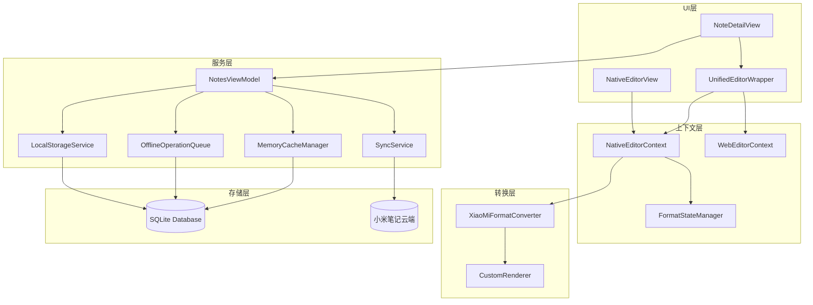

# 设计文档

## 概述

本设计文档描述了原生编辑器内容持久化和同步功能的技术实现方案。核心目标是确保原生编辑器（Native Editor）具有与 Web 编辑器同等的数据持久化能力，包括内容加载、保存、云端同步和离线操作支持。

## 架构

### 整体架构图



## 组件和接口

### 1. NativeEditorContext（原生编辑器上下文）

负责管理原生编辑器的状态和操作。

```swift
@MainActor
public class NativeEditorContext: ObservableObject {
    /// 当前编辑的 NSAttributedString
    @Published var nsAttributedText: NSAttributedString
    
    /// 是否有未保存的更改
    @Published var hasUnsavedChanges: Bool
    
    /// 从 XML 加载内容
    func loadFromXML(_ xml: String)
    
    /// 导出为 XML
    func exportToXML() -> String
    
    /// 内容变化发布者
    var contentChangePublisher: AnyPublisher<NSAttributedString, Never>
}
```

### 2. XiaoMiFormatConverter（格式转换器）

负责 NSAttributedString 与小米笔记 XML 格式之间的双向转换。

```swift
@MainActor
class XiaoMiFormatConverter {
    /// XML → NSAttributedString
    func xmlToNSAttributedString(_ xml: String, folderId: String?) throws -> NSAttributedString
    
    /// NSAttributedString → XML
    func nsAttributedStringToXML(_ nsAttributedString: NSAttributedString) throws -> String
}
```

### 3. UnifiedEditorWrapper（统一编辑器包装器）

负责在原生编辑器和 Web 编辑器之间切换。

```swift
struct UnifiedEditorWrapper: View {
    @Binding var content: String
    @ObservedObject var nativeEditorContext: NativeEditorContext
    let onContentChange: (String, String?) -> Void
    
    private func handleNativeContentChange(_ attributedString: NSAttributedString)
}
```

## 数据模型

### 保存状态枚举

```swift
enum SaveStatus {
    case saved        // 已保存
    case saving       // 保存中
    case unsaved      // 未保存
    case error(String) // 保存失败
}
```

## 正确性属性

*正确性属性是系统应该满足的形式化规范。*

### Property 1: XML 往返一致性

*对于任意* 有效的小米笔记 XML 内容，解析为 NSAttributedString 后再导出为 XML，应该产生语义等效的 XML。

**Validates: Requirements 5.11**

### Property 2: 格式标签转换正确性

*对于任意* 包含格式化文本的 NSAttributedString，转换为 XML 后应该包含对应的格式标签。

**Validates: Requirements 5.2, 5.3, 5.4, 5.5, 5.6, 5.7**

### Property 3: 附件转换正确性

*对于任意* 包含附件的 NSAttributedString，转换为 XML 后应该包含对应的标签并保留所有必要属性。

**Validates: Requirements 5.8, 5.9, 5.10, 8.4**

### Property 4: 复选框状态保留

*对于任意* 包含复选框的 XML 内容，解析后复选框的 checked 属性应该与原始值一致。

**Validates: Requirements 1.4, 5.8**

### Property 5: 保存失败时内容保护

*对于任意* 保存操作失败的情况，用户编辑的内容应该被保留在内存中。

**Validates: Requirements 2.5, 9.1**

### Property 6: 离线队列操作顺序

*对于任意* 离线队列中的操作序列，网络恢复后应该按照添加顺序依次处理。

**Validates: Requirements 4.3**

### Property 7: 冲突解决策略

*对于任意* 本地和云端同时修改的笔记，系统应该使用时间戳比较策略解决冲突。

**Validates: Requirements 4.4**

### Property 8: 内存缓存更新及时性

*对于任意* 内容变化事件，内存缓存应该在内容变化后立即更新。

**Validates: Requirements 2.2**

## 错误处理

### 错误类型

```swift
enum ConversionError: Error {
    case invalidXML(String)
    case conversionFailed(Error)
    case unsupportedElement(String)
}
```

### 错误处理策略

1. **格式转换失败**：记录错误日志，尝试使用原始内容
2. **本地保存失败**：显示错误状态，保留编辑内容
3. **云端同步失败**：将操作加入离线队列

## 测试策略

### 单元测试

- 格式转换测试
- 附件处理测试
- 错误处理测试

### 属性测试

- 使用 XCTest 框架
- 每个属性测试至少运行 100 次迭代
- 标签格式: **Feature: native-editor-persistence, Property N: property_text**
