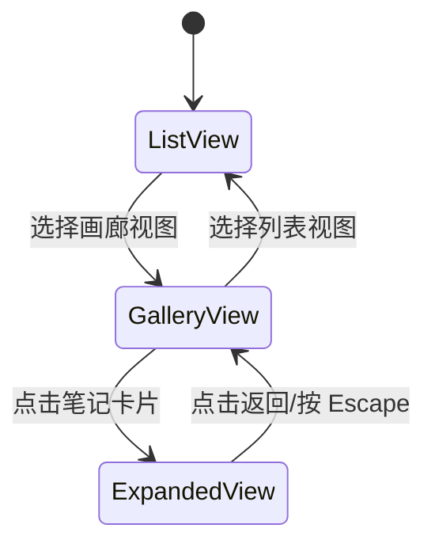

# 设计文档

## 概述

本设计文档描述笔记列表视图功能扩展的技术实现方案。该功能通过新增工具栏按钮提供视图选项菜单，支持排序方式选择、按日期分组开关、以及类似 Apple Notes 的画廊视图功能。

## 架构

### 整体架构

```
┌─────────────────────────────────────────────────────────────────┐
│                        MainWindowController                      │
│  ┌─────────────────────────────────────────────────────────────┐│
│  │                         Toolbar                              ││
│  │  [Sidebar] [NewNote] [Format] [ViewOptions] [Search] [Sync] ││
│  └─────────────────────────────────────────────────────────────┘│
│  ┌──────────┬──────────────────────────────────────────────────┐│
│  │ Sidebar  │              Content Area                         ││
│  │          │  ┌─────────────────────────────────────────────┐ ││
│  │          │  │  List Mode: NotesListView + NoteDetailView  │ ││
│  │          │  │  Gallery Mode: GalleryView (full width)     │ ││
│  │          │  │  Expanded Mode: ExpandedNoteView            │ ││
│  │          │  └─────────────────────────────────────────────┘ ││
│  └──────────┴──────────────────────────────────────────────────┘│
└─────────────────────────────────────────────────────────────────┘
```

### 视图模式状态机



## 组件和接口

### 1. ViewOptionsState（视图选项状态）

```swift
/// 视图模式枚举
/// _Requirements: 4.2, 4.3_
enum ViewMode: String, Codable {
    case list = "list"
    case gallery = "gallery"
}

/// 视图选项状态
/// 
/// 管理笔记列表的显示选项，包括排序方式、排序方向、日期分组和视图模式
/// _Requirements: 2.3, 2.7, 2.9, 3.3, 3.6, 4.7_
struct ViewOptionsState: Codable {
    /// 排序方式
    var sortOrder: NoteSortOrder
    
    /// 排序方向
    var sortDirection: SortDirection
    
    /// 是否启用日期分组
    var isDateGroupingEnabled: Bool
    
    /// 视图模式
    var viewMode: ViewMode
    
    /// 默认值
    static var `default`: ViewOptionsState {
        ViewOptionsState(
            sortOrder: .editDate,
            sortDirection: .descending,
            isDateGroupingEnabled: true,
            viewMode: .list
        )
    }
}
```

### 2. ViewOptionsManager（视图选项管理器）

```swift
/// 视图选项管理器
/// 
/// 负责管理和持久化视图选项状态
/// _Requirements: 2.9, 3.6, 4.7_
@MainActor
class ViewOptionsManager: ObservableObject {
    /// 单例实例
    static let shared = ViewOptionsManager()
    
    /// 当前视图选项状态
    @Published var state: ViewOptionsState
    
    /// 持久化键
    private let persistenceKey = "ViewOptionsState"
    
    /// 初始化，从 UserDefaults 加载状态
    init() {
        self.state = Self.loadState() ?? .default
    }
    
    /// 更新排序方式
    /// _Requirements: 2.3_
    func setSortOrder(_ order: NoteSortOrder) {
        state.sortOrder = order
        saveState()
    }
    
    /// 更新排序方向
    /// _Requirements: 2.7_
    func setSortDirection(_ direction: SortDirection) {
        state.sortDirection = direction
        saveState()
    }
    
    /// 切换日期分组
    /// _Requirements: 3.3, 3.4_
    func toggleDateGrouping() {
        state.isDateGroupingEnabled.toggle()
        saveState()
    }
    
    /// 设置视图模式
    /// _Requirements: 4.3_
    func setViewMode(_ mode: ViewMode) {
        state.viewMode = mode
        saveState()
    }
    
    /// 保存状态到 UserDefaults
    private func saveState() {
        if let data = try? JSONEncoder().encode(state) {
            UserDefaults.standard.set(data, forKey: persistenceKey)
        }
    }
    
    /// 从 UserDefaults 加载状态
    private static func loadState() -> ViewOptionsState? {
        guard let data = UserDefaults.standard.data(forKey: "ViewOptionsState"),
              let state = try? JSONDecoder().decode(ViewOptionsState.self, from: data) else {
            return nil
        }
        return state
    }
}
```

### 3. ViewOptionsMenuView（视图选项菜单视图）

```swift
/// 视图选项菜单视图
/// 
/// 显示排序方式、排序方向、日期分组和视图模式选项
/// _Requirements: 1.2, 2.1, 2.2, 2.6, 3.2, 4.2_
struct ViewOptionsMenuView: View {
    @ObservedObject var optionsManager: ViewOptionsManager
    @Binding var isPresented: Bool
    
    var body: some View {
        VStack(alignment: .leading, spacing: 0) {
            // 排序方式部分
            sortOrderSection
            
            Divider()
            
            // 排序方向部分
            sortDirectionSection
            
            Divider()
            
            // 日期分组部分
            dateGroupingSection
            
            Divider()
            
            // 视图模式部分
            viewModeSection
        }
        .frame(width: 200)
        .background(Color(NSColor.controlBackgroundColor))
        .cornerRadius(8)
        .shadow(radius: 4)
    }
    
    // 排序方式选项
    private var sortOrderSection: some View {
        VStack(alignment: .leading, spacing: 4) {
            Text("排序方式")
                .font(.caption)
                .foregroundColor(.secondary)
                .padding(.horizontal, 12)
                .padding(.top, 8)
            
            ForEach([NoteSortOrder.editDate, .createDate, .title], id: \.self) { order in
                MenuItemButton(
                    title: order.displayName,
                    isSelected: optionsManager.state.sortOrder == order
                ) {
                    optionsManager.setSortOrder(order)
                }
            }
        }
    }
    
    // 排序方向选项
    private var sortDirectionSection: some View {
        VStack(alignment: .leading, spacing: 4) {
            ForEach([SortDirection.ascending, .descending], id: \.self) { direction in
                MenuItemButton(
                    title: direction.displayName,
                    isSelected: optionsManager.state.sortDirection == direction
                ) {
                    optionsManager.setSortDirection(direction)
                }
            }
        }
        .padding(.vertical, 4)
    }
    
    // 日期分组选项
    private var dateGroupingSection: some View {
        MenuItemButton(
            title: "按日期分组",
            isSelected: optionsManager.state.isDateGroupingEnabled
        ) {
            optionsManager.toggleDateGrouping()
        }
        .padding(.vertical, 4)
    }
    
    // 视图模式选项
    private var viewModeSection: some View {
        VStack(alignment: .leading, spacing: 4) {
            ForEach([ViewMode.list, .gallery], id: \.self) { mode in
                MenuItemButton(
                    title: mode.displayName,
                    icon: mode.icon,
                    isSelected: optionsManager.state.viewMode == mode
                ) {
                    optionsManager.setViewMode(mode)
                    isPresented = false
                }
            }
        }
        .padding(.vertical, 4)
    }
}
```

### 4. NoteCardView（笔记卡片视图）

```swift
/// 笔记卡片视图
/// 
/// 画廊视图中的单个笔记预览卡片
/// _Requirements: 5.2, 5.3, 5.4_
struct NoteCardView: View {
    let note: Note
    let isSelected: Bool
    let onTap: () -> Void
    let onContextMenu: () -> Void
    
    @State private var isHovering = false
    @State private var thumbnailImage: NSImage?
    
    var body: some View {
        VStack(alignment: .leading, spacing: 8) {
            // 缩略图区域（如果有图片）
            if let thumbnail = thumbnailImage {
                Image(nsImage: thumbnail)
                    .resizable()
                    .aspectRatio(contentMode: .fill)
                    .frame(height: 120)
                    .clipped()
            }
            
            // 标题
            Text(note.title.isEmpty ? "无标题" : note.title)
                .font(.headline)
                .lineLimit(2)
                .foregroundColor(note.title.isEmpty ? .secondary : .primary)
            
            // 内容预览
            Text(extractPreviewText(from: note.content))
                .font(.subheadline)
                .foregroundColor(.secondary)
                .lineLimit(3)
            
            Spacer()
            
            // 日期
            Text(formatDate(note.updatedAt))
                .font(.caption)
                .foregroundColor(.secondary)
        }
        .padding(12)
        .frame(minWidth: 200, maxWidth: 300)
        .frame(height: 200)
        .background(Color(NSColor.controlBackgroundColor))
        .cornerRadius(12)
        .overlay(
            RoundedRectangle(cornerRadius: 12)
                .stroke(isSelected ? Color.accentColor : Color.clear, lineWidth: 2)
        )
        .overlay(
            // 锁定图标
            Group {
                if note.rawData?["isLocked"] as? Bool == true {
                    Image(systemName: "lock.fill")
                        .foregroundColor(.secondary)
                        .padding(8)
                }
            },
            alignment: .topTrailing
        )
        .shadow(color: isHovering ? Color.black.opacity(0.15) : Color.black.opacity(0.05), radius: isHovering ? 8 : 4)
        .scaleEffect(isHovering ? 1.02 : 1.0)
        .animation(.easeInOut(duration: 0.2), value: isHovering)
        .onHover { hovering in
            isHovering = hovering
            if hovering {
                // 预加载笔记内容
                preloadNoteContent()
            }
        }
        .onTapGesture {
            onTap()
        }
        .contextMenu {
            // 右键菜单（与列表视图相同）
        }
        .onAppear {
            loadThumbnail()
        }
    }
    
    private func loadThumbnail() {
        // 加载笔记中的第一张图片作为缩略图
        // 实现与 NoteRow 中的 loadThumbnail 类似
    }
    
    private func preloadNoteContent() {
        // 预加载笔记完整内容
        // _Requirements: 7.3_
    }
    
    private func extractPreviewText(from content: String) -> String {
        // 提取预览文本
    }
    
    private func formatDate(_ date: Date) -> String {
        // 格式化日期
    }
}
```

### 5. GalleryView（画廊视图）

```swift
/// 画廊视图
/// 
/// 以卡片网格形式展示笔记
/// _Requirements: 5.1, 5.5, 5.7, 5.8, 5.9_
struct GalleryView: View {
    @ObservedObject var viewModel: NotesViewModel
    @ObservedObject var optionsManager: ViewOptionsManager
    @Binding var expandedNote: Note?
    @Namespace private var animation
    
    private let columns = [
        GridItem(.adaptive(minimum: 200, maximum: 300), spacing: 16)
    ]
    
    var body: some View {
        ScrollViewReader { proxy in
            ScrollView {
                if optionsManager.state.isDateGroupingEnabled {
                    // 分组显示
                    groupedGalleryContent
                } else {
                    // 平铺显示
                    flatGalleryContent
                }
            }
            .onChange(of: viewModel.selectedNote?.id) { oldValue, newValue in
                // 滚动到选中的笔记
                if let noteId = newValue {
                    withAnimation {
                        proxy.scrollTo(noteId, anchor: .center)
                    }
                }
            }
        }
        .background(Color(NSColor.windowBackgroundColor))
    }
    
    private var flatGalleryContent: some View {
        LazyVGrid(columns: columns, spacing: 16) {
            ForEach(viewModel.filteredNotes) { note in
                NoteCardView(
                    note: note,
                    isSelected: viewModel.selectedNote?.id == note.id,
                    onTap: {
                        withAnimation(.easeInOut(duration: 0.35)) {
                            expandedNote = note
                            viewModel.selectedNote = note
                        }
                    },
                    onContextMenu: {}
                )
                .id(note.id)
                .matchedGeometryEffect(id: note.id, in: animation)
            }
        }
        .padding(16)
    }
    
    private var groupedGalleryContent: some View {
        LazyVStack(alignment: .leading, spacing: 24) {
            let groupedNotes = groupNotesByDate(viewModel.filteredNotes)
            let sectionOrder = ["置顶", "今天", "昨天", "本周", "本月", "本年"]
            
            // 固定顺序的分组
            ForEach(sectionOrder, id: \.self) { sectionKey in
                if let notes = groupedNotes[sectionKey], !notes.isEmpty {
                    sectionView(title: sectionKey, notes: notes)
                }
            }
            
            // 年份分组
            let yearGroups = groupedNotes.filter { !sectionOrder.contains($0.key) }
            ForEach(yearGroups.keys.sorted(by: >), id: \.self) { year in
                if let notes = yearGroups[year], !notes.isEmpty {
                    sectionView(title: year, notes: notes)
                }
            }
        }
        .padding(16)
    }
    
    private func sectionView(title: String, notes: [Note]) -> some View {
        VStack(alignment: .leading, spacing: 12) {
            Text(title)
                .font(.title2)
                .fontWeight(.semibold)
            
            LazyVGrid(columns: columns, spacing: 16) {
                ForEach(notes) { note in
                    NoteCardView(
                        note: note,
                        isSelected: viewModel.selectedNote?.id == note.id,
                        onTap: {
                            withAnimation(.easeInOut(duration: 0.35)) {
                                expandedNote = note
                                viewModel.selectedNote = note
                            }
                        },
                        onContextMenu: {}
                    )
                    .id(note.id)
                    .matchedGeometryEffect(id: note.id, in: animation)
                }
            }
        }
    }
    
    private func groupNotesByDate(_ notes: [Note]) -> [String: [Note]] {
        // 与 NotesListView 中的 groupNotesByDate 相同的实现
    }
}
```

### 6. ExpandedNoteView（展开笔记视图）

```swift
/// 展开笔记视图
/// 
/// 从画廊视图点击笔记后的全屏编辑模式
/// _Requirements: 6.1, 6.2, 6.3, 6.4, 6.5_
struct ExpandedNoteView: View {
    @ObservedObject var viewModel: NotesViewModel
    @Binding var expandedNote: Note?
    @Namespace var animation: Namespace.ID
    
    var body: some View {
        VStack(spacing: 0) {
            // 顶部工具栏
            HStack {
                Button(action: {
                    withAnimation(.easeInOut(duration: 0.35)) {
                        expandedNote = nil
                    }
                }) {
                    HStack(spacing: 4) {
                        Image(systemName: "chevron.left")
                        Text("返回")
                    }
                }
                .buttonStyle(.plain)
                .keyboardShortcut(.escape, modifiers: [])
                
                Spacer()
            }
            .padding(.horizontal, 16)
            .padding(.vertical, 8)
            .background(Color(NSColor.windowBackgroundColor))
            
            Divider()
            
            // 笔记编辑器
            if let note = expandedNote {
                NoteDetailView(viewModel: viewModel)
                    .matchedGeometryEffect(id: note.id, in: animation)
            }
        }
        .background(Color(NSColor.windowBackgroundColor))
    }
}
```

### 7. ContentAreaView（内容区域视图）

```swift
/// 内容区域视图
/// 
/// 根据视图模式显示不同的内容
/// _Requirements: 4.3, 4.4, 4.5_
struct ContentAreaView: View {
    @ObservedObject var viewModel: NotesViewModel
    @ObservedObject var optionsManager: ViewOptionsManager
    @State private var expandedNote: Note?
    @Namespace private var animation
    
    var body: some View {
        ZStack {
            switch optionsManager.state.viewMode {
            case .list:
                // 列表模式：笔记列表 + 编辑器
                HStack(spacing: 0) {
                    NotesListView(viewModel: viewModel)
                        .frame(minWidth: 200, maxWidth: 400)
                    
                    Divider()
                    
                    NoteDetailView(viewModel: viewModel)
                }
                
            case .gallery:
                if let note = expandedNote {
                    // 展开模式
                    ExpandedNoteView(
                        viewModel: viewModel,
                        expandedNote: $expandedNote,
                        animation: animation
                    )
                    .transition(.asymmetric(
                        insertion: .scale(scale: 0.9).combined(with: .opacity),
                        removal: .scale(scale: 0.9).combined(with: .opacity)
                    ))
                } else {
                    // 画廊模式
                    GalleryView(
                        viewModel: viewModel,
                        optionsManager: optionsManager,
                        expandedNote: $expandedNote
                    )
                }
            }
        }
        .animation(.easeInOut(duration: 0.35), value: expandedNote?.id)
    }
}
```

## 数据模型

### NoteSortOrder 扩展

```swift
extension NoteSortOrder {
    /// 显示名称
    var displayName: String {
        switch self {
        case .editDate: return "编辑时间"
        case .createDate: return "创建时间"
        case .title: return "标题"
        }
    }
}
```

### SortDirection 扩展

```swift
extension SortDirection {
    /// 显示名称
    var displayName: String {
        switch self {
        case .ascending: return "升序"
        case .descending: return "降序"
        }
    }
}
```

### ViewMode 扩展

```swift
extension ViewMode {
    /// 显示名称
    var displayName: String {
        switch self {
        case .list: return "列表视图"
        case .gallery: return "画廊视图"
        }
    }
    
    /// 图标
    var icon: String {
        switch self {
        case .list: return "list.bullet"
        case .gallery: return "square.grid.2x2"
        }
    }
}
```

## 正确性属性

*正确性属性是系统在所有有效执行中应该保持为真的特征或行为——本质上是关于系统应该做什么的形式化陈述。属性作为人类可读规范和机器可验证正确性保证之间的桥梁。*

### Property 1: 排序一致性

*对于任意*笔记列表和任意排序设置（排序方式 + 排序方向），排序后的列表应该严格按照指定的排序规则排列。

**验证: 需求 2.3, 2.7**

### Property 2: 设置持久化往返

*对于任意*视图选项设置（排序方式、排序方向、日期分组、视图模式），保存后重新加载应该得到完全相同的设置值。

**验证: 需求 2.9, 3.6, 4.7**

### Property 3: 日期分组正确性

*对于任意*笔记列表，当启用日期分组时，每个笔记应该出现在与其更新时间对应的正确日期分组中。

**验证: 需求 3.3**

### Property 4: 卡片内容完整性

*对于任意*笔记，其对应的卡片视图应该包含标题（或"无标题"）、内容预览和最后修改日期。

**验证: 需求 5.2**

### Property 5: 视图状态一致性

*对于任意*文件夹切换、搜索操作或视图模式切换，画廊视图显示的笔记集合应该与列表视图在相同条件下显示的笔记集合完全一致。

**验证: 需求 5.8, 8.1, 8.3, 8.4, 8.5**

### Property 6: 选择状态同步

*对于任意*笔记卡片点击操作，展开后 ViewModel 的 selectedNote 应该等于被点击的笔记。

**验证: 需求 6.6**

### Property 7: 数据变更反映

*对于任意*笔记的创建、更新或删除操作，画廊视图应该立即反映该变化（笔记出现、更新或消失）。

**验证: 需求 8.2**

## 错误处理

### 图片加载失败

当笔记卡片的缩略图加载失败时：
- 显示占位图标（photo 图标）
- 不影响卡片的其他内容显示
- 记录错误日志但不向用户显示错误

### 设置加载失败

当视图选项设置加载失败时：
- 使用默认设置值
- 记录警告日志
- 下次保存时覆盖损坏的数据

### 动画中断

当展开/收起动画被中断时（如快速连续点击）：
- 取消当前动画
- 直接跳转到目标状态
- 确保状态一致性

## 测试策略

### 单元测试

1. **ViewOptionsManager 测试**
   - 测试设置保存和加载
   - 测试默认值
   - 测试各种设置组合

2. **排序逻辑测试**
   - 测试各种排序方式
   - 测试升序/降序
   - 测试边界情况（空列表、单元素列表）

3. **日期分组逻辑测试**
   - 测试各种日期分组
   - 测试跨年份笔记
   - 测试置顶笔记分组

### 属性测试

使用 Swift 的 XCTest 框架进行属性测试，每个属性测试至少运行 100 次迭代。

1. **Property 1: 排序一致性测试**
   - 生成随机笔记列表
   - 应用随机排序设置
   - 验证排序结果符合规则

2. **Property 2: 设置持久化测试**
   - 生成随机设置值
   - 保存并重新加载
   - 验证值完全一致

3. **Property 3: 日期分组测试**
   - 生成随机日期的笔记
   - 验证每个笔记在正确的分组中

4. **Property 4: 卡片内容测试**
   - 生成随机笔记
   - 验证卡片包含所有必需信息

5. **Property 5: 视图状态一致性测试**
   - 生成随机文件夹和搜索条件
   - 验证两种视图显示相同的笔记集合

6. **Property 6: 选择状态同步测试**
   - 模拟随机笔记选择
   - 验证 ViewModel 状态正确更新

7. **Property 7: 数据变更反映测试**
   - 执行随机笔记操作
   - 验证视图正确反映变化

### 集成测试

1. **视图切换测试**
   - 测试列表视图到画廊视图的切换
   - 测试画廊视图到展开视图的切换
   - 测试状态保持

2. **工具栏交互测试**
   - 测试视图选项按钮点击
   - 测试菜单显示和隐藏
   - 测试菜单选项选择

