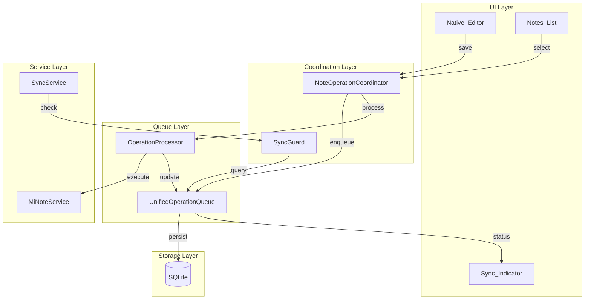
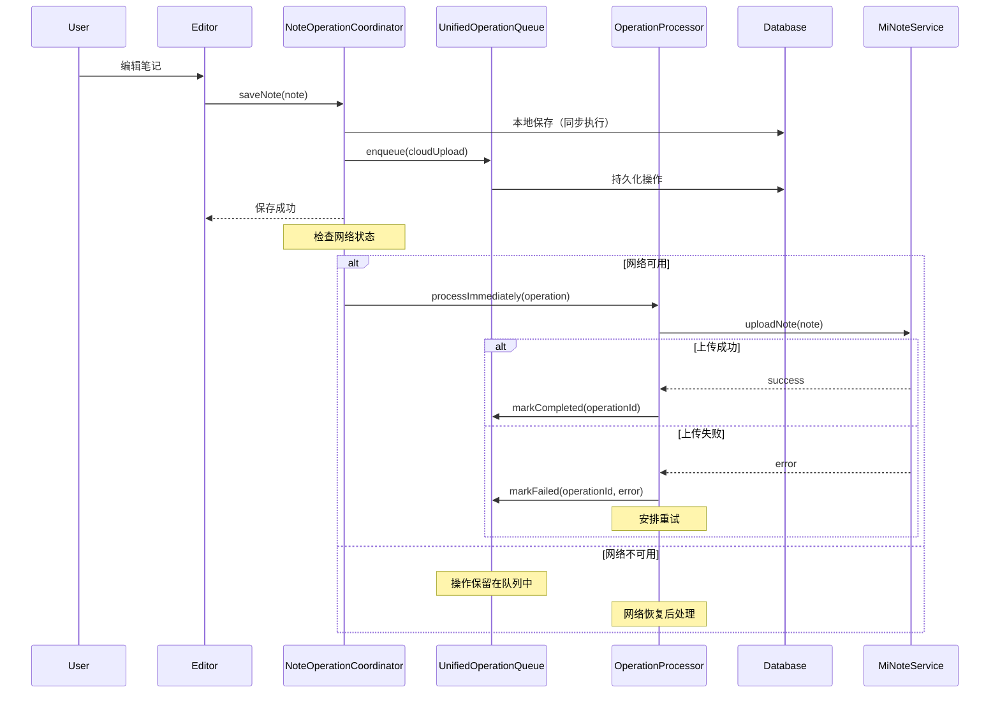
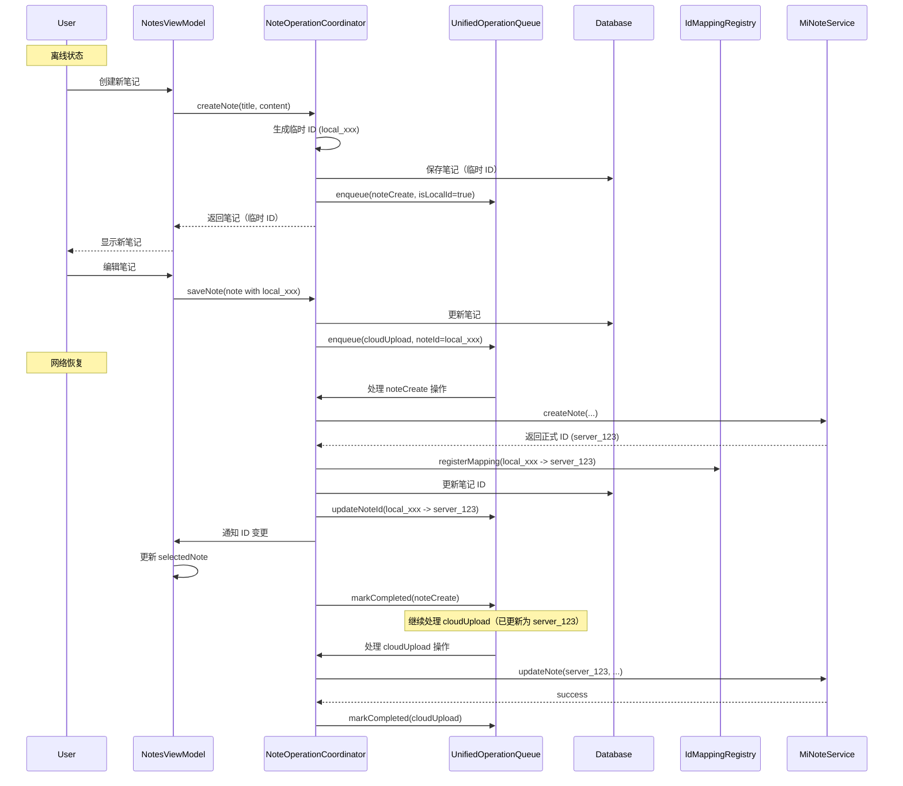

# 设计文档：操作队列重构

## 概述

本设计文档描述操作队列系统的重构方案。核心目标是将三个冗余组件合并为统一的 `UnifiedOperationQueue`，优化上传触发时机，并增强错误处理能力。

## 架构

### 重构前后对比

```
重构前：
┌─────────────────────┐  ┌──────────────────────┐  ┌─────────────────────┐
│  SaveQueueManager   │  │ PendingUploadRegistry│  │OfflineOperationQueue│
│     (内存)          │  │     (SQLite)         │  │     (SQLite)        │
└─────────────────────┘  └──────────────────────┘  └─────────────────────┘
         ↓                        ↓                        ↓
┌─────────────────────────────────────────────────────────────────────────┐
│                      NoteOperationCoordinator                           │
└─────────────────────────────────────────────────────────────────────────┘

重构后：
┌─────────────────────────────────────────────────────────────────────────┐
│                      UnifiedOperationQueue (SQLite)                     │
│  ┌─────────────┐  ┌─────────────┐  ┌─────────────┐  ┌─────────────┐    │
│  │ localSave   │  │ cloudUpload │  │ cloudDelete │  │ imageUpload │    │
│  └─────────────┘  └─────────────┘  └─────────────┘  └─────────────┘    │
└─────────────────────────────────────────────────────────────────────────┘
                                    ↓
┌─────────────────────────────────────────────────────────────────────────┐
│                      NoteOperationCoordinator (Actor)                   │
│  ┌─────────────────┐  ┌─────────────────┐  ┌─────────────────┐         │
│  │activeEditingNote│  │OperationProcessor│  │   SyncGuard     │         │
│  └─────────────────┘  └─────────────────┘  └─────────────────┘         │
└─────────────────────────────────────────────────────────────────────────┘
```

### 组件图



### 数据流图



## 数据模型

### NoteOperation（统一操作）

```swift
/// 笔记操作
public struct NoteOperation: Codable, Identifiable, Sendable {
    /// 操作 ID
    public let id: String
    
    /// 操作类型
    public let type: OperationType
    
    /// 笔记 ID（文件夹操作时为 folderId）
    /// 注意：可能是临时 ID（local_xxx）或正式 ID
    public var noteId: String
    
    /// 操作数据（JSON 编码）
    public let data: Data
    
    /// 创建时间
    public let createdAt: Date
    
    /// 本地保存时间戳（用于同步保护）
    public var localSaveTimestamp: Date?
    
    /// 操作状态
    public var status: OperationStatus
    
    /// 优先级（数字越大优先级越高）
    public var priority: Int
    
    /// 重试次数
    public var retryCount: Int
    
    /// 下次重试时间
    public var nextRetryAt: Date?
    
    /// 最后错误信息
    public var lastError: String?
    
    /// 错误类型
    public var errorType: ErrorType?
    
    /// 是否使用临时 ID（离线创建的笔记）
    public var isLocalId: Bool
    
    /// 检查是否为临时 ID
    static func isTemporaryId(_ id: String) -> Bool {
        return id.hasPrefix("local_")
    }
    
    /// 生成临时 ID
    static func generateTemporaryId() -> String {
        return "local_\(UUID().uuidString)"
    }
}

/// 操作类型
public enum OperationType: String, Codable, Sendable {
    case noteCreate       // 创建笔记（离线创建时使用）
    case cloudUpload      // 上传笔记到云端
    case cloudDelete      // 从云端删除笔记
    case imageUpload      // 上传图片
    case folderCreate     // 创建文件夹
    case folderRename     // 重命名文件夹
    case folderDelete     // 删除文件夹
}

/// 操作状态
public enum OperationStatus: String, Codable, Sendable {
    case pending          // 待处理
    case processing       // 处理中
    case completed        // 已完成
    case failed           // 失败（可重试）
    case authFailed       // 认证失败（需用户处理）
    case maxRetryExceeded // 超过最大重试次数
}

/// 错误类型
public enum ErrorType: String, Codable, Sendable {
    case network          // 网络错误（可重试）
    case timeout          // 超时（可重试）
    case serverError      // 服务器错误（可重试）
    case authExpired      // 认证过期（不可重试）
    case notFound         // 资源不存在（不可重试）
    case conflict         // 冲突（需特殊处理）
    case unknown          // 未知错误
}
```

### 数据库表结构

```sql
-- 统一操作队列表（替换 offline_operations 和 pending_uploads）
CREATE TABLE IF NOT EXISTS unified_operations (
    id TEXT PRIMARY KEY,
    type TEXT NOT NULL,
    note_id TEXT NOT NULL,
    data BLOB NOT NULL,
    created_at INTEGER NOT NULL,
    local_save_timestamp INTEGER,
    status TEXT NOT NULL DEFAULT 'pending',
    priority INTEGER NOT NULL DEFAULT 0,
    retry_count INTEGER NOT NULL DEFAULT 0,
    next_retry_at INTEGER,
    last_error TEXT,
    error_type TEXT,
    is_local_id INTEGER NOT NULL DEFAULT 0
);

-- 索引：按笔记 ID 查询
CREATE INDEX IF NOT EXISTS idx_unified_operations_note_id 
ON unified_operations(note_id);

-- 索引：按状态查询待处理操作
CREATE INDEX IF NOT EXISTS idx_unified_operations_status 
ON unified_operations(status) WHERE status IN ('pending', 'failed');

-- 索引：按重试时间查询
CREATE INDEX IF NOT EXISTS idx_unified_operations_retry 
ON unified_operations(next_retry_at) WHERE next_retry_at IS NOT NULL;

-- ID 映射表（临时 ID -> 正式 ID）
CREATE TABLE IF NOT EXISTS id_mappings (
    local_id TEXT PRIMARY KEY,
    server_id TEXT NOT NULL,
    entity_type TEXT NOT NULL,  -- 'note' 或 'folder'
    created_at INTEGER NOT NULL,
    completed INTEGER NOT NULL DEFAULT 0
);

-- 索引：按正式 ID 查询
CREATE INDEX IF NOT EXISTS idx_id_mappings_server_id 
ON id_mappings(server_id);
```

## 组件接口

### UnifiedOperationQueue

```swift
/// 统一操作队列
public final class UnifiedOperationQueue: @unchecked Sendable {
    public static let shared = UnifiedOperationQueue()
    
    // MARK: - 操作管理
    
    /// 添加操作（自动去重合并）
    func enqueue(_ operation: NoteOperation) throws -> NoteOperation
    
    /// 获取待处理操作（按优先级和时间排序）
    func getPendingOperations() -> [NoteOperation]
    
    /// 获取指定笔记的待处理上传操作
    func getPendingUpload(for noteId: String) -> NoteOperation?
    
    /// 检查笔记是否有待处理上传
    func hasPendingUpload(for noteId: String) -> Bool
    
    /// 获取本地保存时间戳
    func getLocalSaveTimestamp(for noteId: String) -> Date?
    
    // MARK: - 状态更新
    
    /// 标记操作为处理中
    func markProcessing(_ operationId: String) throws
    
    /// 标记操作完成
    func markCompleted(_ operationId: String) throws
    
    /// 标记操作失败
    func markFailed(_ operationId: String, error: Error, errorType: ErrorType) throws
    
    /// 安排重试
    func scheduleRetry(_ operationId: String, delay: TimeInterval) throws
    
    // MARK: - 查询
    
    /// 获取待上传笔记数量
    func getPendingUploadCount() -> Int
    
    /// 获取所有待上传笔记 ID
    func getAllPendingNoteIds() -> [String]
    
    /// 获取需要重试的操作
    func getOperationsReadyForRetry() -> [NoteOperation]
}
```

### OperationProcessor

```swift
/// 操作处理器
public actor OperationProcessor {
    // MARK: - 配置
    
    /// 最大重试次数
    private let maxRetryCount = 5
    
    /// 基础重试延迟（秒）
    private let baseRetryDelay: TimeInterval = 1.0
    
    /// 最大重试延迟（秒）
    private let maxRetryDelay: TimeInterval = 60.0
    
    // MARK: - 处理方法
    
    /// 立即处理操作（网络可用时调用）
    func processImmediately(_ operation: NoteOperation) async
    
    /// 处理队列中的待处理操作
    func processQueue() async
    
    /// 处理需要重试的操作
    func processRetries() async
    
    // MARK: - 错误处理
    
    /// 判断错误是否可重试
    func isRetryable(_ error: Error) -> Bool
    
    /// 计算重试延迟（指数退避）
    func calculateRetryDelay(retryCount: Int) -> TimeInterval
    
    /// 分类错误类型
    func classifyError(_ error: Error) -> ErrorType
}
```

### SyncGuard

```swift
/// 同步保护器
public struct SyncGuard: Sendable {
    private let queue: UnifiedOperationQueue
    private let coordinator: NoteOperationCoordinator
    
    /// 检查笔记是否应该跳过同步
    func shouldSkipSync(noteId: String, cloudTimestamp: Date) async -> Bool
    
    /// 获取跳过原因
    func getSkipReason(noteId: String, cloudTimestamp: Date) async -> SkipReason?
}

/// 跳过原因
public enum SkipReason: Sendable {
    case activelyEditing
    case pendingUpload
    case localNewer(localTimestamp: Date, cloudTimestamp: Date)
}
```

### IdMappingRegistry

```swift
/// ID 映射注册表
/// 
/// 管理临时 ID（离线创建）和正式 ID（云端下发）的映射关系
public final class IdMappingRegistry: @unchecked Sendable {
    public static let shared = IdMappingRegistry()
    
    // MARK: - 映射管理
    
    /// 注册 ID 映射
    /// - Parameters:
    ///   - localId: 临时 ID
    ///   - serverId: 云端下发的正式 ID
    ///   - entityType: 实体类型（note/folder）
    func registerMapping(localId: String, serverId: String, entityType: String) throws
    
    /// 获取正式 ID（如果有映射）
    /// - Parameter localId: 临时 ID
    /// - Returns: 正式 ID，如果没有映射则返回原 ID
    func resolveId(_ id: String) -> String
    
    /// 检查是否为临时 ID
    func isTemporaryId(_ id: String) -> Bool
    
    /// 获取映射关系
    func getMapping(for localId: String) -> IdMapping?
    
    // MARK: - 批量更新
    
    /// 更新所有引用临时 ID 的操作
    /// - Parameters:
    ///   - localId: 临时 ID
    ///   - serverId: 正式 ID
    func updateAllReferences(localId: String, serverId: String) async throws
    
    // MARK: - 清理
    
    /// 标记映射完成
    func markCompleted(localId: String) throws
    
    /// 清理已完成的映射（可选，延后执行）
    func cleanupCompletedMappings() throws
}

/// ID 映射记录
public struct IdMapping: Codable, Sendable {
    let localId: String
    let serverId: String
    let entityType: String
    let createdAt: Date
    var completed: Bool
}
```

## 操作合并规则

```swift
/// 操作合并逻辑
func deduplicateAndMerge(_ newOperation: NoteOperation) throws -> NoteOperation? {
    let existing = getPendingOperations(for: newOperation.noteId)
    
    switch newOperation.type {
    case .cloudUpload:
        // 如果已有上传操作，合并为最新的
        if let existingUpload = existing.first(where: { $0.type == .cloudUpload }) {
            // 删除旧操作
            try remove(existingUpload.id)
            // 返回新操作（使用最新数据）
            return newOperation
        }
        // 如果有删除操作，忽略上传
        if existing.contains(where: { $0.type == .cloudDelete }) {
            return nil
        }
        
    case .cloudDelete:
        // 删除操作清除所有其他操作
        for op in existing {
            try remove(op.id)
        }
        return newOperation
        
    case .imageUpload:
        // 图片上传不去重
        return newOperation
        
    default:
        // 文件夹操作：只保留最新的同类型操作
        if let existingOp = existing.first(where: { $0.type == newOperation.type }) {
            try remove(existingOp.id)
        }
        return newOperation
    }
    
    return newOperation
}
```

## 重试策略

```swift
/// 指数退避重试
func calculateRetryDelay(retryCount: Int) -> TimeInterval {
    // delay = min(baseDelay * 2^retryCount, maxDelay)
    let delay = baseRetryDelay * pow(2.0, Double(retryCount))
    return min(delay, maxRetryDelay)
}

// 重试延迟序列：1s, 2s, 4s, 8s, 16s, 32s, 60s, 60s...
```

## 错误分类

| 错误类型 | 可重试 | 处理方式 |
|---------|--------|---------|
| network | ✅ | 指数退避重试 |
| timeout | ✅ | 指数退避重试 |
| serverError (5xx) | ✅ | 指数退避重试 |
| authExpired | ❌ | 标记失败，通知用户重新登录 |
| notFound (404) | ❌ | 标记失败，可能已被删除 |
| conflict (409) | ⚠️ | 特殊处理，可能需要合并 |

## 离线创建笔记流程

### 场景描述

用户在离线状态下创建新笔记，系统需要：
1. 生成临时 ID 立即保存到本地
2. 允许用户继续编辑该笔记
3. 网络恢复后上传到云端
4. 获取云端下发的正式 ID
5. 更新所有引用临时 ID 的地方

### 流程图



### 临时 ID 格式

```swift
// 临时 ID 格式：local_<UUID>
// 示例：local_550e8400-e29b-41d4-a716-446655440000

static func generateTemporaryId() -> String {
    return "local_\(UUID().uuidString)"
}

static func isTemporaryId(_ id: String) -> Bool {
    return id.hasPrefix("local_")
}
```

### ID 更新流程

当 `noteCreate` 操作成功后，需要更新以下位置：

1. **本地数据库**
   ```swift
   // 更新 notes 表中的 id
   try databaseService.updateNoteId(oldId: localId, newId: serverId)
   ```

2. **操作队列**
   ```swift
   // 更新所有引用临时 ID 的待处理操作
   try unifiedOperationQueue.updateNoteIdInPendingOperations(
       oldId: localId, 
       newId: serverId
   )
   ```

3. **UI 状态**
   ```swift
   // 通知 ViewModel 更新 selectedNote
   await MainActor.run {
       if viewModel.selectedNote?.id == localId {
           viewModel.selectedNote?.id = serverId
       }
       // 更新 notes 数组中的引用
       if let index = viewModel.notes.firstIndex(where: { $0.id == localId }) {
           viewModel.notes[index].id = serverId
       }
   }
   ```

4. **活跃编辑状态**
   ```swift
   // 更新 NoteOperationCoordinator 中的 activeEditingNoteId
   if activeEditingNoteId == localId {
       activeEditingNoteId = serverId
   }
   ```

### 边界情况处理

| 场景 | 处理方式 |
|------|---------|
| 离线创建后立即删除 | 取消 noteCreate 操作，删除本地笔记 |
| 离线创建后多次编辑 | 所有 cloudUpload 操作使用临时 ID，上传成功后统一更新 |
| 上传失败后重试 | 保持临时 ID，重试成功后再更新 |
| 应用重启 | 从数据库恢复临时 ID 笔记和待处理操作 |
| 同步时遇到临时 ID 笔记 | 跳过同步（临时 ID 笔记不会出现在云端）|

### 操作优先级

```swift
// noteCreate 操作优先级最高，确保先获取正式 ID
static func calculatePriority(for type: OperationType) -> Int {
    switch type {
    case .noteCreate:
        return 4  // 最高优先级
    case .cloudDelete, .folderDelete:
        return 3
    case .cloudUpload, .folderRename:
        return 2
    case .imageUpload, .folderCreate:
        return 1
    }
}
```

## 数据迁移

```swift
/// 迁移旧数据到统一队列
func migrateFromLegacyTables() throws {
    let migrationKey = "unified_operation_queue_migrated"
    guard !UserDefaults.standard.bool(forKey: migrationKey) else { return }
    
    // 1. 迁移 PendingUploadRegistry
    let pendingUploads = try databaseService.getAllPendingUploads()
    for entry in pendingUploads {
        let operation = NoteOperation(
            id: UUID().uuidString,
            type: .cloudUpload,
            noteId: entry.noteId,
            data: Data(),  // 从数据库加载笔记数据
            createdAt: entry.registeredAt,
            localSaveTimestamp: entry.localSaveTimestamp,
            status: .pending,
            priority: 2,
            retryCount: 0
        )
        try enqueue(operation)
    }
    
    // 2. 迁移 OfflineOperationQueue
    let offlineOps = try databaseService.getAllOfflineOperations()
    for op in offlineOps {
        let operation = NoteOperation(
            id: op.id,
            type: mapOperationType(op.type),
            noteId: op.noteId,
            data: op.data,
            createdAt: op.timestamp,
            status: mapStatus(op.status),
            priority: op.priority,
            retryCount: op.retryCount,
            lastError: op.lastError
        )
        try enqueue(operation)
    }
    
    // 3. 标记迁移完成
    UserDefaults.standard.set(true, forKey: migrationKey)
    
    // 4. 可选：清理旧表（或保留一段时间后清理）
}
```

## 废弃组件

重构完成后，以下组件将被废弃：

1. `SaveQueueManager` - 功能合并到 NoteOperationCoordinator
2. `PendingUploadRegistry` - 功能合并到 UnifiedOperationQueue
3. `PendingUploadEntry` - 被 NoteOperation 替代
4. `SyncProtectionFilter` - 被 SyncGuard 替代

## 兼容性考虑

1. **渐进式迁移**：先添加新组件，保持旧组件运行，验证后再移除
2. **数据迁移**：应用启动时自动迁移，迁移失败不影响正常使用
3. **回滚方案**：保留旧表数据一段时间，必要时可回滚
