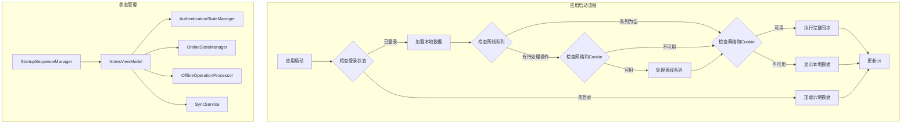
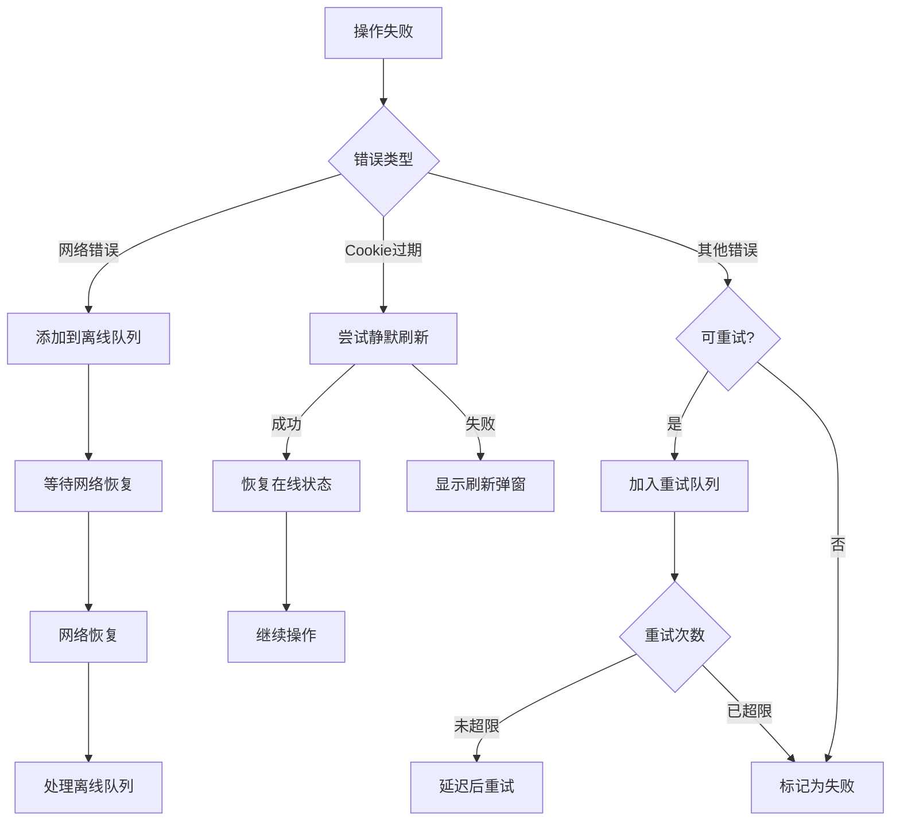

# 设计文档

## 概述

本设计文档描述了应用启动时数据加载、同步和离线操作的全面优化方案。核心目标是确保用户在任何网络条件下都能快速访问笔记内容，同时保证数据的一致性和完整性。

## 架构

### 整体架构



### 组件职责

| 组件 | 职责 |
|------|------|
| StartupSequenceManager | 管理启动序列，协调各步骤的执行顺序 |
| NotesViewModel | 管理笔记数据和UI状态 |
| AuthenticationStateManager | 管理认证状态和Cookie刷新 |
| OnlineStateManager | 管理在线状态 |
| OfflineOperationProcessor | 处理离线操作队列 |
| SyncService | 执行同步操作 |
| LocalStorageService | 管理本地数据库 |

## 组件和接口

### StartupSequenceManager（新增）

```swift
/// 启动序列管理器
/// 
/// 负责协调应用启动时的各个步骤，确保按正确顺序执行
@MainActor
class StartupSequenceManager {
    
    /// 启动序列状态
    enum StartupPhase {
        case idle                    // 空闲
        case loadingLocalData        // 加载本地数据
        case processingOfflineQueue  // 处理离线队列
        case syncing                 // 同步中
        case completed               // 完成
        case failed(Error)           // 失败
    }
    
    /// 当前阶段
    @Published var currentPhase: StartupPhase = .idle
    
    /// 启动序列是否完成
    @Published var isCompleted: Bool = false
    
    /// 错误信息
    @Published var errorMessage: String?
    
    /// 执行启动序列
    /// 
    /// 按顺序执行：加载本地数据 → 处理离线队列 → 执行同步
    func executeStartupSequence() async
    
    /// 加载本地数据
    private func loadLocalData() async throws
    
    /// 处理离线队列
    private func processOfflineQueue() async throws
    
    /// 执行同步
    private func performSync() async throws
}
```

### NotesViewModel 扩展

```swift
extension NotesViewModel {
    
    /// 启动序列管理器
    private let startupManager: StartupSequenceManager
    
    /// 是否为首次启动（本次会话）
    private var isFirstLaunch: Bool = true
    
    /// 执行启动时数据加载
    /// 
    /// 根据登录状态决定加载本地数据还是示例数据
    func performStartupDataLoading() async
    
    /// 登录成功后的处理
    /// 
    /// 清除示例数据，执行完整同步
    func handleLoginSuccess() async
    
    /// Cookie刷新成功后的处理
    /// 
    /// 恢复在线状态，执行完整同步
    func handleCookieRefreshSuccess() async
}
```

### AuthenticationStateManager 扩展

```swift
extension AuthenticationStateManager {
    
    /// 是否正在刷新Cookie
    @Published var isRefreshingCookie: Bool = false
    
    /// 刷新状态消息
    @Published var refreshStatusMessage: String = ""
    
    /// 静默刷新Cookie（带状态更新）
    func attemptSilentRefreshWithStatus() async -> Bool
}
```

## 数据模型

### StartupState

```swift
/// 启动状态
struct StartupState {
    /// 是否已完成本地数据加载
    var localDataLoaded: Bool = false
    
    /// 是否已处理离线队列
    var offlineQueueProcessed: Bool = false
    
    /// 是否已完成同步
    var syncCompleted: Bool = false
    
    /// 启动时间戳
    var startTime: Date = Date()
    
    /// 完成时间戳
    var completionTime: Date?
    
    /// 错误列表（每个步骤的错误）
    var errors: [StartupError] = []
}

/// 启动错误
struct StartupError {
    let phase: StartupSequenceManager.StartupPhase
    let error: Error
    let timestamp: Date
}
```

## 正确性属性

*正确性属性是系统在所有有效执行中都应该保持的特征或行为。属性作为人类可读规范和机器可验证正确性保证之间的桥梁。*

### Property 1: 登录状态下始终加载本地数据

*对于任意* 登录状态和网络状态的组合，当用户处于登录状态时，应用启动时应该首先从本地数据库加载数据，而不是加载示例数据。

**Validates: Requirements 1.1, 1.2, 4.2, 4.3**

### Property 2: 启动序列顺序正确性

*对于任意* 启动场景，启动序列的执行顺序应该是：加载本地数据 → 处理离线队列 → 执行同步，且每个步骤完成后才执行下一步。

**Validates: Requirements 2.1, 2.2**

### Property 3: 启动序列错误容忍性

*对于任意* 启动序列中的步骤失败，后续步骤应该继续执行，不应因为某个步骤失败而中断整个启动流程。

**Validates: Requirements 2.3**

### Property 4: 离线队列处理条件

*对于任意* 离线队列状态和网络状态的组合，只有当网络可用且Cookie有效时才处理离线队列，否则保留队列中的操作。

**Validates: Requirements 3.1, 3.2, 3.3**

### Property 5: 离线队列处理后数据一致性

*对于任意* 离线队列中的操作，处理完成后本地数据库中的数据应该与操作结果一致。

**Validates: Requirements 3.4, 3.5**

### Property 6: 自动同步触发条件

*对于任意* 登录、Cookie刷新或应用启动事件，当条件满足时应该自动触发完整同步。

**Validates: Requirements 4.1, 5.1, 5.2**

### Property 7: 同步锁机制

*对于任意* 同步请求，当同步正在进行中时，新的同步请求应该被阻止。

**Validates: Requirements 6.1**

### Property 8: 同步状态更新

*对于任意* 成功完成的同步操作，同步状态（lastSyncTime和syncTag）应该被正确更新。

**Validates: Requirements 6.2**

### Property 9: 网络错误时离线队列添加

*对于任意* 网络请求失败，操作应该被添加到离线队列以便后续重试。

**Validates: Requirements 8.1**

### Property 10: 静默刷新Cookie流程

*对于任意* Cookie过期事件，系统应该首先尝试静默刷新，成功后恢复在线状态。

**Validates: Requirements 8.2, 8.4**

### Property 11: 网络恢复后自动处理

*对于任意* 网络恢复事件，系统应该自动处理离线队列中的待处理操作。

**Validates: Requirements 8.6**

### Property 12: 重试限制

*对于任意* 操作重试，当重试次数超过最大限制时，操作应该被标记为失败。

**Validates: Requirements 8.7**

## 错误处理

### 错误分类

| 错误类型 | 处理策略 |
|----------|----------|
| 网络错误 | 添加到离线队列，等待网络恢复后重试 |
| Cookie过期 | 尝试静默刷新，失败后提示用户手动刷新 |
| 数据库错误 | 记录日志，显示空列表，不影响后续操作 |
| 同步冲突 | 以云端数据为准，本地修改添加到离线队列 |
| 服务器错误 | 重试，超过最大次数后标记为失败 |

### 错误恢复流程



## 测试策略

### 单元测试

1. **StartupSequenceManager 测试**
   - 测试启动序列的执行顺序
   - 测试各阶段状态转换
   - 测试错误处理和恢复

2. **数据加载测试**
   - 测试登录状态下加载本地数据
   - 测试未登录状态下加载示例数据
   - 测试空数据库情况

3. **离线队列测试**
   - 测试队列添加和处理
   - 测试网络状态对队列处理的影响
   - 测试失败操作的保留

### 属性测试

使用 Swift 的 SwiftCheck 或类似的属性测试框架：

1. **Property 1**: 登录状态下始终加载本地数据
   - 生成随机的登录状态和网络状态组合
   - 验证数据加载来源

2. **Property 2**: 启动序列顺序正确性
   - 记录每个步骤的执行时间戳
   - 验证时间戳顺序

3. **Property 7**: 同步锁机制
   - 并发触发多个同步请求
   - 验证只有一个同步在执行

### 集成测试

1. **完整启动流程测试**
   - 模拟各种网络和认证状态
   - 验证整个启动流程的正确性

2. **登录后同步测试**
   - 模拟登录成功
   - 验证自动同步触发

3. **网络恢复测试**
   - 模拟网络断开和恢复
   - 验证离线队列处理
