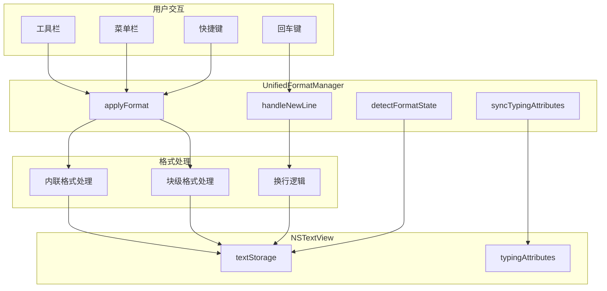

# 设计文档

## 概述

统一格式管理器（UnifiedFormatManager）是一个单例类，负责整合原生编辑器中所有格式处理逻辑。它提供统一的 API 来处理格式应用、格式检测、换行继承和 typingAttributes 同步，确保所有格式功能使用一致的处理流程。

## 架构



## 组件和接口

### UnifiedFormatManager

统一格式管理器，单例模式。

```swift
@MainActor
public final class UnifiedFormatManager {
    // MARK: - 单例
    public static let shared = UnifiedFormatManager()
    
    // MARK: - 属性
    private weak var textView: NSTextView?
    private weak var editorContext: NativeEditorContext?
    
    // MARK: - 注册/注销
    public func register(textView: NSTextView, context: NativeEditorContext)
    public func unregister()
    
    // MARK: - 格式应用（统一入口）
    public func applyFormat(_ format: TextFormat, to range: NSRange)
    
    // MARK: - 换行处理（统一入口）
    public func handleNewLine() -> Bool
    
    // MARK: - 格式检测
    public func detectFormatState(at position: Int) -> FormatState
    
    // MARK: - typingAttributes 同步
    public func syncTypingAttributes(for newLineContext: NewLineContext?)
}
```

### FormatCategory 枚举

格式分类枚举，用于区分不同类型的格式。

```swift
public enum FormatCategory {
    case inline      // 内联格式：加粗、斜体、下划线、删除线、高亮
    case blockTitle  // 块级标题：大标题、二级标题、三级标题
    case blockList   // 块级列表：有序列表、无序列表、Checkbox
    case blockQuote  // 块级引用
    case alignment   // 对齐属性：左对齐、居中、右对齐
}
```

### NewLineContext 结构体

换行上下文，包含换行时需要的信息。

```swift
public struct NewLineContext {
    let currentLineRange: NSRange
    let currentBlockFormat: TextFormat?
    let currentAlignment: NSTextAlignment
    let isListItemEmpty: Bool
    let shouldInheritFormat: Bool
}
```

### InlineFormatHandler

内联格式处理器，处理加粗、斜体、下划线、删除线、高亮。

```swift
struct InlineFormatHandler {
    // 应用内联格式
    static func apply(_ format: TextFormat, to range: NSRange, in textStorage: NSTextStorage)
    
    // 检测内联格式
    static func detect(at position: Int, in textStorage: NSTextStorage) -> Set<TextFormat>
    
    // 构建 typingAttributes（不包含内联格式）
    static func buildCleanTypingAttributes() -> [NSAttributedString.Key: Any]
}
```

### BlockFormatHandler

块级格式处理器，处理标题、列表、引用。

```swift
struct BlockFormatHandler {
    // 应用块级格式
    static func apply(_ format: TextFormat, to range: NSRange, in textStorage: NSTextStorage)
    
    // 检测块级格式
    static func detect(at position: Int, in textStorage: NSTextStorage) -> TextFormat?
    
    // 检查列表项是否为空
    static func isListItemEmpty(at position: Int, in textStorage: NSTextStorage) -> Bool
    
    // 移除块级格式
    static func removeBlockFormat(from range: NSRange, in textStorage: NSTextStorage)
}
```

### NewLineHandler

换行处理器，实现换行继承逻辑。

```swift
struct NewLineHandler {
    // 处理换行
    static func handleNewLine(context: NewLineContext, textView: NSTextView) -> Bool
    
    // 判断是否应该继承格式
    static func shouldInheritFormat(_ format: TextFormat?) -> Bool
    
    // 处理空列表项回车
    static func handleEmptyListItem(at range: NSRange, in textStorage: NSTextStorage) -> Bool
}
```

## 数据模型

### 格式分类映射

```swift
extension TextFormat {
    var category: FormatCategory {
        switch self {
        case .bold, .italic, .underline, .strikethrough, .highlight:
            return .inline
        case .heading1, .heading2, .heading3:
            return .blockTitle
        case .bulletList, .numberedList, .checkbox:
            return .blockList
        case .quote:
            return .blockQuote
        case .alignCenter, .alignRight:
            return .alignment
        default:
            return .inline
        }
    }
    
    var shouldInheritOnNewLine: Bool {
        switch category {
        case .inline, .blockTitle:
            return false
        case .blockList, .blockQuote, .alignment:
            return true
        }
    }
}
```

### 换行继承规则表

| 格式类型 | 换行继承 | 空行回车行为 |
|---------|---------|-------------|
| 内联格式（加粗、斜体等） | ❌ 不继承 | N/A |
| 标题（H1、H2、H3） | ❌ 不继承 | N/A |
| 有序列表 | ✅ 继承 | 变为普通正文 |
| 无序列表 | ✅ 继承 | 变为普通正文 |
| Checkbox | ✅ 继承 | 变为普通正文 |
| 引用 | ✅ 继承 | 正常换行 |
| 对齐属性 | ✅ 继承 | N/A |

## 正确性属性

*正确性属性是系统应该在所有有效执行中保持的特性。每个属性都是一个形式化的声明，描述系统应该做什么。*

### Property 1: 内联格式换行清除

*对于任意* 包含内联格式（加粗、斜体、下划线、删除线、高亮）的文本，在该文本后按回车键，新行的 typingAttributes 应该不包含任何内联格式属性。

**验证: 需求 2.1, 2.2, 2.3, 2.4, 2.5, 2.6**

### Property 2: 标题格式换行清除

*对于任意* 标题行（大标题、二级标题、三级标题），在该行按回车键，新行应该变为普通正文格式。

**验证: 需求 4.1, 4.2, 4.3, 4.4**

### Property 3: 列表格式换行继承

*对于任意* 非空的列表项（有序列表、无序列表、Checkbox），在该项末尾按回车键，新行应该继承相同的列表格式。

**验证: 需求 5.1, 5.2, 5.3**

### Property 4: 空列表项回车取消格式

*对于任意* 空的列表项（有序列表、无序列表、Checkbox），按回车键应该将当前行变为普通正文，而不是换行。

**验证: 需求 5.4, 5.5, 5.6**

### Property 5: 引用格式换行继承

*对于任意* 引用块行，在该行按回车键，新行应该继承引用格式。

**验证: 需求 6.1, 6.2**

### Property 6: 对齐属性换行继承

*对于任意* 具有对齐属性（居中、右对齐）的行，在该行按回车键，新行应该继承相同的对齐属性。

**验证: 需求 7.1, 7.2, 7.3**

### Property 7: 多格式同时应用

*对于任意* 文本范围，应用多个内联格式后，所有格式应该同时生效且互不干扰。

**验证: 需求 1.4**

### Property 8: 块级格式互斥

*对于任意* 行，同一时间只能有一个块级格式（标题或列表），应用新的块级格式应该自动移除旧的块级格式。

**验证: 需求 3.1, 3.2, 3.3, 3.4, 3.5, 3.6, 3.7**

## 错误处理

### 错误类型

```swift
enum UnifiedFormatError: Error {
    case textViewUnavailable
    case textStorageEmpty
    case invalidRange
    case formatApplicationFailed(String)
}
```

### 错误处理策略

1. **textView 不可用**: 记录警告日志，返回默认值或不执行操作
2. **textStorage 为空**: 使用默认格式状态
3. **无效范围**: 调整范围到有效边界
4. **格式应用失败**: 记录错误日志，保持原有状态

## 测试策略

### 单元测试

1. **InlineFormatHandler 测试**
   - 测试各内联格式的应用和移除
   - 测试多格式同时应用
   - 测试斜体 obliqueness 后备方案

2. **BlockFormatHandler 测试**
   - 测试块级格式的应用和移除
   - 测试块级格式互斥
   - 测试空列表项检测

3. **NewLineHandler 测试**
   - 测试各种格式的换行继承规则
   - 测试空列表项回车行为

### 属性测试

使用 Swift 的 XCTest 框架进行属性测试，每个属性测试至少运行 100 次迭代。

1. **Property 1 测试**: 生成随机内联格式组合，验证换行后清除
2. **Property 2 测试**: 生成随机标题格式，验证换行后变为正文
3. **Property 3 测试**: 生成随机列表内容，验证换行后继承
4. **Property 4 测试**: 生成空列表项，验证回车后取消格式
5. **Property 5 测试**: 生成引用内容，验证换行后继承
6. **Property 6 测试**: 生成随机对齐属性，验证换行后继承
7. **Property 7 测试**: 生成随机格式组合，验证同时应用
8. **Property 8 测试**: 生成随机块级格式序列，验证互斥
