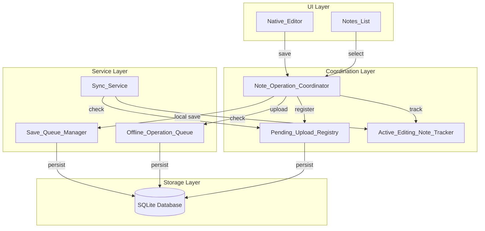
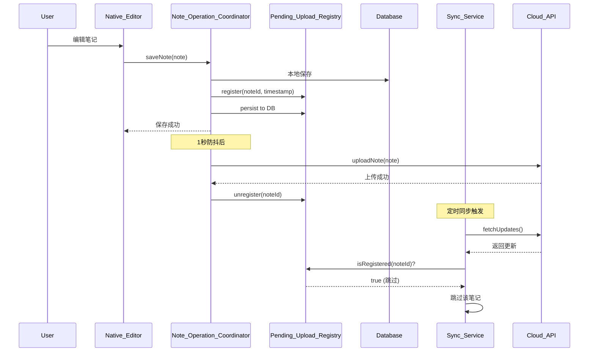

# 设计文档

## 概述

本设计文档描述了统一操作队列（Unified Operation Queue）的架构设计。该功能通过创建 `NoteOperationCoordinator` Actor 来协调所有笔记操作，采用 Local-First 架构模式，防止保存-同步竞态条件导致的格式丢失问题。

### 设计理念

基于业界最佳实践（参考 [Local-First Architecture](https://techbuzzonline.com/note-taking-app-synchronization-architecture/) 和 [Swift Actors](https://www.avanderlee.com/swift/actors/)），本设计采用以下核心原则：

1. **Local-First**：本地写入立即生效，网络操作异步执行
2. **Intent-Based Logging**：记录用户意图（操作），而非文档状态
3. **Actor Isolation**：使用 Swift Actor 确保线程安全，防止数据竞争
4. **Pending Upload Registry**：追踪待上传笔记，阻止同步覆盖本地修改

## 架构

### 组件图



### 数据流图



## 组件和接口

### 1. NoteOperationCoordinator (Actor)

核心协调器，使用 Swift Actor 确保线程安全。

```swift
/// 笔记操作协调器
/// 
/// 协调保存、上传、同步操作的中央控制器
/// 使用 Actor 确保线程安全，防止数据竞争
actor NoteOperationCoordinator {
    // MARK: - 单例
    static let shared = NoteOperationCoordinator()
    
    // MARK: - 依赖
    private let pendingUploadRegistry: PendingUploadRegistry
    private let saveQueueManager: SaveQueueManager
    private let syncService: SyncService
    private let databaseService: DatabaseService
    
    // MARK: - 状态
    private var activeEditingNoteId: String?
    private var uploadDebounceTask: Task<Void, Never>?
    private let uploadDebounceInterval: TimeInterval = 1.0
    
    // MARK: - 保存操作
    
    /// 保存笔记（本地 + 触发上传）
    /// 
    /// - Parameter note: 要保存的笔记
    /// - Returns: 保存结果
    func saveNote(_ note: Note) async throws -> SaveResult
    
    /// 立即保存（切换笔记时调用）
    /// 
    /// - Parameter note: 要保存的笔记
    func saveNoteImmediately(_ note: Note) async throws
    
    // MARK: - 活跃编辑管理
    
    /// 设置活跃编辑笔记
    /// 
    /// - Parameter noteId: 笔记 ID
    func setActiveEditingNote(_ noteId: String?)
    
    /// 检查笔记是否正在编辑
    /// 
    /// - Parameter noteId: 笔记 ID
    /// - Returns: 是否正在编辑
    func isNoteActivelyEditing(_ noteId: String) -> Bool
    
    // MARK: - 同步保护
    
    /// 检查笔记是否可以被同步更新
    /// 
    /// - Parameter noteId: 笔记 ID
    /// - Parameter cloudTimestamp: 云端时间戳
    /// - Returns: 是否可以更新
    func canSyncUpdateNote(_ noteId: String, cloudTimestamp: Date) async -> Bool
    
    /// 处理同步冲突
    /// 
    /// - Parameter noteId: 笔记 ID
    /// - Parameter cloudNote: 云端笔记
    /// - Returns: 冲突解决结果
    func resolveConflict(noteId: String, cloudNote: Note) async -> ConflictResolution
}
```

### 2. PendingUploadRegistry

待上传注册表，追踪有本地修改等待上传的笔记。

```swift
/// 待上传注册表
/// 
/// 记录有本地修改等待上传的笔记 ID 和时间戳
/// 支持持久化到数据库，应用重启后可恢复
final class PendingUploadRegistry: @unchecked Sendable {
    // MARK: - 单例
    static let shared = PendingUploadRegistry()
    
    // MARK: - 数据结构
    
    /// 待上传条目
    struct PendingEntry: Codable {
        let noteId: String
        let localSaveTimestamp: Date
        let registeredAt: Date
    }
    
    // MARK: - 状态
    private var entries: [String: PendingEntry] = [:]
    private let lock = NSLock()
    
    // MARK: - 注册/注销
    
    /// 注册待上传笔记
    /// 
    /// - Parameters:
    ///   - noteId: 笔记 ID
    ///   - timestamp: 本地保存时间戳
    func register(noteId: String, timestamp: Date)
    
    /// 注销待上传笔记（上传成功后调用）
    /// 
    /// - Parameter noteId: 笔记 ID
    func unregister(noteId: String)
    
    // MARK: - 查询
    
    /// 检查笔记是否在待上传列表中
    /// 
    /// - Parameter noteId: 笔记 ID
    /// - Returns: 是否在列表中
    func isRegistered(_ noteId: String) -> Bool
    
    /// 获取笔记的本地保存时间戳
    /// 
    /// - Parameter noteId: 笔记 ID
    /// - Returns: 本地保存时间戳，如果不在列表中返回 nil
    func getLocalSaveTimestamp(_ noteId: String) -> Date?
    
    /// 获取所有待上传笔记 ID
    /// 
    /// - Returns: 笔记 ID 数组
    func getAllPendingNoteIds() -> [String]
    
    // MARK: - 持久化
    
    /// 持久化到数据库
    func persistToDatabase() throws
    
    /// 从数据库恢复
    func restoreFromDatabase() throws
}
```

### 3. SyncProtectionFilter

同步保护过滤器，在 SyncService 中使用。

```swift
/// 同步保护过滤器
/// 
/// 在同步时过滤掉不应被更新的笔记
struct SyncProtectionFilter {
    private let coordinator: NoteOperationCoordinator
    private let registry: PendingUploadRegistry
    
    /// 检查笔记是否应该被同步跳过
    /// 
    /// - Parameters:
    ///   - noteId: 笔记 ID
    ///   - cloudTimestamp: 云端时间戳
    /// - Returns: 是否应该跳过
    func shouldSkipSync(noteId: String, cloudTimestamp: Date) async -> Bool {
        // 1. 检查是否正在编辑
        if await coordinator.isNoteActivelyEditing(noteId) {
            return true
        }
        
        // 2. 检查是否在待上传列表中
        if registry.isRegistered(noteId) {
            // 比较时间戳
            if let localTimestamp = registry.getLocalSaveTimestamp(noteId),
               localTimestamp >= cloudTimestamp {
                return true
            }
        }
        
        return false
    }
}
```

## 数据模型

### PendingUploadEntry（数据库表）

```sql
CREATE TABLE IF NOT EXISTS pending_uploads (
    note_id TEXT PRIMARY KEY,
    local_save_timestamp INTEGER NOT NULL,
    registered_at INTEGER NOT NULL
);
```

### 冲突解决结果

```swift
/// 冲突解决结果
enum ConflictResolution {
    /// 保留本地内容，触发上传
    case keepLocal
    /// 使用云端内容更新本地
    case useCloud
    /// 跳过（不做任何操作）
    case skip
}
```

## 正确性属性

*正确性属性是系统应该在所有有效执行中保持的特性。每个属性都是一个形式化声明，描述系统应该做什么。属性用于属性测试（Property-Based Testing），验证系统在各种输入下的正确行为。*

### Property 1: 待上传注册一致性

*对于任意*笔记和任意保存操作，如果本地保存成功，则该笔记必须被注册到 Pending_Upload_Registry 中，且注册状态必须持久化到数据库。当云端上传成功时，该笔记必须从注册表中移除；当上传失败时，该笔记必须保留在注册表中并加入离线队列。

**Validates: Requirements 1.1, 1.2, 1.3, 6.1**

### Property 2: 同步保护有效性

*对于任意*笔记和任意同步操作，当 Sync_Service 获取到笔记更新时：
- 如果笔记在 Pending_Upload_Registry 中，则必须跳过该笔记的内容更新
- 如果笔记在 Pending_Upload_Registry 中且云端时间戳早于 Local_Save_Timestamp，则必须完全跳过该笔记
- 如果笔记是 Active_Editing_Note，则必须跳过该笔记的内容更新
- 如果笔记不在 Pending_Upload_Registry 中且不是 Active_Editing_Note，则正常执行同步

**Validates: Requirements 2.1, 2.2, 2.3, 2.4, 3.2**

### Property 3: 活跃编辑状态管理

*对于任意*笔记切换操作，当用户在 Native_Editor 中打开笔记时，该笔记必须被标记为 Active_Editing_Note；当用户切换到其他笔记时，原笔记的 Active_Editing_Note 标记必须被清除，新笔记必须被标记。任意时刻最多只有一个笔记被标记为 Active_Editing_Note。

**Validates: Requirements 3.1, 3.3, 3.4**

### Property 4: 上传调度防抖

*对于任意*连续的保存操作序列，Note_Operation_Coordinator 必须使用防抖机制合并上传请求。如果网络可用且无其他上传任务，最后一次保存后必须在 1 秒内开始上传。上传成功后必须更新本地笔记的云端同步时间戳。

**Validates: Requirements 4.1, 4.2, 4.3, 4.4**

### Property 5: 冲突解决正确性

*对于任意*同步获取到的笔记更新和任意本地状态组合：
- 如果 Local_Save_Timestamp 较新，则必须保留本地内容并触发上传
- 如果云端时间戳较新且笔记不在 Pending_Upload_Registry 中，则必须使用云端内容更新本地
- 如果云端时间戳较新但笔记在 Pending_Upload_Registry 中，则必须保留本地内容（用户优先策略）

**Validates: Requirements 5.1, 5.2, 5.3, 5.4**

### Property 6: 状态持久化 Round-Trip

*对于任意* Pending_Upload_Registry 状态，持久化到数据库后再恢复，必须得到等价的状态。应用启动时必须从数据库恢复 Pending_Upload_Registry，网络恢复时必须处理所有待上传笔记。

**Validates: Requirements 1.4, 6.1, 6.2, 6.3**

## 错误处理

### 错误类型

```swift
/// 操作协调器错误
enum NoteOperationError: Error {
    /// 保存失败
    case saveFailed(underlying: Error)
    /// 上传失败
    case uploadFailed(underlying: Error)
    /// 网络不可用
    case networkUnavailable
    /// 笔记不存在
    case noteNotFound(noteId: String)
    /// 持久化失败
    case persistenceFailed(underlying: Error)
}
```

### 错误恢复策略

| 错误类型 | 恢复策略 |
|---------|---------|
| 本地保存失败 | 重试 3 次，失败后通知用户 |
| 上传失败（网络） | 保留在 Pending_Upload_Registry，网络恢复后重试 |
| 上传失败（服务器） | 加入离线队列，指数退避重试 |
| 持久化失败 | 记录日志，内存状态保持有效 |

## 测试策略

### 单元测试

1. **PendingUploadRegistry 测试**
   - 注册/注销操作
   - 时间戳比较
   - 持久化/恢复

2. **NoteOperationCoordinator 测试**
   - 保存流程
   - 活跃编辑状态管理
   - 冲突解决逻辑

3. **SyncProtectionFilter 测试**
   - 跳过条件判断
   - 边界情况处理

### 属性测试

使用 Swift 的 XCTest 框架进行属性测试，每个测试运行至少 100 次迭代。

1. **Property 1 测试**：验证保存后注册一致性
2. **Property 2 测试**：验证同步保护有效性
3. **Property 3 测试**：验证活跃编辑保护
4. **Property 5 测试**：验证冲突解决正确性
5. **Property 6 测试**：验证状态持久化 Round-Trip

### 集成测试

1. **保存-同步竞态测试**：模拟用户编辑 → 保存 → 定时同步场景
2. **网络恢复测试**：模拟离线编辑 → 网络恢复 → 上传场景
3. **应用重启测试**：模拟应用重启后 Pending_Upload_Registry 恢复
