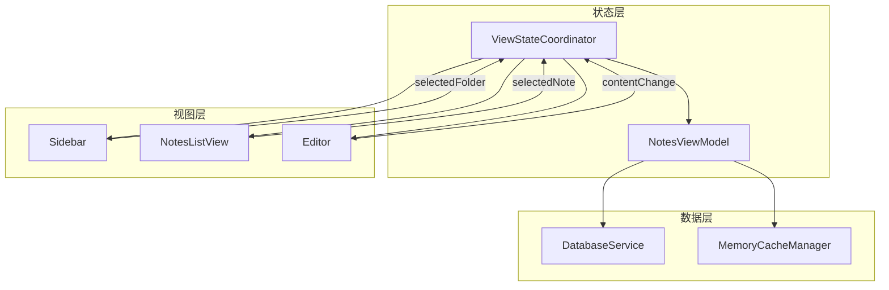
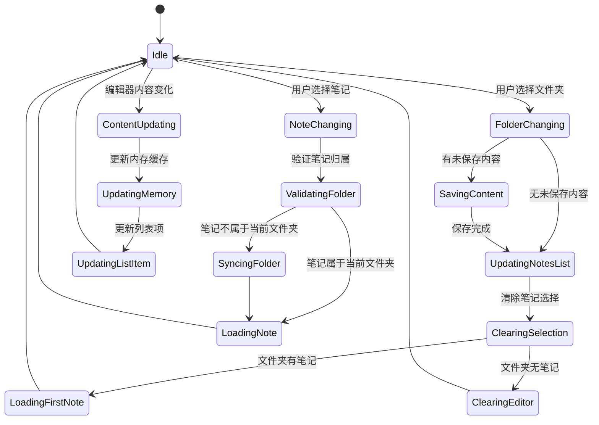

# Design Document: 视图状态同步

## Overview

本设计文档描述了 MiNoteMac 应用中侧边栏（Sidebar）、笔记列表视图（Notes_List_View）和编辑器（Editor）之间的状态同步机制。核心目标是确保三个视图之间保持一致的层级关系，同时在笔记内容更新时保持选择状态不变，并提供平滑的列表动画效果。

### 设计原则

1. **单一数据源**：使用 `ViewStateCoordinator` 作为状态协调器，统一管理三个视图的状态
2. **最小化视图重建**：通过精确的状态更新和 Equatable 比较，避免不必要的视图重绘
3. **平滑过渡**：使用 SwiftUI 动画系统实现列表项移动的平滑动画
4. **保存优先**：在切换文件夹前确保当前编辑内容已保存

## Architecture

### 整体架构图



### 状态流转图



## Components and Interfaces

### 1. ViewStateCoordinator（状态协调器）

负责协调三个视图之间的状态同步，作为单一数据源管理选择状态。

```swift
/// 视图状态协调器
/// 负责协调侧边栏、笔记列表和编辑器之间的状态同步
@MainActor
class ViewStateCoordinator: ObservableObject {
    
    // MARK: - Published Properties
    
    /// 当前选中的文件夹
    @Published private(set) var selectedFolder: Folder?
    
    /// 当前选中的笔记
    @Published private(set) var selectedNote: Note?
    
    /// 是否正在切换状态
    @Published private(set) var isTransitioning: Bool = false
    
    /// 是否有未保存的内容
    @Published var hasUnsavedContent: Bool = false
    
    // MARK: - Dependencies
    
    private weak var viewModel: NotesViewModel?
    private var cancellables = Set<AnyCancellable>()
    
    // MARK: - Public Methods
    
    /// 选择文件夹
    /// - Parameter folder: 要选择的文件夹
    /// - Returns: 是否成功切换
    func selectFolder(_ folder: Folder?) async -> Bool
    
    /// 选择笔记
    /// - Parameter note: 要选择的笔记
    /// - Returns: 是否成功选择
    func selectNote(_ note: Note?) async -> Bool
    
    /// 更新笔记内容（不触发选择变化）
    /// - Parameter note: 更新后的笔记
    func updateNoteContent(_ note: Note)
    
    /// 验证当前状态一致性
    /// - Returns: 状态是否一致
    func validateStateConsistency() -> Bool
    
    /// 同步状态（修复不一致）
    func synchronizeState()
}
```

### 2. AnimatedNotesListView（带动画的笔记列表视图）

封装笔记列表视图，提供平滑的列表项移动动画。

```swift
/// 带动画的笔记列表视图
struct AnimatedNotesListView: View {
    @ObservedObject var viewModel: NotesViewModel
    @ObservedObject var coordinator: ViewStateCoordinator
    
    /// 动画持续时间（毫秒）
    private let animationDuration: Double = 0.3
    
    var body: some View {
        List(selection: Binding(
            get: { coordinator.selectedNote },
            set: { note in
                Task {
                    await coordinator.selectNote(note)
                }
            }
        )) {
            ForEach(viewModel.filteredNotes) { note in
                NoteRow(note: note, viewModel: viewModel)
                    .tag(note)
                    .transition(.asymmetric(
                        insertion: .opacity.combined(with: .move(edge: .top)),
                        removal: .opacity
                    ))
            }
        }
        .animation(.easeInOut(duration: animationDuration), value: viewModel.filteredNotes.map(\.id))
    }
}
```

### 3. SelectionPreservingNoteRow（保持选择状态的笔记行）

优化的笔记行视图，避免不必要的重建。

```swift
/// 保持选择状态的笔记行
struct SelectionPreservingNoteRow: View {
    let note: Note
    @ObservedObject var viewModel: NotesViewModel
    
    /// 用于比较的显示属性
    private var displayProperties: NoteDisplayProperties {
        NoteDisplayProperties(
            id: note.id,
            title: note.title,
            updatedAt: note.updatedAt,
            isStarred: note.isStarred,
            folderId: note.folderId
        )
    }
    
    var body: some View {
        // 视图实现
    }
}

/// 笔记显示属性（用于 Equatable 比较）
struct NoteDisplayProperties: Equatable {
    let id: String
    let title: String
    let updatedAt: Date
    let isStarred: Bool
    let folderId: String
}
```

### 4. NotesViewModel 扩展

扩展 NotesViewModel 以支持精确的笔记更新。

```swift
extension NotesViewModel {
    
    /// 更新单个笔记（不替换整个数组）
    /// - Parameter note: 更新后的笔记
    /// - Returns: 是否成功更新
    @discardableResult
    func updateNoteInPlace(_ note: Note) -> Bool {
        guard let index = notes.firstIndex(where: { $0.id == note.id }) else {
            return false
        }
        
        // 只更新变化的属性，不触发整个数组的重新发布
        notes[index] = note
        return true
    }
    
    /// 批量更新笔记（带动画）
    /// - Parameter updates: 更新操作列表
    func batchUpdateNotes(_ updates: [(noteId: String, update: (inout Note) -> Void)]) {
        withAnimation(.easeInOut(duration: 0.3)) {
            for (noteId, update) in updates {
                if let index = notes.firstIndex(where: { $0.id == noteId }) {
                    update(&notes[index])
                }
            }
        }
    }
}
```

## Data Models

### 1. ViewState（视图状态）

```swift
/// 视图状态快照
struct ViewState: Equatable {
    let selectedFolderId: String?
    let selectedNoteId: String?
    let timestamp: Date
    
    /// 检查状态是否一致
    func isConsistent(with notes: [Note], folders: [Folder]) -> Bool {
        // 如果没有选中笔记，状态一致
        guard let noteId = selectedNoteId else { return true }
        
        // 查找选中的笔记
        guard let note = notes.first(where: { $0.id == noteId }) else {
            return false
        }
        
        // 如果没有选中文件夹，检查笔记是否在"所有笔记"中
        guard let folderId = selectedFolderId else {
            return true
        }
        
        // 检查笔记是否属于选中的文件夹
        return note.folderId == folderId || 
               folderId == "0" || // 所有笔记
               folderId == "starred" && note.isStarred // 置顶
    }
}
```

### 2. StateTransition（状态转换）

```swift
/// 状态转换记录
struct StateTransition {
    let from: ViewState
    let to: ViewState
    let trigger: TransitionTrigger
    let timestamp: Date
    
    enum TransitionTrigger {
        case folderSelection
        case noteSelection
        case contentUpdate
        case stateSync
    }
}
```

### 3. NoteUpdateEvent（笔记更新事件）

```swift
/// 笔记更新事件
enum NoteUpdateEvent {
    case contentChanged(noteId: String, newContent: String)
    case titleChanged(noteId: String, newTitle: String)
    case timestampUpdated(noteId: String, newTimestamp: Date)
    case metadataChanged(noteId: String)
    
    /// 是否需要触发列表动画
    var requiresListAnimation: Bool {
        switch self {
        case .timestampUpdated:
            return true
        default:
            return false
        }
    }
    
    /// 是否需要保持选择状态
    var shouldPreserveSelection: Bool {
        return true
    }
}
```

## Correctness Properties

*A property is a characteristic or behavior that should hold true across all valid executions of a system-essentially, a formal statement about what the system should do. Properties serve as the bridge between human-readable specifications and machine-verifiable correctness guarantees.*

### Property 1: 笔记更新时选择状态保持不变

*For any* 笔记列表和选中的笔记，当该笔记的内容或时间戳更新时，selectedNote 的 id 应保持不变。

**Validates: Requirements 1.1, 1.2**

### Property 2: 视图重建后选择状态恢复

*For any* 视图状态，当视图因任何原因重建后，如果之前有选中的笔记且该笔记仍存在于列表中，则选择状态应恢复。

**Validates: Requirements 1.4**

### Property 3: 文件夹切换后笔记列表正确过滤

*For any* 文件夹选择操作，切换后 filteredNotes 应只包含属于该文件夹的笔记（或满足特殊文件夹条件的笔记）。

**Validates: Requirements 3.1**

### Property 4: 文件夹切换后编辑器状态同步

*For any* 文件夹切换操作，切换后编辑器应显示新文件夹的第一篇笔记或清空内容。

**Validates: Requirements 3.2, 6.4**

### Property 5: 文件夹切换清除笔记选择

*For any* 文件夹切换操作，切换后 selectedNote 应为 nil 或为新文件夹中的笔记。

**Validates: Requirements 3.3**

### Property 6: 状态不一致时自动修复

*For any* 检测到的状态不一致（selectedNote 不属于 selectedFolder），系统应自动更新 selectedFolder 或清除 selectedNote。

**Validates: Requirements 3.4, 4.4**

### Property 7: 文件夹切换前保存内容

*For any* 有未保存内容的文件夹切换操作，系统应先完成保存操作再执行切换。

**Validates: Requirements 3.5, 6.1**

### Property 8: 状态更新顺序正确

*For any* selectedFolder 变化，状态更新应按顺序执行：保存内容 → 更新笔记列表 → 更新编辑器。

**Validates: Requirements 4.2, 6.2**

### Property 9: 笔记选择验证归属关系

*For any* 笔记选择操作，系统应验证该笔记是否属于当前 selectedFolder。

**Validates: Requirements 4.3**

### Property 10: 笔记更新使用原地更新

*For any* 笔记内容更新，应只更新 notes 数组中对应笔记的属性，而不是替换整个数组。

**Validates: Requirements 5.1**

### Property 11: 非显示属性变化不触发重建

*For any* 笔记的非显示属性（如 rawData）变化，不应触发 NoteRow 视图重建。

**Validates: Requirements 5.4**

## Error Handling

### 1. 保存失败处理

```swift
enum SaveError: Error {
    case databaseError(underlying: Error)
    case networkError(underlying: Error)
    case timeout
    case cancelled
}

/// 保存失败时的处理策略
enum SaveFailureStrategy {
    case retryWithBackoff(maxRetries: Int)
    case saveLocally
    case discardChanges
    case askUser
}
```

### 2. 状态不一致处理

```swift
/// 状态不一致类型
enum StateInconsistency {
    case noteNotInFolder(noteId: String, folderId: String)
    case noteNotFound(noteId: String)
    case folderNotFound(folderId: String)
    case multipleSelections
}

/// 状态不一致处理策略
enum InconsistencyResolution {
    case clearSelection
    case updateFolder(to: Folder)
    case selectFirstNote
    case logAndIgnore
}
```

## Testing Strategy

### 单元测试

1. **ViewStateCoordinator 测试**
   - 测试文件夹选择逻辑
   - 测试笔记选择逻辑
   - 测试状态一致性验证
   - 测试状态同步修复

2. **NotesViewModel 扩展测试**
   - 测试原地更新功能
   - 测试批量更新功能
   - 测试过滤逻辑

### 属性测试

使用 SwiftCheck 或类似的属性测试框架，每个属性测试至少运行 100 次迭代。

1. **Property 1 测试**：生成随机笔记更新，验证选择状态保持
2. **Property 3 测试**：生成随机文件夹切换，验证过滤结果
3. **Property 6 测试**：生成随机不一致状态，验证自动修复
4. **Property 10 测试**：生成随机更新，验证原地更新行为

### 集成测试

1. **端到端状态同步测试**
   - 模拟完整的用户操作流程
   - 验证三个视图的状态一致性

2. **动画测试**
   - 验证列表项移动动画是否正确触发
   - 验证动画持续时间配置
