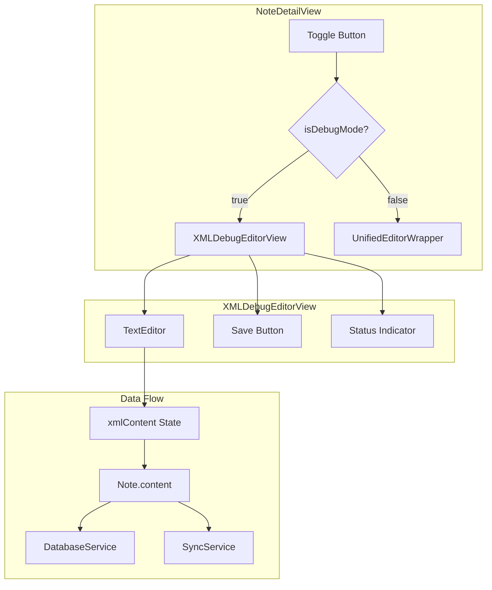

# Design Document: XML Debug Editor

## Overview

本设计文档描述了小米笔记 macOS 客户端的 XML 调试编辑器功能。该功能允许开发者直接查看和编辑笔记的原始 XML 数据，用于调试格式转换问题和排查数据异常。

调试编辑器将作为现有编辑器的一个替代视图，通过切换按钮在普通编辑器和调试编辑器之间切换。

## Architecture



## Components and Interfaces

### 1. XMLDebugEditorView

新增的 SwiftUI 视图组件，用于显示和编辑原始 XML 内容。

```swift
/// XML 调试编辑器视图
/// 
/// 提供原始 XML 内容的查看和编辑功能
/// 
/// _Requirements: 1.1, 2.1, 3.1, 4.1_
struct XMLDebugEditorView: View {
    /// 绑定的 XML 内容
    @Binding var xmlContent: String
    
    /// 是否可编辑
    @Binding var isEditable: Bool
    
    /// 保存状态
    @Binding var saveStatus: SaveStatus
    
    /// 保存回调
    var onSave: () -> Void
    
    /// 内容变化回调
    var onContentChange: (String) -> Void
}
```

### 2. DebugEditorState

调试编辑器状态管理，集成到现有的 NoteDetailView 中。

```swift
/// 调试编辑器状态
/// 
/// _Requirements: 1.1, 1.2, 1.3_
extension NoteDetailView {
    /// 是否处于调试模式
    @State private var isDebugMode: Bool = false
    
    /// 调试模式下的 XML 内容
    @State private var debugXMLContent: String = ""
}
```

### 3. 界面集成

在 NoteDetailView 的工具栏中添加调试模式切换按钮。

```swift
/// 调试模式切换按钮
/// 
/// _Requirements: 1.1, 1.2, 5.2, 6.1_
var debugModeToggle: some View {
    Button {
        toggleDebugMode()
    } label: {
        Label(
            isDebugMode ? "退出调试" : "调试模式",
            systemImage: isDebugMode ? "xmark.circle" : "chevron.left.forwardslash.chevron.right"
        )
    }
    .keyboardShortcut("d", modifiers: [.command, .shift])
    .disabled(viewModel.selectedNote == nil)
}
```

## Data Models

### 编辑器模式枚举

```swift
/// 编辑器显示模式
/// 
/// _Requirements: 1.1, 1.2_
enum EditorDisplayMode {
    case normal     // 普通编辑器（原生或 Web）
    case debug      // XML 调试编辑器
}
```

### 保存状态（复用现有）

```swift
/// 保存状态枚举（复用 NoteDetailView 中的定义）
enum SaveStatus {
    case saved        // 已保存
    case saving       // 保存中
    case unsaved      // 未保存
    case error(String) // 保存失败
}
```

## Correctness Properties

*A property is a characteristic or behavior that should hold true across all valid executions of a system—essentially, a formal statement about what the system should do. Properties serve as the bridge between human-readable specifications and machine-verifiable correctness guarantees.*

### Property 1: 调试模式显示正确的 XML 内容

*For any* note with XML content, when debug mode is activated, the displayed content in the debug editor should exactly match `Note.primaryXMLContent`.

**Validates: Requirements 1.1, 2.1**

### Property 2: 模式切换往返保留内容

*For any* XML content edited in debug mode, switching to normal mode and back to debug mode should preserve the edited content unchanged.

**Validates: Requirements 1.2, 1.4**

### Property 3: 内容修改标记未保存状态

*For any* modification to the XML content in debug mode, the save status should change to `.unsaved`.

**Validates: Requirements 3.3**

### Property 4: 保存操作更新笔记内容

*For any* edited XML content, after save operation completes successfully, `Note.content` should equal the edited XML content.

**Validates: Requirements 4.1, 4.2**

### Property 5: 笔记切换加载正确内容

*For any* two notes A and B, when in debug mode and switching from note A to note B, the debug editor should display note B's `primaryXMLContent`.

**Validates: Requirements 6.4**

### Property 6: 换行和缩进保留

*For any* XML content containing line breaks and indentation, editing and saving should preserve all whitespace characters exactly.

**Validates: Requirements 3.4**

## Error Handling

### 保存失败处理

```swift
/// 保存失败时的处理
/// 
/// _Requirements: 4.7_
/// 
/// 1. 显示错误提示
/// 2. 保留编辑的内容
/// 3. 允许用户重试
func handleSaveError(_ error: Error) {
    saveStatus = .error(error.localizedDescription)
    // 不清空 debugXMLContent，保留用户编辑的内容
}
```

### 空内容处理

```swift
/// 空内容时的处理
/// 
/// _Requirements: 2.4_
/// 
/// 显示占位符提示
var emptyContentPlaceholder: some View {
    Text("无 XML 内容")
        .foregroundColor(.secondary)
        .font(.system(.body, design: .monospaced))
}
```

## Testing Strategy

### 单元测试

1. **XMLDebugEditorView 渲染测试**
   - 验证空内容显示占位符
   - 验证非空内容正确显示
   - 验证等宽字体应用

2. **状态管理测试**
   - 验证模式切换状态正确
   - 验证保存状态更新正确
   - 验证内容变化检测

3. **保存流程测试**
   - 验证保存成功更新笔记
   - 验证保存失败保留内容
   - 验证保存状态指示器

### 属性测试

使用 Swift 的 XCTest 框架进行属性测试，每个属性测试运行至少 100 次迭代。

1. **Property 1 测试**: 生成随机 XML 内容的笔记，验证调试模式显示正确
2. **Property 2 测试**: 生成随机编辑内容，验证模式切换往返保留
3. **Property 3 测试**: 生成随机修改，验证未保存状态标记
4. **Property 4 测试**: 生成随机 XML 内容，验证保存后内容更新
5. **Property 5 测试**: 生成随机笔记对，验证切换加载正确内容
6. **Property 6 测试**: 生成包含各种空白字符的 XML，验证保存后保留

### 集成测试

1. **端到端保存流程**
   - 进入调试模式 → 编辑内容 → 保存 → 验证数据库更新

2. **模式切换流程**
   - 普通模式 → 调试模式 → 编辑 → 普通模式 → 调试模式 → 验证内容保留

3. **快捷键测试**
   - Cmd+S 触发保存
   - Cmd+Shift+D 切换模式
